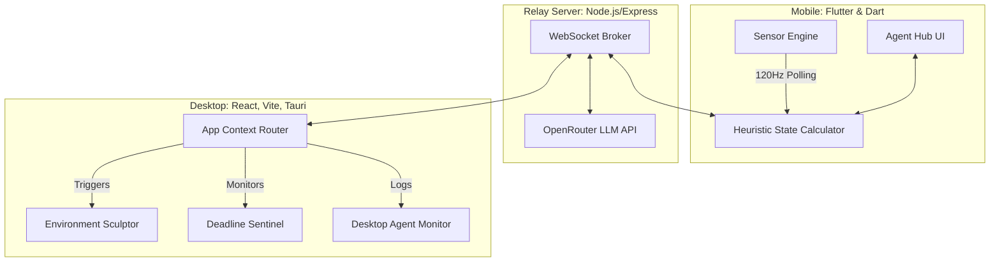

# APEX Technical Architecture

APEX uses a novel, highly decoupled **Phone-First Edge Architecture**. The smartphone operates as the primary sensor hub and user interface (Agent Hub), while the desktop functions strictly as the execution muscle and visualization canvas.

## 1. System Topology

## 2. The iQOO Office Kit Bridge
APEX simulates the exact value proposition of the **iQOO Office Kit** via our custom Node.js `relay.cjs` broker running on port `8080`.
* **Zero-Cloud Local Sync:** Both the phone and laptop connect to the same local IP address. 
* **Red Light (60% Time):** The student is isolated to the phone interface. The laptop is strictly receiving telemetry, ready to act but not interacted with directly.
* **Green Light (40% Time):** Both devices operate in tandem. The phone acts as a secondary command palette or biometric watchdog, and the laptop is the primary coding/writing environment.

## 3. The Multi-Agent System (AgentKit)

Rather than having one massive LLM that is too slow to run on mobile, APEX utilizes an orchestrator and five specialized agents:

1. **State Agent:** Runs locally on the phone. Reads accelerometer, gyroscope, and touch-density metrics. Determines if the student is in `Flow`, `Distracted`, `Fatigued`, or `Overloaded`.
2. **Environment Sculptor:** Runs on the PC. Reshapes the UI (e.g., closing non-essential tabs, activating Grayscale Focus Mode) based on the State Agent's broadcast.
3. **Socratic Challenger:** Plugs into the `DeepSeek-R1` and `MiniMax-m3` models via OpenRouter. Triggers active recall interventions. When a student is stuck and hits the "Help Me" panic button on the phone, the Socratic Challenger fetches the context and unblocks them on the PC screen.
4. **Peer Radar:** Monitors external communication channels (mocked Discord/WhatsApp feeds) and calculates signal-to-noise ratios, only interrupting the user for critical task-related information.
5. **Deadline Sentinel:** Continuously evaluates assignment due dates against historical fatigue data to calculate real-time completion risk vectors.

## 4. Why Heuristics First? (The Edge Advantage)
Sending 120Hz raw accelerometer data to a cloud LLM is economically impossible and introduces massive latency. 
Instead, APEX uses **On-Device Sensor Fusion**:
1. The `sensor_engine.dart` script tracks $X, Y, Z$ spatial variance and touch bursts natively on the iQOO hardware.
2. It applies a math-based heuristic smoothing algorithm to generate a rolling `Distraction Score (0-100)`.
3. **Only when a threshold is breached** (>75 Distraction Score), the State Agent triggers a `STATE_TRANSITION` payload to the cloud and PC.
4. This preserves battery life, protects privacy, and guarantees sub-10ms UI updates (the phone UI instantly turns red and initiates a lockdown).

## 5. Technology Stack Breakdown
- **Frontend (Mobile):** Flutter 3, Dart, `sensors_plus`, Provider. (Compiled to Web/Wasm for seamless cross-device testing).
- **Frontend (Desktop):** React 19, TypeScript, Vite, Tailwind CSS v4, Framer Motion (for dynamic UI morphs), Lucide Icons.
- **Relay Backend:** Node.js, Express, `ws` (WebSockets).
- **Intelligence Layer:** OpenRouter SDK interacting with MiniMax and DeepSeek reasoning models.
