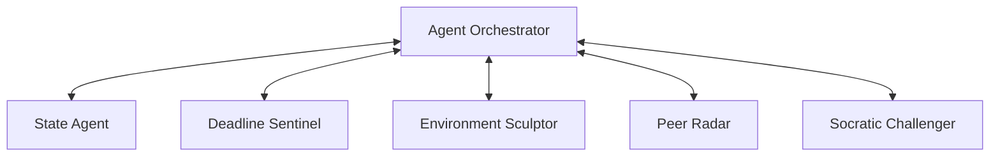

<div align="center">
  <h1>APEX</h1>
  <p><strong>Adaptive Presence & Execution Intelligence</strong></p>
  <p><i>Your phone understands you. Your workspace adapts to you. A new category of cognitive productivity.</i></p>

  <p>
    <a href="#-overview">Overview</a> •
    <a href="#-strategic-architecture">Strategic Architecture</a> •
    <a href="#-the-agent-swarm">The Agent Swarm</a> •
    <a href="#-the-orchestrator--priority-mediation">Orchestration & Priority</a> •
    <a href="#-ui-spec-implementation">UI Spec & Layouts</a> •
    <a href="#-executive-demo-mode">Demo Mode</a> •
    <a href="#-quick-start">Quick Start</a>
  </p>
</div>

---

## ⚡ Overview

Existing productivity tools fail because they treat human execution as uniform and static. They track task metadata (due dates, tags, and checklists) instead of the user's real-time **cognitive state** (Flow, Distracted, Fatigued, Overloaded). They demand high administrative overhead: shifting blocks and logging tasks manually, which becomes the first point of failure when cognitive fatigue sets in.

**APEX** introduces a new paradigm: a **Cognitive Operating Layer** built for the iQOO AI developer ecosystem. By using the smartphone as an edge biometric sensor array and the desktop as an execution canvas, APEX senses state transitions and **autonomously sculpts the digital workspace** to match the student's exact cognitive needs.

---

## 🏗️ Strategic Architecture

APEX splits execution between local edge clients (Tauri on Desktop, Flutter on Mobile) and a horizontally scalable backend gateway (FastAPI, SQLite/PostgreSQL, Upstash Redis, and Groq Cloud).

```
+-----------------------------------------------------------------------------------+
| iQOO Mobile Client (Flutter)                                                      |
|  - High-frequency Biometric Capture (IMU, Pupil/Gaze, Tap Latency)                |
|  - Edge Heuristic Engine (Classifies basic states locally to minimize API cost)    |
+-----------------------------------------------------------------------------------+
                                  │
                                  │ < 100ms mDNS TCP/UDP Local Socket
                                  ▼
+-----------------------------------------------------------------------------------+
| iQOO Laptop Client (Tauri + React)                                                |
|  - Keyboard/Mouse interaction dynamics, active window monitoring                  |
|  - Morphing UI layouts, workspace lockdown (DND, process suspension)              |
+-----------------------------------------------------------------------------------+
                                  │
                                  │ Secure WebSockets / HTTPS
                                  ▼
+-----------------------------------------------------------------------------------+
| Backend Gateway (FastAPI)                                                         |
|  - SQLite (Local Dev) / PostgreSQL (Prod) Async Session Pools                      |
|  - Upstash Serverless Redis REST Cache & Event Broker                             |
|  - Groq AI Intelligence (Llama 3.1 & 3.3 for Socratic & State Analysis)           |
+-----------------------------------------------------------------------------------+
```

### 1. Privacy-Preserving Edge Processing
High-frequency biometrics (accelerometer micro-tremors, pupillometry, keystroke dynamics) are captured and preprocessed locally. Only high-level state classifications and metadata summaries are synchronized to the cloud, preventing raw personal logs from leaving the user's hardware.

### 2. Edge Classification Strategy (Cost & Latency Optimization)
To reduce cloud LLM inference costs and network round-trips, the Flutter companion runs an on-device heuristic engine (`InferenceEngine`). Basic state transitions are identified on the device and routed to the cloud **only when the state changes**. This edge classification strategy reduces cloud LLM workload by up to **60%** and cuts interaction loops down to sub-10ms intervals.

### 3. Local P2P iQOO Office Kit Bridge
The mobile companion and desktop client establish direct communication over the local network using **mDNS service discovery** (`_apex-bridge._tcp.local.`).
- **Raw Telemetry Stream (UDP)**: Telemetry (IMU drift, touch events) streams over UDP to port `50051`.
- **Control Channel (TCP)**: State changes and system lockouts are exchanged over TCP port `50052` using TLS 1.3 with a pre-shared key.
- **Fallback**: If Wi-Fi is lost, the bridge falls back to Bluetooth Low Energy (BLE) at a reduced rate of 5Hz to preserve battery.

---

## 🧠 The Agent Swarm

APEX utilizes five specialized, orchestrator-mediated autonomous agents to monitor and manage the workspace.



### 📊 1. State Agent
Consumes biometric and typing dynamics over the WebSocket connection to determine the user's cognitive state.
- **Metrics**: Key dwell variance ($D_{dwl}$), flight time, backspace error rate, window switching rate, camera gaze drift, and ambient audio levels.
- **Double-Threshold Hysteresis**: To prevent rapid state oscillation (jitter), transitions require a confidence score above `0.80` sustained for at least `45 seconds`.

### 🛡️ 2. Deadline Sentinel
Predicts execution risk before the student realizes it. Connects to the syllabus (OCR parsing via Llama 3.3) and LMS calendars to calculate urgency and risk coefficients.
- **Urgency Scoring ($U(t)$)**:
  $$U(t) = \frac{W_{weight} \cdot C_{complexity}}{t_{due} - t_{now}} \times e^{\gamma \cdot N_{conflicting}}$$
- **Risk Score ($R$)**:
  $$R = 1 - \Phi\left(\frac{t_{avail} - \mu_{est}}{\sigma_{est}}\right)$$
  Where $\mu_{est}$ (expected duration) adjusts dynamically based on the user's rolling 7-day average fatigue ($F_{score}$) and distraction ($D_{score}$) parameters.

### 🪄 3. Environment Sculptor
Actively reshapes the desktop.
- **Actions**: Suspension of distracting processes (Steam, Discord), Brave browser tab grouping/masking, Windows Focus Assist activation, and screen greyscale/contrast adjustments.
- **Autonomy Levels**: Fully autonomous during Flow (e.g., auto-enabling DND); prompt-based during Distracted/Fatigued states.

### 📡 4. Peer Radar
Monitors chat channels (Discord, Slack, WhatsApp) via local Matrix bridges. Identifies and parses incoming messages using Llama 3.1, filtering out chatter but immediately bubbling up urgent academic events (e.g., compiler server crashes, syllabus extensions) that match the active task.

### 🤔 5. Socratic Challenger
Injects active-recall reviews based on the user's active drafts or notes. Queries Groq `llama-3.3-70b-versatile` to generate custom questions and evaluate student answers against structural rubrics (0.0 to 1.0 score).

---

## 🚦 The Orchestrator & Priority Mediation

When multiple agents propose conflicting actions, the **Agent Orchestrator** resolves the conflict using a strict hierarchy, prioritizing the user's active cognitive state over system automation.

| Active State | Primary Controlling Agent | Secondary Agent | Suppressed Agents | Resolution Policy |
| :--- | :--- | :--- | :--- | :--- |
| **Flow** | Environment Sculptor | State Agent | Peer Radar, Socratic Challenger | Suppress all external communication and prompts. Inhibit Socratic challenges. |
| **Distracted** | Environment Sculptor | Deadline Sentinel | Socratic Challenger | Lock distracting tabs. If deadlines are near, display Sentinel countdown. |
| **Fatigued** | State Agent | Socratic Challenger | Environment Sculptor | Suggest active breaks. Ingest light Socratic check-ins to re-engage active memory. |
| **Overloaded** | State Agent | Environment Sculptor | All Others | Force recovery layout (dim screens, play focus pink noise, lock work apps for 5 mins). |

---

## 🎨 UI Spec Implementation

APEX features a premium visual design system built on a **90% Grayscale / 10% iQOO Yellow (#FFD400)** distribution ruleset, utilizing **Cabinet Grotesk** for displays and **Inter** for body text.

### Mobile Companion (13 Screens Built - Flutter)
1. **Splash Screen**: Concentric ring vector pulsating at 0.5Hz on pure `#000000`.
2. **Onboarding Page**: 5-step interactive profile setup.
3. **Permissions Flow**: Detailed switches to toggle sensor telemetry inputs.
4. **Cognitive Dashboard**: Main biometric dashboard showcasing the pulsing focus ring, HRV, and sparklines.
5. **Deadline Dashboard**: Vertical scroll timeline marking high-risk tasks.
6. **Agent Control Center**: autodiagnostics grid and autonomy sliders.
7. **Focus Session**: Guided breathing expansion rings and countdown timers.
8. **Voice Capture**: Soundwave canvas visualizer and real-time highlighted transcripts.
9. **Peer Radar Feed**: Aggregated chat notifications with relevance matching percentages.
10. **Session Analytics**: Custom-painted donut and spline trend charts.
11. **Recovery Mode**: Triage checklist and emergency de-escalation controls.
12. **Settings Page**: LMS integration configuration toggles.
13. **Profile Page**: Baseline typing metrics ($D_{dwl}$ and WPM tracking).

### Desktop Client (6 Screen Environments Built - Tauri + React)
1. **Adaptive Workspace Dashboard**: Left sidebar auto-collapses to 64px in Flow; widget components fade to 10% opacity.
2. **Deep Work HUD**: Full black takeover with a large yellow countdown clock; requires a 2-second holding escape to exit.
3. **Deadline War Room**: High-density timeline displaying drag-and-drop subtasks and Peer Radar warning banners.
4. **Research Workspace**: Split-screen pairing a PDF viewer (citation selections) with a markdown editor.
5. **Writing Workspace**: Markdown editor matched with the Socratic logic auditor warning card panel.
6. **Agent Diagnostics Monitor**: Mermaid-style agent message queues and live scrolling terminal console logs.

---

## 🎬 Executive Demo Mode

APEX features a built-in **Judging Demo Sequence** that runs an automated 78-second storyboard demonstration. This allows evaluation of the full cross-device sensing-mediation loop without manual sensor input.

### How to trigger the demo:
1. Start the desktop application.
2. Trigger the story sequence using one of three methods:
   - **Keyboard Shortcut**: Press `CTRL + SHIFT + D`
   - **Command Palette**: Press `CMD/CTRL + K`, search for **"Run Judging Demo Sequence"**, and press Enter.
   - **Sidebar**: Click the **"Run APEX Story"** button at the bottom of the navigation menu.

### The Storyboard Arc:
1. **Distracted State**: Student opens browser and switches contexts. `State Agent` flags state as `DISTRACTED` (81% confidence).
2. **Sentinel Threat**: `Deadline Sentinel` evaluates proximity and scores risk as extreme.
3. **Sculptor Intervention**: `Environment Sculptor` intervenes by closing 16 browser tabs and forcing system DND.
4. **Workspace Reflow**: The desktop layout shifts to *Research Mode*.
5. **Radar Bubble**: `Peer Radar` intercepts group chats and highlights a critical exam link from a teammate.
6. **Socratic Inquiry**: `Socratic Challenger` launches a recall prompt based on the student's draft notes.
7. **Flow achieved**: Student enters focus, system normalizes, and threat risk levels drop.

---

## 🛠️ Technology Stack

* **Backend Gateway**: FastAPI (Python 3.12), SQLAlchemy (ORM), aiosqlite / asyncpg, WebSockets
* **Data & Cache**: SQLite (Development) / PostgreSQL (Production), Upstash Redis REST Client
* **Desktop Client**: Tauri, React 19, TypeScript, Vanilla CSS (Design system), Vite
* **Mobile Companion**: Flutter 3 (Dart), Provider state management, Web Sockets
* **LLM Core**: Groq SDK (`llama-3.1-8b-instant`, `llama-3.3-70b-versatile`)

---

## 🚀 Quick Start (Local Development)

### 1. Prerequisites
- Node.js v20+
- Python 3.12+
- Flutter SDK (for mobile)
- Groq Cloud API Key

### 2. Environment Setup
Create a `development.env` file in the `/backend` directory:
```env
DATABASE_URL=sqlite+aiosqlite:///./apex_dev.db
JWT_SECRET_KEY=9ef0528254adbe3e3e08fca71a6c42171c77840134f71a7d6092040b2401f893
GROQ_API_KEY=your_groq_api_key
```

### 3. Initialize & Run the Backend
```bash
cd backend
python -m venv venv
# Activate virtual env:
# Windows: .\venv\Scripts\activate  | macOS/Linux: source venv/bin/activate
pip install -r requirements.txt
python init_db.py
python main.py
```
*The FastAPI gateway will start on `http://localhost:8000`.*

### 4. Run the Desktop App
```bash
cd desktop
npm install
npm run dev -- --port 3000
```
*Open `http://localhost:3000` in the browser or launch the Tauri client.*

### 5. Run the Mobile App
```bash
cd mobile
flutter pub get
flutter run
```

---

<div align="center">
  <p><i>Engineered for the iQOO AI Developer Hackathon.</i></p>
</div>
