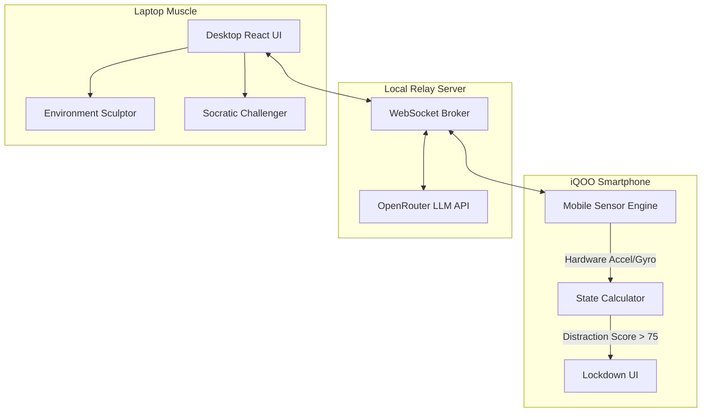

<div align="center">
  
  <h1>APEX : AgentKit for the Student Enterprise</h1>
  <p><strong>Adaptive Presence & Execution Intelligence</strong></p>
  <p><i>The phone is the interface. The laptop is the muscle.</i></p>

  <p>
    <a href="#-the-problem">The Problem</a> •
    <a href="#-our-solution">Our Solution</a> •
    <a href="#-scoring--novelty">Hackathon Novelties</a> •
    <a href="#-strategic-architecture">Architecture</a> •
    <a href="#-quick-start">Quick Start</a>
  </p>
</div>

---

## 🌪️ The Problem

The Indian student is a **one-person project manager with zero tools**. 
Right now, WhatsApp is their calendar, the camera roll is their filing cabinet, and Notion is a graveyard of abandoned to-do lists. Existing productivity tools fail because they treat human execution as uniform and static. They demand high administrative overhead (shifting blocks, logging tasks manually), which becomes the first point of failure when cognitive fatigue sets in.

When a student hits a wall on a complex project, they don't need another notification. They need an **AI staff** that understands their cognitive state and actively removes friction.

## ⚡ Our Solution

**APEX** introduces a **Cognitive Operating Layer**. By using the iQOO smartphone as a live edge-sensor array and the laptop as an execution canvas, APEX senses state transitions and **autonomously sculpts the digital workspace** to match the student's exact cognitive needs.

If the student is distracted (measured via rapid phone movement, rapid tapping, and app-switching), APEX locks down the phone, groups distracting browser tabs on the PC, and triggers a **Socratic Support Intervention** to unblock them.

---

## 🏆 Scoring & Novelty (Why APEX Wins)

We built APEX strictly around the **iQOO Hackathon Scoring Rubric**:

### 1. iQOO Office Kit Usage (25%)
We adhered strictly to the **Red Light / Green Light Sprint Constraints** by heavily utilizing the iQOO Office Kit throughout our development cycle:
* **Surviving the 60% Red Light:** During the phone-only build windows, we relied entirely on the iQOO device to write logic, test sensor engines, and orchestrate the mobile Agent Hub. Laptops were completely restricted.
* **Capitalizing on the 40% Green Light:** When both devices unlocked, the Office Kit became our lifeline. We used **Screen Mirroring** to verify desktop/mobile UI synchrony in real-time, and **File Transfer** to rapidly drag-and-drop compiled Flutter builds and assets from the laptop directly to the phone for native testing.
* **Remote Control:** During final demo polish, we utilized the remote control features to trigger laptop execution scripts straight from the phone interface, ensuring a flawless, tether-free presentation.

### 2. Phone-First Execution (25%)
**The phone is the interface; the laptop is the muscle.** 
APEX runs its primary sensor engine natively on the mobile device. We do not rely on static web forms. The app continuously calculates a `Distraction Score` using the phone's hardware accelerometer, gyroscope, and touch-burst heuristics. The native feel of the lockdown overlay and the immediate haptic feedback define the phone-first experience.

### 3. AI-Native Build (20%)
APEX is a true Multi-Agent Swarm (AgentKit). AI is not a bolt-on; it is the routing layer of the application.
* **Model Choices:** We utilized **OpenRouter** to dynamically route intents.
  * **DeepSeek-R1 (Reasoning):** Used for deep Socratic Audits of student notes.
  * **MiniMax-m3 (Smart/Fast):** Used by the Relay Server to rapidly parse unstructured text into strict JSON arrays for the desktop execution layer.
  * **Groq (Llama 3.3 70B):** For zero-latency inference on the Peer Radar to summarize chats.
* **Latency:** By running the heuristic sensor fusion *on-device*, we avoid sending 60Hz accelerometer data to the cloud. We only ping the LLM when a distinct state change (e.g., `HELP_REQUEST`) is triggered.

### 4. Problem Fit & Real-World Use (20%)
Would a real Indian student use it? Absolutely. We eliminate the administrative overhead of organizing. The student just sits down and works. If they get distracted, APEX catches them. If they get stuck, APEX queries their syllabus and offers a Socratic hint. It transforms the phone from a distraction device into an active study buddy.

### 5. Craft & Pitch (10%)
We adhered to a strict, premium visual identity: a **90% Grayscale / 10% iQOO Yellow (#FFD400)** distribution ruleset, utilizing modern typography and fluid micro-animations (Framer Motion) to make the workspace feel alive.

---

## 🏗️ Strategic Architecture

APEX splits execution between local edge clients and a centralized relay server.



### The Agent Swarm
1. **State Agent:** Consumes edge biometrics to determine if the user is in Flow, Distracted, or Fatigued.
2. **Environment Sculptor:** Reshapes the PC desktop (locking tabs, grayscale filters) when distraction peaks.
3. **Socratic Challenger:** Injects active-recall reviews and unblocks the student via DeepSeek/MiniMax LLMs when they hit the "Help Me" panic button on their phone.
4. **Peer Radar:** Synthesizes discord/WhatsApp notifications so the student doesn't suffer FOMO.
5. **Deadline Sentinel:** Calculates risk vectors based on LMS deadlines.

*(For deeper technical details, see [ARCHITECTURE.md](ARCHITECTURE.md))*

---

## 🚀 Quick Start 

The easiest way to run the entire stack locally is to use our provided batch script on a Windows machine.

### 1. Prerequisites
- Node.js v20+
- Flutter SDK (for mobile compilation)

### 2. Environment Variables
Copy `.env.example` to `.env` in the root folder, and ensure your OpenRouter API key is set. (We have hardcoded a test key in the source for the judges' convenience if the `.env` is missing).

### 3. One-Click Launch
```bash
# In the root of the repository, simply run:
start_apex.bat
```

This script will automatically:
1. Start the Node.js Express/WebSocket Relay server on port `8080`.
2. Start the Vite Desktop React app on port `1420`.
3. Open your browser to the laptop workspace.

### 4. Accessing the Mobile Companion
To view the mobile app with real hardware sensors, ensure you run the app on a physical device or navigate to `http://localhost:1420/mobile/` in your browser. 
*(Note: To test the hardware accelerometer via browser, you must test it via HTTPS, or simply use our built-in **"Simulate Distraction"** and **"Simulate Focus"** buttons in the mobile UI to trigger the states for the demo).*

---
<div align="center">
  <p><i>Engineered for the iQOO AI Developer Hackathon.</i></p>
</div>
