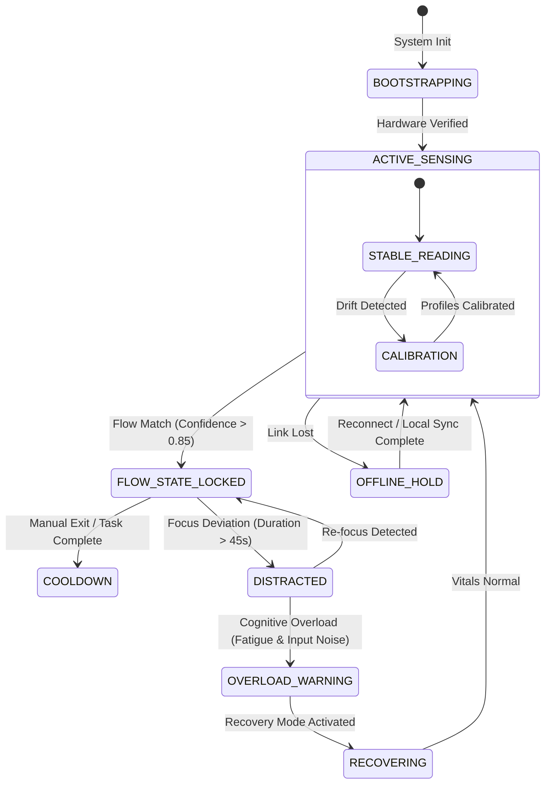
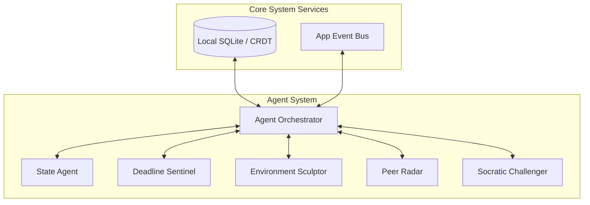

# APEX (Adaptive Presence & Execution Intelligence)
## Product Architecture & Core Systems Specification (Part 1 of 5)

---

## 1. PRODUCT VISION & PHILOSOPHY

### 1.1 The Thesis: Why Productivity Tools Fail Students
Existing student productivity systems—from simple calendar apps to complex workspaces like Notion or Google Calendar—fail because they are built on three flawed assumptions:
1. **Infinite Cognitive Bandwidth:** They assume that a student's capacity to execute is uniform throughout the day. A time block at 9:00 AM after a full night's sleep is treated identically to a time block at 11:30 PM after a six-hour lab session.
2. **Metadata Tracking over State Tracking:** They focus entirely on task metadata (due dates, priority tags, subtask checklists) instead of the user’s real-time cognitive capacity.
3. **High System Administrative Overhead:** They require manual updates. The student must act as the "database administrator" of their own productivity, logging tasks, shifting blocks, and color-coding tags. When cognitive fatigue sets in, the very system designed to help them becomes the first point of failure and is abandoned.

APEX (Adaptive Presence & Execution Intelligence) replaces the passive organizational paradigm with an **active, cognitive operating layer**. Instead of requiring the user to manage their system, APEX dynamically adjusts the digital environment to match the user's current cognitive state.

---

### 1.2 The Cognitive Operating Layer Paradigm
APEX acts as an execution buffer between the user and their operating systems (Windows via Tauri; Android/iOS via Flutter). By continuously modeling the student’s focus, fatigue, and distraction levels, APEX transforms the operating system from a passive launchpad for notifications into an adaptive execution canvas.

```
+--------------------------------------------------------+
|                      USER                              |
+--------------------------------------------------------+
                             │ Biometrics &
                             │ Interactions
                             ▼
+--------------------------------------------------------+
|             APEX COGNITIVE OPERATING LAYER             |
|  - Blocks Distractions      - Adjusts UI Layouts       |
|  - Reroutes Messages        - Injects Active Recall    |
+--------------------------------------------------------+
                             │ Filtered &
                             │ Structured Execution
                             ▼
+--------------------------------------------------------+
|                OPERATING SYSTEM (OS)                   |
+--------------------------------------------------------+
```

---

### 1.3 How APEX Differs from Existing Tools

| Dimension | Traditional Tools (Notion, GCal, Pomodoro) | APEX Cognitive Operating Layer |
| :--- | :--- | :--- |
| **System Interaction** | Passive (requires manual input, checking, and updating). | Active (senses state, morphs UI, and filters environment). |
| **Pacing Model** | Static time-blocking (rigid hours) or fixed Pomodoro intervals. | Dynamic cognitive pacing (extends/contracts blocks based on Flow). |
| **Context Awareness** | Siloed. Doesn't know if you are typing a paper or scrolling YouTube. | Full-context. Correlates window active state with biometrics. |
| **Communication** | Allows all notifications; relies on manual "Do Not Disturb" toggles. | Contextual gatekeeping; intercepts and summarizes chats in real-time. |
| **Learning Support** | Static storage of notes and PDFs. | Socratic Challenger active-recall generation based on active drafts. |

---

### 1.4 The iQOO Ecosystem Advantage
APEX leverages the tight integration of the **iQOO hardware ecosystem** to create a distributed sensor-execution loop:
- **The Sensor Array (iQOO Mobile Device):** Captures high-frequency physical interactions. The phone is positioned on the desk or held in the hand, using its inertial measurement unit (IMU), front-facing camera, and touchscreen digitizer to measure tap latency, hand micro-tremors, gaze stability, and ambient audio environments.
- **The Execution Canvas (iQOO Laptop):** Provides the workspace. APEX running in the desktop shell tracks window switching speed, keystroke intervals, mouse path deviations, and active document state.
- **The iQOO Office Kit Bridge:** A local, low-latency communication protocol that links both devices. By using direct socket connections over Wi-Fi and fallback Bluetooth Low Energy (BLE), the phone and laptop exchange state data at sub-100ms speeds, allowing biometric signals from the phone to instantly modify the desktop UI without cloud round-trips.

---

### 1.5 First Principles Design Decisions
1. **Privacy-Preserving Edge Processing:** High-frequency biometrics (pupillometry, keystroke dynamics, raw voice transcripts) never leave local hardware. Only high-level state classifications and metadata are synchronized.
2. **Friction-Matched Interventions:** If a user is in deep Flow, the UI provides zero interface friction (no prompts, minimal visual layout, dark colors). If the user falls into a Distracted state, the interface scales up visual anchors (yellow accents, window locking, app blocking) to match the distraction level.
3. **No-Config Onboarding:** The system builds its initial cognitive baseline during the first 10 minutes of active use by monitoring standard typing and browsing patterns, avoiding long calibration forms.

---

## 2. PRODUCT ARCHITECTURE

### 2.1 Complete System Architecture

```mermaid
graph TD
    subgraph Sensing Layer (iQOO Mobile - Flutter / Android Native)
        A1[Touch Digitizer - Tap Velocity] --> B1[Phone Edge Sensor Preprocessor]
        A2[IMU Sensor - Micro-Tremor] --> B1
        A3[Camera - Pupil & Gaze] --> B1
        A4[Microphone - Ambient Noise] --> B1
    end

    subgraph Execution Layer (iQOO Laptop - Tauri / Rust / TS)
        C1[Window Monitor - Active App] --> D1[Laptop Edge Preprocessor]
        C2[Keyboard/Mouse Dynamics] --> D1
        C3[Active Chrome/Brave Extension] --> D1
        C4[Tauri Window Manager Shell] --> E1[Environment Sculptor Exec]
    end

    subgraph iQOO Office Kit Bridge (Local Protocol)
        B1 <-->|Sub-100ms UDP / TCP Socket| D1
    end

    subgraph Intelligence Layer (APEX Cloud Engine - FastAPI / Groq)
        D1 <-->|WebSocket State Sync| F1[Agent Orchestrator]
        F1 <--> G1[State Agent]
        F1 <--> G2[Deadline Sentinel]
        F1 <--> G3[Peer Radar]
        F1 <--> G4[Socratic Challenger]
        
        G2 <-->|Integrations| H1[Canvas/Blackboard LMS API]
        G2 <-->|Integrations| H2[Google/Apple Calendar API]
        G3 <-->|Integrations| H3[WhatsApp/Telegram Bridges]
        
        I1[Groq Cloud API Llama-3.3-70b-versatile / Llama-3.1-8b-instant] <--> F1
    end

    E1 <-->|Local Actions: Lock App, Adjust Contrast, Pin Source| D1
```

---

### 2.2 iQOO Office Kit Bridge Protocol Design
The Office Kit Bridge maintains real-time synchronization between the mobile sensor array and the desktop execution environment.

```
+-----------------------------------------------------------------------------------+
| iQOO Mobile                                                           iQOO Laptop |
|                                                                                   |
|  +--------------------+   UDP Broadcast (mDNS Discovery)   +--------------------+  |
|  | mDNS Client        | =================================> | mDNS Server        |  |
|  +--------------------+                                    +--------------------+  |
|            │                                                         │            |
|            ▼                                                         ▼            |
|  +--------------------+      TCP Handshake / TLS 1.3       +--------------------+  |
|  | Local Client Port  | ─────────────────────────────────> | Local Server Port  |  |
|  +--------------------+                                    +--------------------+  |
|            │                                                         │            |
|            ▼                                                         ▼            |
|  +--------------------+  UDP Stream (Biometrics @ 50Hz)    +--------------------+  |
|  | Socket Writer      | ---------------------------------> | Socket Reader      |  |
|  +--------------------+                                    +--------------------+  |
|            │                                                         │            |
|            ▼                                                         ▼            |
|  +--------------------+   TCP Control Channel (Bidirectional) +--------------------+  |
|  | State Sync Agent   | <================================> | State Sync Agent   |  |
|  +--------------------+                                    +--------------------+  |
+-----------------------------------------------------------------------------------+
```

#### 2.2.1 Transport Layer Details
- **Discovery:** mDNS (Multicast DNS) utilizing service name `_apex-bridge._tcp.local.` to discover the laptop on the local network.
- **Biometric Stream (UDP):** Raw telemetry (gyroscope changes, tap latency deltas) is streamed over UDP to port `50051` to minimize overhead. Packets use a lightweight binary payload header:
  ```
  [2 Bytes: Magic Number (0xAPEX)]
  [8 Bytes: Timestamp (Uint64)]
  [1 Byte: Sensor Type (0x01: IMU, 0x02: Tap, 0x03: Gaze)]
  [N Bytes: Floating-point Payload]
  ```
- **Control Channel (TCP):** State changes, environment configuration shifts, and user commands are transmitted via TCP port `50052` encrypted using TLS 1.3 with a pre-shared key (PSK) generated during onboarding.

#### 2.2.2 Fallback and Recovery
- **Local Network Interruption:** If Wi-Fi is lost, the bridge initiates a fallback to Bluetooth Low Energy (BLE) using custom GATT services. The BLE connection reduces transmission frequency from 50Hz to 5Hz to preserve battery and respect bandwidth limitations.
- **Offline Mode:** If both Wi-Fi and BLE connections fail, the mobile device and laptop process biometrics independently. When the bridge is re-established, the laptop acts as the primary clock and reconciles the state log.

---

### 2.3 Data Flow Architecture
The APEX pipeline processes high-frequency interactions into low-frequency execution events:

```
[Raw Sensors: Phone/Laptop] (50Hz)
            │
            ▼
[Edge Preprocessors: Noise Filters & Moving Averages] (10Hz)
            │
            ▼
[Feature Extraction: Tap Latencies, Mouse Path Deviations, Focus Transitions] (1Hz)
            │
            ▼
[State Classifier: Flow / Fatigue / Distraction / Overload Model] (0.2Hz)
            │
            ▼
[Agent Orchestrator: Priority Resolution and Context Routing] (Event-Driven)
            │
            ├──────────────────────────┐
            ▼                          ▼
[Local Environment Modifications]   [Cloud LLM Agents: Summarization /挑战]
(DND, App Blocking, UI Shift)     (Syllabus Parsing, Socratic Challenging)
```

---

### 2.4 Offline-First Architecture with Sync Reconciliation
APEX uses an offline-first data model to ensure that connection losses do not interrupt focus sessions.

#### 2.4.1 Conflict-Free Replicated Data Types (CRDTs)
Tasks, syllabi, notes, and session logs are managed locally as CRDT documents (using Yjs implementation patterns). This allows independent modifications on mobile and desktop while resolving sync issues without data loss.

#### 2.4.2 Local Storage Strategy
- **Laptop (Tauri Shell):** SQLite database stored in the user’s application data folder, managing tasks, calendar events, environmental overrides, and local logs.
- **Mobile (Flutter App):** Hive/SQLite database engine running native bindings.
- **Cloud Sync:** When an internet connection is active, local changes are committed to the cloud PostgreSQL database via a delta synchronization protocol.

```json
{
  "sync_header": {
    "device_id": "iqoo_neo_9_09812",
    "client_logical_clock": 1042,
    "last_sync_timestamp": 1780447200000
  },
  "deltas": [
    {
      "collection": "tasks",
      "operation": "UPDATE",
      "record_id": "task_cs_4400_p1",
      "changes": {
        "status": "COMPLETED",
        "completed_at": 1780447540000
      }
    }
  ]
}
```

---

### 2.5 Edge Computing Strategy

APEX divides computational loads between edge devices and the cloud to protect privacy, reduce latency, and control API costs.

```
+-------------------------------------------------------------------------------+
|                            EDGE (LOCAL DEVICE)                                |
|                                                                               |
|  - Real-Time Sensor Processing  - High-Frequency Tap/Dwell Analytics          |
|  - Pupillometry & Gaze Inference - System-Level Focus Locking & DND           |
+-------------------------------------------------------------------------------+
                                     │
                                     │ Filtered Metadata
                                     ▼
+-------------------------------------------------------------------------------+
|                           CLOUD (APEX CLOUD ENGINE)                           |
|                                                                               |
|  - Syllabus Parsing & OCR        - Complex LLM Socratic Challenge Generation  |
|  - Multi-Channel Chat Summaries - Cross-LMS Calendar Sync                     |
+-------------------------------------------------------------------------------+
```

---

### 2.6 The Event Bus Architecture
The application uses an asynchronous, message-driven event bus to communicate state changes across different parts of the system.

#### 2.6.1 Local Event Types
- `LOCAL_SENSE_IMU_RAW`: Emitted by mobile accelerometer/gyroscope.
- `LOCAL_INTERACTION_KEYSTROKE`: Emitted by desktop system hooks.
- `LOCAL_UI_STATE_CHANGE`: Triggered by active app change on desktop.

#### 2.6.2 Cross-Device Event Types
- `BRIDGE_STATE_UPDATE`: Mobile sensor classification transmitted to laptop.
- `BRIDGE_ACTION_TRIGGER`: Command sent from laptop to lock phone apps.

#### 2.6.3 Sync Event Types
- `CLOUD_SYNC_REQUEST`: Sync handshake init.
- `CLOUD_SYNC_RESOLVED`: Database updates applied.

---

### 2.7 Application Lifecycle State Machine



---

## 3. MULTI-AGENT ORCHESTRATION

### 3.1 Agent System Architecture
APEX coordinates five specialized agents, each managing a specific part of the user's workspace, schedule, and cognitive state.



---

### 3.2 Inter-Agent Communication Protocol
Agents communicate using structured JSON messages sent over the internal event bus.

#### 3.2.1 Message Schema: SENSING_UPDATE
```json
{
  "msg_id": "msg_sensor_0982348",
  "timestamp": 1780447820102,
  "sender": "state_agent",
  "payload": {
    "current_state": "FLOW",
    "confidence": 0.94,
    "metrics": {
      "tap_latency_ms": 112,
      "gaze_drift_ratio": 0.05,
      "window_switches_per_min": 0,
      "ambient_decibels": 42
    }
  }
}
```

#### 3.2.2 Message Schema: GOAL_URGENCY
```json
{
  "msg_id": "msg_urgency_1273912",
  "timestamp": 1780447820105,
  "sender": "deadline_sentinel",
  "payload": {
    "task_id": "task_cs_4400_p1",
    "due_timestamp": 1780476000000,
    "urgency_score": 8.92,
    "risk_score": 0.74,
    "time_buffer_minutes": 45
  }
}
```

#### 3.2.3 Message Schema: SCULPT_EXECUTE
```json
{
  "msg_id": "msg_sculpt_8923472",
  "timestamp": 1780447820110,
  "sender": "environment_sculptor",
  "payload": {
    "action": "LOCK_WORKSPACE",
    "params": {
      "suppress_notifications": true,
      "pin_window_class": "Brave-Browser",
      "allowed_subdomains": ["gatech.instructure.com", "github.com"],
      "phone_dnd_level": "EXTREME"
    }
  }
}
```

#### 3.2.4 Message Schema: RADAR_SUMMARY
```json
{
  "msg_id": "msg_radar_3429384",
  "timestamp": 1780447820115,
  "sender": "peer_radar",
  "payload": {
    "messages_evaluated": 18,
    "urgent_notifications": [
      {
        "source": "WhatsApp",
        "sender": "Lab Partner (Siddharth)",
        "summary": "Project server deployment crashed. Need compilation fix.",
        "relevance_score": 0.95
      }
    ]
  }
}
```

#### 3.2.5 Message Schema: SOCK_CHALLENGE
```json
{
  "msg_id": "msg_challenge_4723984",
  "timestamp": 1780447820120,
  "sender": "socratic_challenger",
  "payload": {
    "target_concept": "MapReduce Data Flow Pattern",
    "challenge_type": "ACTIVE_RECALL",
    "prompt": "Explain why the Shuffle phase in MapReduce cannot start until all Map tasks are complete.",
    "difficulty_level": 4
  }
}
```

---

### 3.3 Priority Resolution Matrix
When multiple agents request contradictory actions, the **Agent Orchestrator** resolves the conflict using a strict hierarchy, prioritizing user state over automation.

| Active Cognitive State | Primary Controlling Agent | Secondary Agent | Suppressed Agents | Resolution Policy |
| :--- | :--- | :--- | :--- | :--- |
| **Flow** | Environment Sculptor | State Agent | Peer Radar, Socratic Challenger | Suppress all external communication and prompts. Inhibit Socratic Challenger prompts unless the user explicitly pauses. |
| **Distracted** | Environment Sculptor | Deadline Sentinel | Socratic Challenger | Escalate environment lockdown (e.g., lock distracting tabs). If deadlines are close, surface Sentinel countdown. |
| **Fatigued** | State Agent | Socratic Challenger | Environment Sculptor | Recommend breaks. Inject light Socratic check-ins to re-engage active memory instead of heavy execution tasks. |
| **Overloaded** | State Agent | Environment Sculptor | All Others | Force recovery layout (dim screen, play low-frequency audio, block all academic work screens for 5 minutes). |

---

### 3.4 The Agent Orchestrator
The Orchestrator acts as the central router of the multi-agent system.
- **Routing Engine:** Evaluates the state and agent outputs every 500ms.
- **Routing Logic:** APEX routes telemetry events locally through a fast pattern-matching rule engine (implemented in Rust within the Tauri shell). If a complex agent conflict occurs (e.g., a high-urgency deadline overlaps with high cognitive fatigue), the orchestrator formats the context and queries the Groq Cloud API using `llama-3.1-8b-instant` for routing decisions, or `llama-3.3-70b-versatile` if the system needs to re-plan the user's daily calendar.

---

### 3.5 Detailed Specification for Each Agent

```
+-----------------------------------------------------------------------------------------------------------------+
|                                              AGENT ARCHITECTURE                                                |
|                                                                                                                 |
|  +--------------------+  +--------------------+  +--------------------+  +--------------------+  +-----------+  |
|  | STATE AGENT        |  | DEADLINE SENTINEL  |  | ENV SCULPTOR       |  | PEER RADAR         |  | SOCRATIC  |  |
|  | Monitors           |  | Tracks Calendars & |  | Manages Desktop &  |  | Intercepts &       |  | CHALLENGER|  |
|  | Biometrics &       |  | LMS Syllabi to     |  | Phone Workspaces;  |  | Summarizes Peer    |  | Generates |  |
|  | Interactions.      |  | Score Urgency.     |  | Suppresses Apps.   |  | Group Messages.    |  | Recall.   |  |
|  +--------------------+  +--------------------+  +--------------------+  +--------------------+  +-----------+  |
+-----------------------------------------------------------------------------------------------------------------+
```

#### 3.5.1 State Agent
The State Agent tracks the user's cognitive state using biometric and interactive telemetry.

##### Inputs Consumed:
- **Keystroke Cadence:** Tracks the timing of key down and key up events.
  - *Dwell Time:* Time a key is held down (measured in milliseconds).
  - *Flight Time:* Delay between releasing a key and pressing the next one (measured in milliseconds).
  - *Error Rate:* Frequency of backspaces and deletes relative to total keystrokes in a rolling 60-second window.
- **App Switching Rate:** Frequency of transitions between system windows. High transitions combined with short dwell times indicates a distracted state.
- **Micro-Tremor Measurement:** Tracks high-frequency, low-amplitude oscillations in the mobile device's accelerometer (IMU) while held or resting on the desk, which can indicate fatigue or caffeine spikes.
- **Ambient Context:** Measures decibel levels and spectral noise patterns using the mobile microphone to identify distracting study environments.
- **Pupillometry & Gaze:** Measures pupil size changes and gaze stability using the front-facing camera during reading or coding blocks.

##### Cognitive State Classification
- **Flow:** High focus. Steady, predictable typing dynamics, low backspace usage, stable gaze, and zero app-switching events outside of allowed workspace applications.
- **Distracted:** Moderate focus. Elevated app-switching rate, increased flight time between keystrokes, and frequent eye gaze deviations away from the laptop screen.
- **Fatigued:** Low energy. Long dwell times, slow overall typing speed, frequent mouse path corrections, and drooping head alignment detected by camera.
- **Overloaded:** Cognitive saturation. High typing error rate, rapid but irregular typing speed, high ambient noise level, and rapid switching between conflicting tasks.

##### Hysteresis and State Transitions
To prevent rapid oscillations between states (e.g., swapping between Flow and Distracted every few seconds), the State Agent uses a double-threshold hysteresis filter:
- A state transition requires a confidence score above `0.80` for at least `45 seconds`.
- Temporary interruptions (e.g., checking a single code file for 15 seconds) do not break the active Flow state classification.

```
        State Confidence
        1.0 ───┬───────────────────────────
               │    ▲
               │    │ Flow State Confirmed
        0.8 ───┼────┼──────────────────────
               │    │ (45s Delay Buffer)
               │    │
        0.5 ───┼────┼──────────────────────
               │    │
               │    ▼ Focus Drop detected
        0.0 ───┴────┴──────────────────────
              0s   30s   45s   60s   90s (Time)
```

---

#### 3.5.2 Deadline Sentinel
The Deadline Sentinel calculates the urgency and risk profiles of upcoming assignments.

##### Integrations:
- CalDAV synchronization engines for personal calendars (Google Calendar, iCloud Calendar).
- LMS REST Integration: Fetches assignment metadata, weightings, and submission endpoints from Canvas and Blackboard.
- PDF Parser: Extracts task structures and dates from uploaded course syllabi using OCR and Groq API formatting.

##### Urgency Scoring Algorithm
Urgency ($U(t)$) is calculated every 10 minutes:

$$U(t) = \frac{W_{weight} \cdot C_{complexity}}{t_{due} - t_{now}} \times e^{\gamma \cdot N_{conflicting}}$$

Where:
- $W_{weight}$: Assignment grade weight as a percentage of the total course grade (e.g., `0.20` for a 20% project).
- $C_{complexity}$: Estimated scale of effort (assigned value: `1` = short quiz, `10` = term paper).
- $t_{due} - t_{now}$: Time remaining in days.
- $N_{conflicting}$: Number of other assignments due within a 48-hour window of $t_{due}$.
- $\gamma$: Weight factor for conflicting deadlines (tuned to `0.15`).

##### Risk Scoring Algorithm
Risk ($R$) represents the probability that the user will fail to complete the task before the deadline:

$$R = 1 - \Phi\left(\frac{t_{avail} - \mu_{est}}{\sigma_{est}}\right)$$

Where:
- $t_{avail}$: Remaining hours available for work before the deadline, adjusted by the user's historical study schedules.
- $\mu_{est}$: Mean expected duration of the task, calculated using historical completion times for similar assignments.
- $\sigma_{est}$: Standard deviation of historical task completion times.
- $\Phi$: Cumulative distribution function (CDF) of the standard normal distribution.

##### Buffer Estimation Model
The estimated task duration ($\mu_{est}$) is adjusted dynamically using the user's cognitive state metrics:

$$\mu_{est} = \mu_{base} \times (1 + \alpha_{fatigue} \cdot F_{score}) \times (1 + \beta_{distract} \cdot D_{score}) \times (1 + \delta_{complexity})$$

Where:
- $F_{score}$ and $D_{score}$ are rolling 7-day average metrics for fatigue and distraction.
- $\alpha_{fatigue}$ and $\beta_{distract}$ scale factors representing task performance degradation (tuned to `0.30` and `0.25`).

---

#### 3.5.3 Environment Sculptor
The Environment Sculptor manages the digital workspace on both the laptop and mobile phone to keep the user focused.

##### Actions (Laptop):
- **Tab Grouping and Hiding:** Automatically hides non-essential tabs in Brave/Chrome and groups active research files.
- **Operating System Focus Override:** Invokes Windows Focus Assist API to block toast notifications.
- **Window Grid Arranger:** Forces a split-screen layout pairing the IDE/editor on the left (65% width) and documentation on the right (35% width).
- **Process Suspend:** Low-level process suspension (renice/suspend commands in Tauri) for resource-heavy applications flagged as distractions (e.g., Steam, Discord, Spotify's visual player).

##### Actions (Mobile):
- **Ambient Screen Overlay:** Displays a dark, low-contrast interface on the phone when the laptop is in Flow mode.
- **Notification Suppression:** Restricts notification alerts to high-priority senders.
- **Application Block:** Displays a warning overlay if blocked applications are launched.

```
+-------------------------------------------------------+
|  APEX ENVIRONMENT SCULPTOR                           |
|                                                       |
|   [!] FOCUS STATE ACTIVE                              |
|   Instagram is blocked during this block.             |
|                                                       |
|   Remaining: 42m                                      |
|                                                       |
|   [ Bypass (5m) ]                [ Lock Session ]     |
+-------------------------------------------------------+
```

##### Permission Model:
- **Autonomous Mode:** Executed without user prompts during Flow (e.g., turning on DND, hiding non-workspace tabs, dimming secondary screens).
- **Prompt-Based Mode:** Triggered during Distracted or Fatigued states (e.g., closing open gaming applications, shifting scheduled blocks, or locking down the workspace).

---

#### 3.5.4 Peer Radar
Peer Radar monitors, filters, and summarizes communication channels to prevent chat notifications from breaking focus.

##### Channel Integrations:
- **Bridges:** Uses local Matrix bridges and API loops to monitor WhatsApp, Discord, Telegram, Slack, and university discussion boards (e.g., Piazza).
- **Classification Pipeline:**
  ```
  [Incoming Message]
         │
         ▼
  [Classifier: Llama-3.1-8b-instant]
         │
         ├─► Social/Banter ──► Suppress & Batch
         ├─► Administrative ─► Log to Inbox
         └─► Project Urgent ─► Check Task Relevance
                                     │
                                     ├─► Match ──► Alert User (High Priority)
                                     └─► Mismatch ► Delay Route
  ```

##### Privacy Architecture:
All message processing uses **local PII masking**. Names, telephone numbers, and email addresses are replaced with anonymous tokens (`[USER_A]`, `[EMAIL_1]`) before message text is sent to cloud LLM summarizers.

---

#### 3.5.5 Socratic Challenger
The Socratic Challenger uses passive data gathering to reinforce learning and evaluate understanding.

##### Operations:
1. **Audio Pipeline:** Transcribes lectures in the background using local Whisper engine models.
2. **Concept Extraction:** Processes notes and transcripts using the cloud-based Groq Cloud Llama-3.3-70b-versatile engine to build a conceptual map of the course material.
3. **Active Recall Challenges:** Generates customized review prompts based on the student's active drafts or notes.

```json
{
  "challenge_profile": {
    "concept": "CAP Theorem",
    "prompt_type": "SOCRATIC_INQUIRY",
    "challenge_text": "You stated in your draft that DynamoDB guarantees consistency. How does it handle network partitions while maintaining availability?",
    "grading_rubric": "User must explain eventual consistency, vector clocks, and read/write quorums."
  }
}
```

---

## 4. REAL-TIME STATE SYSTEM

### 4.1 Signal Acquisition & Preprocessing
The state system processes high-frequency sensor readings into clean telemetry streams.

```
Mobile Accelerometer (50Hz) ──► Low-Pass Butterworth Filter ──► Micro-Tremor Features (1Hz)
Keystroke Timings (Event)    ──► Outlier Rejection Filter      ──► Dwell/Flight Ratios (0.2Hz)
Camera Frame (30fps)        ──► FaceMesh & Pupil Tracker       ──► Gaze Direction Features (1Hz)
```

- **Butterworth Filter:** Removes high-frequency noise from IMU readings.
- **Outlier Rejection:** Discards keyboard timings longer than `3000ms` (which represent natural pauses) to avoid skewing moving averages.

---

### 4.2 Feature Extraction Specification
The following variables are calculated across a rolling 180-second window:
- $F_{typ}$: Typing cadence speed (words per minute).
- $D_{dwl}$: Dwell variance (standard deviation of key down durations).
- $W_{swi}$: Window switch frequency (switches per minute).
- $E_{err}$: Error ratio (ratio of deletions to total characters typed).
- $G_{drift}$: Gaze drift ratio (percentage of camera frames where gaze deviates from the screen boundary).

---

### 4.3 State-Driven System Behavior Matrix
When a state is confirmed, the digital environment changes automatically based on the following configurations:

| Parameter | Flow State | Distracted State | Fatigued State | Overloaded State |
| :--- | :--- | :--- | :--- | :--- |
| **Accent Hue** | #FFD400 (Solid) | #FFD400 (Flashing) | #00D26A (Calm Green) | #FF4D4F (Warm Amber) |
| **UI Motion Scale** | `0.0` (Animations off) | `0.4` (Minimal spring) | `1.0` (Standard ease) | `1.5` (Slow transitions) |
| **Notification Level** | Extreme Suppression | Dynamic Blocking | Digest Summary | Block All Workspace Screens |
| **Font Rendering** | High Contrast Mode | Normal Contrast | Large Font Size | Clean Sans-Serif Layout |
| **DND Mode** | Activated (High) | Activated (Standard) | Disabled (Manual Only) | Activated (All Sources) |
| **Brave Tab Mask** | Enable focus tabs only | Mask non-academic tabs | Suggest study guides | Hide main work windows |
| **Speaker Output** | Low-noise Pink Noise | Focus Audio Loop | Low-tempo instrumental | Guided Breathing Track |

---

### 4.4 Calibration Wizard & Personalization
The baseline for cognitive tracking is calibrated through a 4-step interactive wizard during first-time onboarding:
1. **Focus Baseline (2 min):** The user types a technical document or notes. The system logs baseline key dwell/flight averages.
2. **Fatigue Simulation (1 min):** The user types a text sequence with artificial delays to calibrate sluggish muscle behavior models.
3. **Distraction Baseline (1 min):** The user is asked to alternate typing with searching for specific details online to baseline focus transitions.
4. **Environment Audit (1 min):** The system calibrates ambient decibel thresholds and camera gaze coordinates relative to the screen.

---

## 5. USER JOURNEYS

```
+---------------------------------------------------------------------------------------------------+
| USER JOURNEYS                                                                                     |
|                                                                                                   |
|  1. Onboarding & Cal  2. Fatigue Detection  3. Deadline Crisis  4. Collab (Peer Radar)            |
|  5. Research (Socrat) 6. Recovery           7. Phone Handoff    8. Emergency Override             |
+---------------------------------------------------------------------------------------------------+
```

### 5.1 Journey 1: First-Time Onboarding & Calibration
- **User:** Maya, 1st-year biology student.
- **Context:** Opening the APEX application for the first time on an iQOO Neo 9 phone and iQOO laptop.
- **Step-by-Step Flow:**
  1. Maya installs the APEX desktop application and launches the mobile companion app.
  2. The mobile app automatically detects the laptop via mDNS over local Wi-Fi.
  3. Maya verifies connection with a secure 6-digit confirmation pin.
  4. The onboarding wizard starts the 5-minute calibration cycle.
  5. APEX prompts Maya to read an article while the front camera maps eye gaze boundaries.
  6. The system prompts Maya to transcribe a scientific text to baseline her typing dynamics.
  7. The calibration wizard writes the baseline profile to her local SQLite database.
- **Agent Actions:**
  - *State Agent:* Establishes sensor baseline values ($D_{dwl} = 74\text{ms}$, typing speed $F_{typ} = 65\text{WPM}$).
- **Failure Case / Exception Handling:** If the local Wi-Fi network blocks mDNS discovery, the desktop application displays a fallback QR code containing the laptop's direct IP address, allowing the phone to connect manually.

---

### 5.2 Journey 2: Deep Work Session & Cognitive Fatigue Detection
- **User:** Siddharth, 3rd-year CS major.
- **Context:** Working on a compiler engineering assignment for four hours.
- **Step-by-Step Flow:**
  1. Siddharth starts a work block by opening VS Code on his iQOO laptop.
  2. APEX enters **Flow State** as typing patterns stabilize.
  3. The laptop and phone screens dim secondary UI elements, and notifications are held.
  4. After 2.5 hours of continuous typing, Siddharth's dwell time increases, and his error rate climbs.
  5. The front camera detects a downward head shift and slower gaze adjustments.
  6. APEX identifies the transition from **Flow** to **Fatigued**.
  7. The system displays a subtle green notification recommending a 10-minute break.
- **Agent Actions:**
  - *State Agent:* Signals fatigue state transition (confidence = 0.88).
  - *Environment Sculptor:* Restores screen brightness, scales animations to smooth curves, and turns off app blocking.
- **Failure Case / Exception Handling:** If Siddharth ignores the break prompt and continues typing, APEX disables autonomous adjustments and remains in passive sensing mode to prevent interface frustration.

---

### 5.3 Journey 3: Deadline Crisis with Converging Assignments
- **User:** Sarah, 2nd-year engineering major.
- **Context:** A physics lab report is due in 3 hours, and a calculus homework set is due in 5 hours.
- **Step-by-Step Flow:**
  1. Sarah logs into her computer in a state of high anxiety.
  2. APEX detects high typing speeds, frequent spelling corrections, and rapid window switches.
  3. The Deadline Sentinel calculates the urgency score of both tasks.
  4. APEX runs an optimization loop and determines that completing the physics report requires all remaining time.
  5. The Environment Sculptor locks down Sarah's environment: all non-physics research tabs are hidden, and the calculus assignment is temporarily archived.
  6. A countdown timer is pinned to the corner of the screen.
- **Agent Actions:**
  - *Deadline Sentinel:* Signals high urgency ($U(t) = 9.8$).
  - *Environment Sculptor:* Suspends social media and entertainment processes.
- **Failure Case / Exception Handling:** If Sarah tries to force open an excluded tool (e.g., Discord) to contact a classmate, APEX prompts her to confirm the action. If approved, the app is opened in a side panel with a 5-minute timer.

---

### 5.4 Journey 4: Collaborative Project with Peer Radar Active
- **User:** Marcus, 4th-year design major.
- **Context:** Working on a final project prototype while coordinates are changing via group chat.
- **Step-by-Step Flow:**
  1. Marcus is focused on Figma (Flow state active).
  2. His group project members are sending messages in Discord.
  3. Peer Radar intercepts these incoming notifications, suppressing alerts for general chat while monitoring for relevant project updates.
  4. A group member sends a message containing an updated design asset link: *"Here is the new wireframe link: figmaspec.com/final."*
  5. Peer Radar identifies this message as relevant to Marcus's current task.
  6. APEX displays a high-priority notification with a summary: *"Siddharth sent a new design spec link."*
- **Agent Actions:**
  - *Peer Radar:* Evaluates and flags the message (relevance score = 0.94).
  - *Environment Sculptor:* Delivers the specific notification while keeping other social feeds blocked.
- **Failure Case / Exception Handling:** If Peer Radar loses internet access, it falls back to caching incoming SMS and local messages on the mobile device, displaying them in a combined list once connection is restored.

---

### 5.5 Journey 5: Research Session with Socratic Challenger
- **User:** Elena, Graduate Biology Student.
- **Context:** Reviewing research articles for a literature review.
- **Step-by-Step Flow:**
  1. Elena opens a PDF document in Brave and reads the text.
  2. The Socratic Challenger extracts key concepts (e.g., *"CRISPR-Cas9 Off-Target Effects"*).
  3. Once Elena finishes reading and begins drafting a notes summary, the Challenger generates an inline question.
  4. A Socratic panel slides out: *"How does the author propose reducing off-target cleavage events?"*
  5. Elena types her response into the panel.
  6. The Challenger reviews her answer against the PDF source text and provides feedback.
- **Agent Actions:**
  - *Socratic Challenger:* Extracts concepts and displays active-recall challenges.
- **Failure Case / Exception Handling:** If Elena struggles to answer, the Challenger adjusts the difficulty down, providing hints and links to the relevant sections in the source document.

---

### 5.6 Journey 6: Recovery from Cognitive Overload
- **User:** Julian, 1st-year math major.
- **Context:** Working for 6 hours straight; sensor inputs indicate cognitive exhaustion.
- **Step-by-Step Flow:**
  1. Julian’s keystrokes show high error rates ($E_{err} = 0.32$), slow speeds, and constant window switching.
  2. APEX classifies his state as **Overloaded**.
  3. The laptop screen dims, and the active workspace is replaced by a calm interface overlay.
  4. The phone speaker plays a low-tempo pink noise track to help him unwind.
  5. The system displays a screen message: *"Take a step back. Your focus is dropping. Let's take a 5-minute break."*
  6. The system locks out work-related applications for 5 minutes.
- **Agent Actions:**
  - *State Agent:* Triggers overload classification (confidence = 0.91).
  - *Environment Sculptor:* Activates recovery overlay and suspends work tools.
- **Failure Case / Exception Handling:** Julian can bypass the lockout screen by holding the ESC key for 5 seconds, allowing him to resume work in emergency situations.

---

### 5.7 Journey 7: Phone-to-Laptop Handoff Mid-Task
- **User:** Kenji, 3rd-year chemistry major.
- **Context:** Reading a chemistry research paper on his phone while traveling, then continuing on his laptop at home.
- **Step-by-Step Flow:**
  1. Kenji reads a paper using the APEX mobile PDF viewer while traveling.
  2. The mobile app tracks his reading position and notes key concepts.
  3. When Kenji arrives home and opens his laptop, the devices connect via the Office Kit Bridge.
  4. The desktop app displays a notification: *"Resume reading ChemPaper_Review.pdf?"*
  5. Kenji clicks the notification, and the document opens to the exact page and paragraph he was reading on his phone.
- **Agent Actions:**
  - *State Agent:* Syncs session state and reading position via the bridge protocol.
- **Failure Case / Exception Handling:** If the local bridge cannot connect, the session state is synchronized through the cloud database over cellular data.

---

### 5.8 Journey 8: Emergency Mode Activation
- **User:** Anita, final-year engineering student.
- **Context:** A system-critical project demo is due in 30 minutes, and the deployment is failing.
- **Step-by-Step Flow:**
  1. Anita hits a keyboard shortcut (`Ctrl + Win + Alt + E`) to activate **Emergency Mode**.
  2. The system overrides all automatic fatigue and break suggestions.
  3. All non-relevant apps are closed, and maximum processing priority is assigned to terminal and IDE tasks.
  4. The phone switches to a high-contrast console mode, displaying error logs and server statuses.
  5. APEX blocks all notifications except for direct messages from team members.
- **Agent Actions:**
  - *Orchestrator:* Locks the workspace into maximum execution mode.
- **Failure Case / Exception Handling:** Emergency Mode automatically turns off after 90 minutes to prevent user exhaustion.

---

## 6. NOTIFICATION SYSTEM

### 6.1 Priority Levels & Visual Treatment

APEX uses four distinct visual treatments for notifications, matching the user's focus level.

```
[Level 1: CRITICAL] ──► Full-Overlay Modal (Red Border, Screen Lock)
[Level 2: HIGH]     ──► Floating Toast Alert (Yellow Outline, Pulsing)
[Level 3: MEDIUM]   ──► Slide-In Panel (Gray Background, No sound)
[Level 4: LOW]      ──► Cached in Focus Digest (Silent Sync)
```

1. **Level 1: Critical (System Alert / Emergency)**
   - *Visual Treatment:* A full-screen dialog box with a red (#FF4D4F) border.
   - *Animation:* A sharp fade-in with a scale spring effect (`0.05s`).
   - *Behavior:* Interrupts all applications. Requires manual confirmation to dismiss.
2. **Level 2: High (Urgent Team Message / Calendar Event)**
   - *Visual Treatment:* A compact notification box with a yellow (#FFD400) border.
   - *Animation:* Slides in from the top right over `0.25s`.
   - *Behavior:* Stays visible for 10 seconds before minimizing to the notification drawer.
3. **Level 3: Medium (Task Update / Class Notification)**
   - *Visual Treatment:* A standard notification card in dark gray (#121212) with white text.
   - *Behavior:* Stays silent and appears briefly in the corner of the screen.
4. **Level 4: Low (System Status / Digest Updates)**
   - *Visual Treatment:* Hidden from the main workspace. Added directly to the focus log.

---

### 6.2 Cognitive State-Aware Notification Filtering

The system filters notifications dynamically based on the user's active state:

```
                  [Incoming Notification]
                             │
                             ▼
                    Active State Check?
                             │
     ┌───────────────┼───────────────┬───────────────┐
     ▼               ▼               ▼               ▼
   [Flow]       [Distracted]     [Fatigued]     [Overloaded]
     │               │               │               │
  Block L2-L4    Filter Social   Allow Updates   Block L2-L4
  Deliver L1     Deliver L1-L2   Show Digests    Deliver L1
```

---

### 6.3 Notification Batching & Focus Digests
Notifications that are suppressed during work sessions are organized into a **Focus Digest**.
- **Delivery Timing:** Delivered during natural work breaks or when focus state drops.
- **Summary Format:** Grouped by category (e.g., WhatsApp, Discord) and summarized using bullet points.

---

### 6.4 Cross-Device Notification Synchronization
- **Mirroring:** When the Office Kit Bridge is connected, notification states sync between devices in real-time.
- **Dismissal:** Dismissing a notification on the laptop automatically clears it from the phone.

---

### 6.5 Sound Design & Haptic Patterns
- **Audio Cues:** Uses clean, non-distracting tones (432Hz sine-wave sweeps) instead of sharp system beeps.
- **Phone Haptics:** Custom vibration profiles using the mobile device's linear haptic motor:
  - *Critical:* Three short, high-frequency pulses (`120ms` duration, `50ms` gap).
  - *High:* Two medium-frequency pulses (`200ms` duration, `100ms` gap).
  - *Normal:* One soft, low-frequency rumble (`150ms`).

---

### 6.6 Do Not Disturb (DND) Integration & Override Conditions
- **System Sync:** APEX synchronizes its state with the host operating system's DND settings (Windows Focus Assist / Android DND).
- **Override Whitelist:** Users can configure emergency override lists (e.g., parents, lab partners, system alarms) that bypass all filters.

---

## 7. AI INTERACTION PATTERNS

### 7.1 Tone & Voice Guidelines per Cognitive State
The APEX AI assistant adapts its tone to match the user's mental energy:
- **Flow State:** Concise and objective. Direct information with no conversational filler.
- **Distracted State:** Direct and encouraging. Focuses on redirecting attention to active goals.
- **Fatigued State:** Calm and supportive. Suggests breaks and uses simplified language.
- **Overloaded State:** Calm and direct. Focuses on breathing exercises or short, actionable recovery steps.

---

### 7.2 Proactive vs Reactive Interaction Triggers
- **Proactive Interventions:** Triggered automatically by state transitions (e.g., offering a summary of group updates when detecting fatigue).
- **Reactive Queries:** Triggered directly by the user via keyboard shortcuts or the command palette.

---

### 7.3 AI Explanation & Transparency Framework
Users can inspect APEX's decisions at any time. Clicking an automated adjustment option opens an explanation panel:

```
+-------------------------------------------------------+
|  APEX SYSTEM INSIGHT                                  |
|                                                       |
|   "Why did APEX block Discord?"                       |
|                                                       |
|   - Real-time distraction score reached 84%.          |
|   - Window switching rate exceeded 12 switches/min.   |
|   - Your physics report is due in 2 hours.            |
|                                                       |
|   [ Temporarily Unblock (5m) ]     [ Adjust Rule ]    |
+-------------------------------------------------------+
```

---

### 7.4 User Override & Correction Mechanisms
- **Undo Gesture (Phone):** Shake the phone within 3 seconds of an automatic change to revert it.
- **Cancel Shortcut (Laptop):** Press `Esc` twice to undo the latest workspace adjustment.
- **Profile Calibration Tuning:** Users can flag false state classifications to update the local ML model.

---

### 7.5 Conversation Memory & Context Retention
- **Session History:** APEX maintains an active short-term memory (storing active files, browser tabs, and recent questions) to keep responses relevant to current tasks.
- **Long-Term Memory:** Stores general user preferences, peak productivity hours, and common distraction targets while keeping all data local.

---

## 8. INFORMATION ARCHITECTURE

### 8.1 Desktop Navigation Model (Tauri Shell)
The desktop application is built with a minimalist sidebar layout optimized for keyboard-driven navigation:

```
+-------------------------------------------------------------------------------+
| ( ) ( ) ( )  APEX Desktop                                                     |
| +---+-----------------------------------------------------------------------+ |
| | A | [Focus Session] - Active: Calculus Homework                           | |
| | P | Status: FLOW (Confidence: 94%)                                        | |
| | E |                                                                       | |
| | X | > Tasks                                                               | |
| |---+   [ ] Complete Physics Lab Report (Due in 3 hours)                     | |
| |   |   [ ] Calculus HW Set 4 (Due in 5 hours)                              | |
| | T |                                                                       | |
| | D | > Environment Controls                                                | |
| | C |   [x] Focus Assist (Active)                                           | |
| | S |   [x] Suppress Notifications                                          | |
| +---+-----------------------------------------------------------------------+ |
+-------------------------------------------------------------------------------+
```

- **A (APEX Home):** Central cockpit showing active cognitive state, current task, and quick-toggle options.
- **T (Tasks & Deadlines):** Detail view of assignments, due dates, and Sentinel risk metrics.
- **D (Diagnostics & Analytics):** Visualizes focus trends, fatigue baselines, and distraction hot spots.
- **C (Calibration Hub):** Wizard controls for testing sensor profiles and adjusting device link settings.
- **S (Settings):** API connection management, privacy rules, and custom application filters.

---

### 8.2 Command Palette Design (Raycast-Inspired)
Pressing `Alt + Space` opens a clean command palette overlay centered on the screen.

```
+-------------------------------------------------------------------------------+
|  Type a command or search tasks... (Alt + Space)                              |
+-------------------------------------------------------------------------------+
|  Commands:                                                                    |
|  ⚡ Start Focus Block (50 min)                                                 |
|  ⚡ Toggle Emergency Mode                                                      |
|  📂 Open Active Syllabus                                                       |
|                                                                               |
|  Tasks:                                                                       |
|  [ ] Physics Lab Report (Urgency: 9.8)                                        |
|  [ ] Calculus HW Set (Urgency: 7.2)                                           |
+-------------------------------------------------------------------------------+
```

The palette supports full fuzzy matching and executes commands locally.

#### 3.2.1 Command Schema Configuration
```json
{
  "commands": [
    {
      "id": "start_focus_block",
      "title": "Start Focus Block",
      "subtitle": "Locks down workspace for deep work",
      "shortcut": "Alt + F",
      "action_type": "LOCAL_EVENT",
      "payload": {
        "event": "FOCUS_BLOCK_START",
        "duration_minutes": 50
      }
    },
    {
      "id": "toggle_emergency",
      "title": "Toggle Emergency Mode",
      "subtitle": "Overrides normal notifications and limits distractions",
      "shortcut": "Ctrl + Win + Alt + E",
      "action_type": "CROSS_DEVICE_EVENT",
      "payload": {
        "event": "EMERGENCY_MODE_TOGGLE"
      }
    }
  ]
}
```

---

### 8.3 Keyboard Shortcut System & Deep Linking

#### 8.3.1 System Keyboard Shortcuts
- `Alt + Space`: Toggle Command Palette.
- `Alt + Shift + K`: Toggle Mobile Connection Status.
- `Alt + Esc`: Clear active notifications and alerts.
- `Ctrl + Win + Alt + E`: Toggle Emergency Mode.

#### 8.3.2 Deep Linking Format
The system uses the custom `apex://` protocol scheme for quick cross-device navigation:
- `apex://task/{id}`: Opens details for a specific task.
- `apex://state/flow`: Switches the application view to the focus dashboard.
- `apex://calibration/wizard`: Launches the calibration process.
- `apex://bridge/pair?key={token}`: Connects a mobile device with the laptop using a pairing key.
