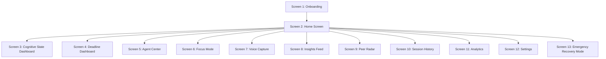
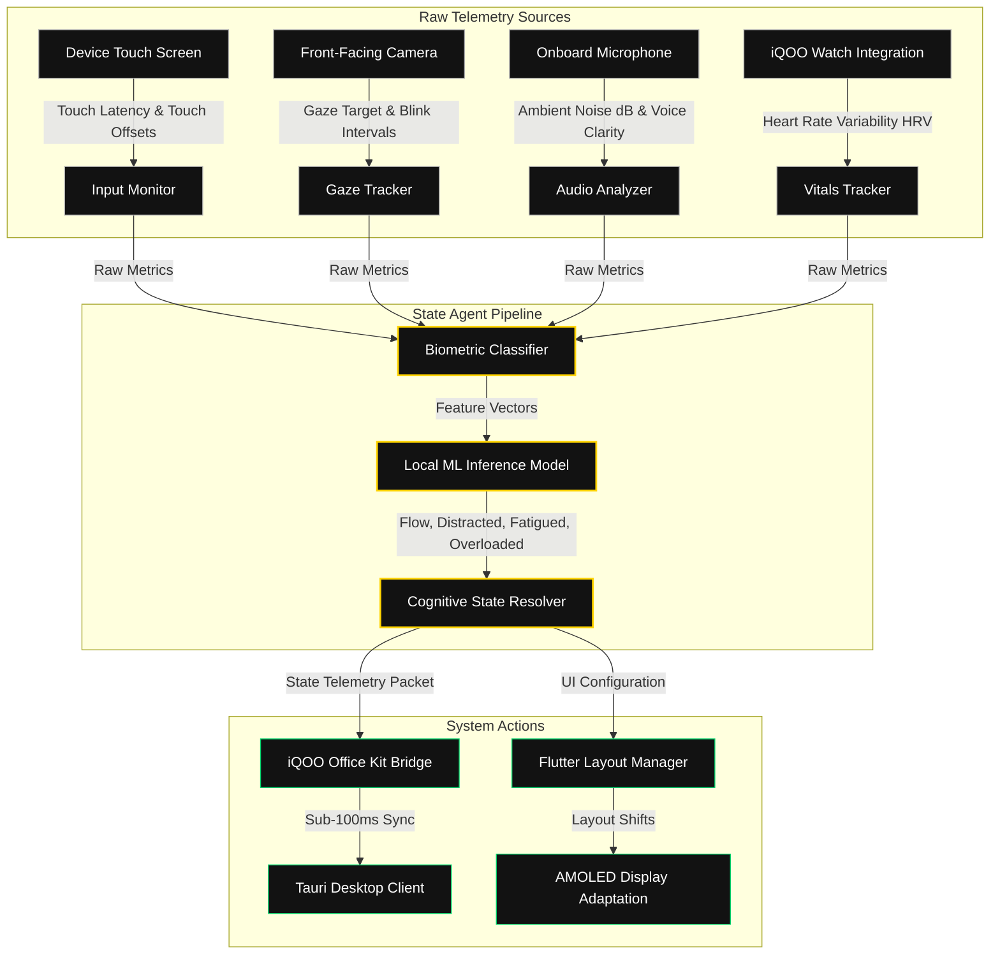

# APEX (Adaptive Presence & Execution Intelligence)
## Mobile Application Specification — Part 2 of 5
**Target Platform:** Android (iQOO Flagship Devices, 6.7" AMOLED, 120Hz Refresh Rate, 19.8:9 Aspect Ratio)  
**Development Framework:** Flutter (Dart)  
**Document Status:** Production-Ready Specification  

---

## 1. GLOBAL SYSTEM SPECIFICATIONS & DESIGN SYSTEM

### 1.1 UI Color Tokens
Designed specifically for AMOLED displays to maximize contrast ratios (8,000,000:1), reduce screen battery consumption, and minimize visual fatigue during late-night study sessions.

| Token | Hex Value | Flutter Color | Role |
| :--- | :--- | :--- | :--- |
| **Primary Background** | `#0A0A0A` | `Color(0xFF0A0A0A)` | Screen canvas, deep black to disable AMOLED pixels |
| **Secondary Background** | `#121212` | `Color(0xFF121212)` | Cards, panels, sheets, elevation overlays |
| **Accent Yellow** | `#FFD400` | `Color(0xFFFFD400)` | Active focus, primary brand elements, interactive controls |
| **Text Primary** | `#FFFFFF` | `Color(0xFFFFFFFF)` | Headers, primary titles, critical labels |
| **Text Secondary** | `#B0B0B0` | `Color(0xFFB0B0B0)` | Body text, disabled labels, timestamps, metadata |
| **Success Green** | `#00D26A` | `Color(0xFF00D26A)` | Flow state, completed items, positive safety scores |
| **Warning Orange** | `#FFB800` | `Color(0xFFFFB800)` | Distracted state, moderate deadline risk, snooze actions |
| **Error Red** | `#FF4D4F` | `Color(0xFFFF4D4F)` | Overloaded state, high deadline risk, emergency recovery |

### 1.2 Typography Hierarchy
- **Primary Display Font:** `Plus Jakarta Sans` (PJS) — optimized for high-readability UI grids.
- **Monospace Font:** `JetBrains Mono` (JBM) — reserved for telemetry stats, scores, countdown timers, and data displays.

| Token | Family | Weight | Size (dp) | Line Height | Case | Usage |
| :--- | :--- | :--- | :--- | :--- | :--- | :--- |
| **Display Large** | PJS | 700 (Bold) | 32dp | 1.2 | Normal | Welcome Screen / Onboarding Headers |
| **Heading 1** | PJS | 700 (Bold) | 24dp | 1.3 | Normal | Primary Screen Headers |
| **Heading 2** | PJS | 600 (SemiBold) | 20dp | 1.3 | Normal | Card Headers, Section Headings |
| **Body Large** | PJS | 500 (Medium) | 16dp | 1.4 | Normal | Main paragraphs, input fields |
| **Body Regular** | PJS | 400 (Regular) | 14dp | 1.4 | Normal | Secondary text, details |
| **Mono Timer** | JBM | 700 (Bold) | 48dp | 1.0 | Normal | Active Focus Clock, Countdown timers |
| **Mono Metrics** | JBM | 500 (Medium) | 12dp | 1.1 | Upper | Sensor outputs, cognitive scores |

### 1.3 AMOLED & 120Hz Performance Guidelines
1. **AMOLED Power Saving:** Keep pure black `#000000` (disabled pixels) on 100% of background surfaces that do not require visual containment. Use `#121212` for containers with thin 1dp `#262626` borders.
2. **Animation Frame Rates:** All Flutter animations must run at 120fps on iQOO hardware. Use `ImplicitlyAnimatedWidget` or custom `AnimationController` instances bound to `VSyncProvider`. Avoid heavy drop shadows; use clean solid borders instead.
3. **Sensor-Driven Layout Adaptation:** Layout spatial constraints, padding, and interactive block sizes shift automatically based on the user's current cognitive state (Flow, Distracted, Fatigued, Overloaded) as detailed in Section 2.

---

## 2. SCREEN-BY-SCREEN SPECIFICATIONS



---

### SCREEN 1: ONBOARDING

#### 1. Purpose
Guides new users through application initialization, establishes a cognitive baseline via sensor checks and tests, grants mandatory OS-level permissions, and configures the 5-agent system.

#### 2. Flow & Spatial Layout (5-Step Stepper Flow)
A multi-step container utilizing a horizontal `PageView` (physics disabled to prevent skipping pages without input completion) wrapped in a Scaffold with a bottom progress indicator bar.

```
+------------------------------------------+
|  [Step Indicator: 1 of 5]  [Skip Link]   |
+------------------------------------------+
|                                          |
|                                          |
|            [DYNAMIC PAGE AREA]           |
|                                          |
|                                          |
+------------------------------------------+
|  [Back Button]            [CTA Button]   |
+------------------------------------------+
```

##### Step 1: Welcome Screen
*   **Visual Design:** Deep black background `#000000`. In the center, a 180dp x 180dp vector logo placeholder that contains a dynamic SVG representation of a morphing cognitive wave.
*   **Logo Reveal Animation (Frame-by-Frame, 120Hz):**
    *   **0ms - 200ms:** SVG stroke path drawing (`stroke-dashoffset` animates from 100% to 0% using `Curves.easeOutCubic`).
    *   **200ms - 600ms:** Pulse of `#FFD400` radial glow behind the logo (opacity transitions from 0.0 to 0.45; radius expands from 40dp to 120dp).
    *   **600ms - 1000ms:** Outer rings expand outwards, fading to 0% opacity.
*   **Typography:** Title: "APEX" in Display Large (Bold, 32dp), color `#FFFFFF`. Tagline: "Your Cognitive Operating Layer" in Body Large (Medium, 16dp), color `#B0B0B0`.
*   **CTA:** A full-width primary button (height: 56dp, color `#FFD400`, text "INITIALIZE BRIDGE" in PJS Bold 16dp, text color `#0A0A0A`).

##### Step 2: Identity Setup
*   **Layout:** Vertical column structure with 24dp padding on all sides.
*   **University Input:** Auto-complete text field (height: 60dp). Standard border: 1dp `#262626` color. Highlighted active border: 1.5dp `#FFD400` color. The field auto-suggests options in an overlay list (height: 180dp max, rounded edges `borderRadius: BorderRadius.circular(8)`, overlay background `#121212`).
*   **Course/Major Selection:** Interactive flow chip panel. Chips are sized 40dp in height, with `#121212` backgrounds and `#B0B0B0` labels when inactive. Upon tap, chips transition to `#FFD400` border, `#FFFFFF` text, and play a 100ms haptic tap (light feedback).
*   **Schedule Import:** A drag-and-drop or select box styled container (120dp height) with a dashed border pattern (dash length: 6dp, space: 4dp, color: `#B0B0B0`). Contains text: "Import .ICS or Sync Canvas Academic Calendar" in PJS Body Regular.

##### Step 3: Permission System
*   **Design:** A vertical stack of 6 permission cards (each 72dp tall, `#121212` background, 1dp border `#262626`).
    
    | Permission Card | Sourced Signals | Degraded UX behavior if denied |
    | :--- | :--- | :--- |
    | **Accessibility** | Tracking keystroke rates, app transitions, screen context | State Agent cannot detect app distraction patterns; Environment Sculptor cannot auto-minimize distractive apps. |
    | **Notifications** | Alerts, Agent alerts, Sentinel risk nudges | Critical system interventions and Socratic Challenger prompts will be delayed to manual app launches. |
    | **Calendar** | Deadline monitoring, course events | Deadline Sentinel cannot calculate risk factors or buffer zones; auto-schedule import fails. |
    | **Microphone** | Voice capture, room noise decibels (ambient tension) | Voice Capture feature disabled. State Agent cannot estimate environmental audio strain. |
    | **Usage Stats** | Detailed tracking of screen-on duration, app focus timings | No automated context cards for app usage; analytics displays blank data for execution time. |
    | **Battery Exemption** | Keeps background sync, agent calculations running | The iQOO Office Kit bridge will suffer from disconnects and latency increases exceeding 1500ms. |

*   **Card UI Layout:** Left side shows permission icon (24dp, color `#B0B0B0`), middle shows title and helper text, right side contains a custom switch (width: 48dp, height: 26dp, thumb color `#FFFFFF`, track color transitions from `#262626` when off to `#00D26A` when on).
*   **Skip vs Grant Path:** "Skip All" text link at the top-right. Tapping this triggers a Warning Dialog: "Without these links, APEX operates in Offline Companion Mode only. Proceed?" (Options: "Proceed anyway" in `#FF4D4F`, "Grant Access" in `#FFD400`).

##### Step 4: Calibration (3-Minute Baseline Exercise)
A crucial sequence designed to initialize the State Agent's machine learning classifiers. Requires uninterrupted execution.
*   **Layout:** Full-screen modal with a top linear progress bar (height: 4dp, color `#262626`, filled with `#FFD400` based on percentage of completion).
*   **Test 1 (60s): Typing Dynamics:** A text box displays a random passage. The user must type it into an input field below. Measures Keystroke Latency Variance and typing rhythm.
*   **Test 2 (60s): Reading Retention:** User reads a short paragraph (200 words). The screen tracks the scroll velocity and pauses. A 3-question multiple-choice quiz follows to measure cognitive retention.
*   **Test 3 (60s): Saccadic Reaction:** Circles appear in random positions on the AMOLED screen (color `#FFD400`, size 40dp). The user must tap them as fast as possible. Measures reaction latencies and touch accuracy offsets.
*   **Baseline Outputs:** System creates a profile containing: Normal WPM, reading rate (words/min), mean reaction speed (ms), and typing flight time variance.

##### Step 5: Agent Introduction
*   **Layout:** Horizontal swipe card deck. Each card represents one of the 5 agents (State Agent, Deadline Sentinel, Environment Sculptor, Peer Radar, Socratic Challenger).
*   **Design:** Card size: 300dp height, 260dp width.
*   **Avatar Visualization:** At the top of each card, a custom Lottie vector loop (color `#FFD400`) animations tailored to the agent's theme (e.g., a shifting pendulum for Deadline Sentinel, a pulsating geometric crystalline shape for Socratic Challenger).
*   **Interaction:** Tapping "Test Drive Agent" launches a mini-conversation simulator overlay (height: 200dp) showcasing a mock output.
*   **Priority Config:** Slider widget at the bottom of each card (values: 1-5, representing execution priority ranking).

---

#### 3. Interactions & Animations (Onboarding)
*   **Page Transitions:** Swiping left/right is disabled. Movement between onboarding steps is animated via `PageController.animateToPage` with a duration of `450ms` using `Curves.easeInOutCubic`.
*   **Haptics:** Button presses use a medium haptic tap. Permission switch toggles trigger a light double-tap sensation.
*   **Edge Cases:** If a user denies a critical permission (Accessibility), the Next button displays a warning tooltip: "Accessibility permission missing. State Agent will operate in limited mode."

---

### SCREEN 2: HOME SCREEN

#### 1. Purpose
The central operational dashboard for the APEX ecosystem. Provides real-time visibility into the student's cognitive state, active context items, and quick action nodes.

#### 2. Layout Architecture & Spatial Relationships
*   **Screen Constraints:** 6.7" vertical viewport.
*   **Header Section (Height: 80dp):** System status, time, and active sync status badge representing the connection to the iQOO Office Kit bridge (shows latency in `ms`).
*   **Hero Section (Height: 220dp):** Dynamic Cognitive State Card.
*   **Middle Section (Dynamic height, typically 320dp):** Scrollable stack of Active Context Cards.
*   **Quick Action Floating Bar (Height: 56dp):** Placed exactly 24dp above the bottom navigation bar.
*   **Bottom Navigation Bar (Height: 72dp):** Fixed at the bottom of the viewport.

```
+------------------------------------------+
| [Profile]      [APEX Active]   [Bridge]  |
+------------------------------------------+
|                                          |
|         COGNITIVE STATE CARD             |
|                                          |
+------------------------------------------+
|  CONTEXT CARDS (Scrollable)              |
|  - Task A                                |
|  - Agent Notification                    |
+------------------------------------------+
|  [Focus]  [Voice]  [Summon]  [QuickTask] |
+------------------------------------------+
|  [Home]  [Deadlines] [Agents] [Insights] |
+------------------------------------------+
```

#### 3. Component Details & Visual Styling

##### Cognitive State Card (Hero)
*   **Dimensions:** Width: Full screen minus 32dp margins. Height: 200dp. Radius: 16dp.
*   **Background Canvas:** Animated shader grid that adapts color dynamically:
    *   **Flow:** Deep emerald backdrop `#0A1C12` with glowing neon green lines `#00D26A`.
    *   **Distracted:** Muted amber-brown `#1C160A` with pulsing gold rings `#FFB800`.
    *   **Fatigued:** Steel-gray/blue `#10141A` with slow breathing indicators `#B0B0B0`.
    *   **Overloaded:** Crimson gradient `#210C0E` to `#0A0A0A` with red warnings `#FF4D4F`.
*   **Contents:**
    *   **Top Left:** State Title (e.g., "FLOW STATE") in PJS Heading 2 (Bold, 20dp).
    *   **Top Right:** Focus Efficiency Score (e.g., "94%") in JBM Mono Timer (48dp).
    *   **Center-Bottom:** 2-Hour Timeline Sparkline (Width: 260dp, Height: 48dp). Custom-drawn bezier curve plotting cognitive focus metrics over the past 120 minutes. Line color matches state token, with a glowing active endpoint dot.

```
+----------------------------------------+
|  FLOW STATE                       94%  |
|  Current Task: CS301 Compiler Design   |
|                                        |
|  ~~/\_/\_/\_/\_ (Timeline Graph)       |
+----------------------------------------+
```

##### Active Context Cards
*   **Dimensions:** Width: Full screen minus 32dp. Height: 90dp. Background `#121212`. Thin border `#262626`.
*   **Types:**
    *   *Type A: Current Task Card.* Displays task name, due time, and environment sculptor active preset (e.g., "Quiet Room").
    *   *Type B: Deadline Sentinel Card.* Displays an urgent alert. Shows risk score `82%` in `#FF4D4F`.
    *   *Type C: Peer Radar Summarization.* Displays aggregated messages from teammates.
*   **Swipe Interactions:**
    *   **Swipe Left (Trigger threshold: 90dp):** Action: Dismiss card. Swiping reveals an underlying red container `#FF4D4F` containing a trash-can icon.
    *   **Swipe Right (Trigger threshold: 90dp):** Action: Snooze card. Swiping reveals an underlying warning orange container `#FFB800` containing a clock icon.
    *   **Tap Action:** Opens the detail panel related to that card.

##### Quick Actions Bar
*   **Layout:** Horizontal row containing 4 pill buttons. Height: 50dp. Outer container background is translucent `#121212` with a 15% backdrop blur.
*   **Buttons:**
    1.  *Focus Toggle:* Large square button, icon of a target crosshair.
    2.  *Voice Capture:* Microphone icon.
    3.  *Agent Summon:* Glowing circular core with color matching the active cognitive state. Tapping summons the Voice assistant UI.
    4.  *Quick Task Add:* Plus sign `+` icon.

##### Navigation Bar
*   **Height:** 72dp. Grounded at bottom. Background `#0A0A0A`. Top border 1dp `#1C1C1C`.
*   **Tabs:** Home, Deadlines, Agents, Insights, Profile.
*   **Active Indicator:** A thin bar (width: 24dp, height: 3dp, color `#FFD400`) positioned exactly 4dp below the active tab's icon.
*   **Badge:** Unread insights generate a dot badge (size: 6dp, color `#FF4D4F`) on the upper right corner of the Insights icon.

---

#### 4. Interactions & Animations (Home)
*   **Dynamic Background Morphing:** Transitioning from "Flow" (Green) to "Distracted" (Yellow) morphs colors over a `1200ms` transition window using `ColorTween` and standard canvas re-painting triggers.
*   **Active Context Card Dismissal:** When a user swiping left crosses the threshold, the card collapses vertically (height goes from 90dp to 0dp in `250ms` using a `SizeTransition` with `Curves.fastOutSlowIn`). Remaining cards slide up vertically to fill the gap.
*   **Cognitive Adaptation:** If the State Agent determines the user is **Overloaded**, the home screen undergoes a layout shift: context cards are collapsed into a single summary block, non-essential elements are hidden, and the Focus Mode CTA expands to fill 94% of the middle section.

---

### SCREEN 3: COGNITIVE STATE DASHBOARD

#### 1. Purpose
Provides a detailed visual analysis of the user's current cognitive state, historical metrics, and real-time biometric inputs.

#### 2. Layout Architecture
*   **Top Header (Height: 64dp):** Back navigation arrow, Title "COGNITIVE STATE TELEMETRY", Settings gear.
*   **Section A: Live Visualizer (Height: 220dp):** Concentric telemetry pulse rings.
*   **Section B: Historical Chart (Height: 240dp):** Multi-timeframe area graph with scrubbers.
*   **Section C: Signal Breakdown Grid (Height: 180dp):** 2x2 grid representing telemetry inputs.
*   **Section D: Controls (Height: 80dp):** Manual override CTA.

```
+------------------------------------------+
|  [Back]        TELEMETRY        [Gear]   |
+------------------------------------------+
|                                          |
|            PULSING TELEMETRY             |
|                                          |
+------------------------------------------+
|  [ 1H ] [ 24H ] [ 7D ]                   |
|  (Historical Bezier Area Chart)          |
+------------------------------------------+
|  [Typing Speed]     [HRV Variance]       |
|  [Gaze Fixation]    [Room Noise]         |
+------------------------------------------+
|           [MANUAL OVERRIDE]              |
+------------------------------------------+
```

#### 3. Component Details & Visual Styling

##### Telemetry Visualizer
*   **Widget:** Custom Painter layout drawing concentric circles centered on the screen.
*   **Interaction/Pulse:** The pulse rate matches the current estimated stress level. Under normal conditions (Flow), the circles pulse at a frequency of 0.8 Hz. Under Overloaded conditions, the pulse rate increases to 2.2 Hz, changing color to `#FF4D4F`.
*   **Data Labels:** Live JBM Mono texts rendering: `HRV: 74ms`, `Gaze Anchor: 92%`, `Keystroke Jitter: 12ms`.

##### State History Graph
*   **Chart Framework:** Spline Area Chart.
*   **X-Axis:** Time intervals (Hour, Day, Week toggles at the top of the chart container, height 32dp).
*   **Y-Axis:** Cognitive Efficiency (0 - 100).
*   **Interaction:** Double-finger pinch zooms the timeline scale (zoom range: 0.5x to 4.0x). Single-finger long-press activates a vertical scrubber line that follows the cursor, showing a tool-tip with the state label and metric breakdown for that timestamp.

##### Signal Breakdown Grid
*   **Grid layout:** 2 columns, 2 rows. Card sizes: Width: 165dp, Height: 74dp.
*   *Card 1: HRV Variance.* Metric: `68 ms` (Normal). Status indicator dot: `#00D26A`.
*   *Card 2: Gaze Fixation.* Metric: `Focused` (94%). Status indicator dot: `#00D26A`.
*   *Card 3: Typing Cadence.* Metric: `Unstable` (High latency variance). Status indicator dot: `#FFB800`.
*   *Card 4: Ambient Audio.* Metric: `42 dB` (Quiet). Status indicator dot: `#00D26A`.

##### Manual Override Bar
*   **CTA:** Standard button. Dimensions: Width: 100%, Height: 50dp. Rounded border: 8dp. Background: `#121212`, text color: `#B0B0B0`.
*   **Tap Behavior:** Opens a slide-up bottom sheet containing radio dials for the four states and a text input field for manual journal entries.

---

#### 4. Interactions & Animations
*   **Telemetry Ring Animations:** Rendered using custom path drawings. Path transitions are smooth, interpolating radius sizes over a `350ms` loop window.
*   **Pinch-to-Zoom:** Zoom gesture scaling transitions are calculated using Flutter `InteractiveViewer` controllers, targeting a constant 120fps redraw rate.

---

### SCREEN 4: DEADLINE DASHBOARD

#### 1. Purpose
Organizes, scores, predicts, and lists academic deadlines. Tracks task completions and provides forecasting metrics.

#### 2. Layout Architecture
*   **Header Section (Height: 80dp):** Screen title "DEADLINES", View Toggles (Timeline, Calendar, List), and LMS Sync status indicator.
*   **Primary Content Pane (Dynamic Height):** Displays the selected view layout.
*   **Detail Panel Overlay (Slide-out or Hero transition):** Details on selected tasks.

```
+------------------------------------------+
|  DEADLINES      [Time] [Cal] [List]      |
+------------------------------------------+
|  [Search and Filters]                    |
+------------------------------------------+
|                                          |
|  DYNAMIC VIEW AREA                       |
|  (e.g., Vertical Timeline)               |
|                                          |
+------------------------------------------+
|                     [Scan Syllabus Photo] |
+------------------------------------------+
```

#### 3. Component Details & Visual Styling

##### Timeline View (Vertical Axis)
*   **Layout:** A vertical dotted line down the left side (padding: 24dp from left margin).
*   **Timeline Nodes:** Nodes on the line are color-coded based on the calculated Urgency Score. Tapping a node expands the adjacent card.

##### Deadline Cards
*   **Dimensions:** Width: Full screen minus 48dp, Height: 110dp. Rounded edges.
*   **Urgency Metric (0 - 100 scale):**
    *   Urgency score is calculated based on: $U = \text{Time Remaining} \times \text{Risk Coefficient}$.
    *   The border of the card contains an animated gradient that transitions along the edges based on the score:
        *   `0-40`: `#00D26A` (Green)
        *   `41-75`: `#FFB800` (Orange)
        *   `76-100`: `#FF4D4F` (Red)
*   **Metrics Panel (JBM Mono Metrics):** Displays `Est. Work: 6.5h`, `Buffer: 2.2h`, `Risk Level: High (88%)`.

##### Calendar View (Heatmap)
*   **Layout:** Standard grid of 7 columns (days of the week).
*   **Visual Style:** Individual day blocks are shaded relative to overall daily academic strain.
    *   Light Gray (`#262626`): 0 deadlines due.
    *   Dark Yellow (`#5E4A00`): Low stress (1 deadline, low risk).
    *   Bright Yellow (`#FFD400`): Moderate stress (2+ deadlines, medium risk).
    *   Red (`#FF4D4F`): Critical stress peak (Multi-deadline cluster with zero buffer space).

##### Deadline Detail Page
*   **Transition:** Tapping a card triggers a `Hero` transition expanding the card to fill the screen.
*   **Subtask Checklist:** Bullet points with strike-through animations on toggle.
*   **Peer Radar Integrations:** Mini feed showing peer comments relating to this specific deadline (e.g., "Lab Report guidelines updated by Prof").

##### Creation Panel & AI Scanner
*   **CTA Floating Button:** Icon: Camera `[O]`.
*   **OCR Process:** Launches camera capture. Takes photo of syllabus or portal. Sends crop box matrix to the backend. The backend uses OCR to extract fields and pre-populate title, due date, and course data.

---

#### 4. Interactions & Animations
*   **Timeline Expansion:** Clicking a card grows its height from 110dp to 260dp to reveal details. This uses an `AnimatedContainer` with `curve: Curves.fastOutSlowIn` and duration `300ms`.
*   **Checklist Completion:** Tapping checkbox plays a fast scale animation on the checkmark (`ScaleTransition` 0.0 to 1.0 in `150ms`) combined with a localized sound chime.

---

### SCREEN 5: AGENT CENTER

#### 1. Purpose
The central control station for APEX's multi-agent runtime. Displays operational states, diagnostics, logs, and lets users adjust agent autonomy.

#### 2. Layout Architecture
*   **Header (Height: 64dp):** Title "AGENT HUB", Active Agent Counter ("5 of 5 Online").
*   **Agent Grid (Height: 240dp):** 2-column scrollable grid displaying the status of the 5 agents.
*   **Agent Details Pane (Dynamic Height):** Focuses on the selected agent's parameters.
*   **Autonomy Slider Section (Height: 120dp):** Settings for execution limits.

```
+------------------------------------------+
|  AGENT HUB                   [5 Active]  |
+------------------------------------------+
|  [State Agent]        [Deadline Sentinel]|
|  [Environment Sculpt] [Peer Radar]       |
|  [Socratic Challeng]  -                  |
+------------------------------------------+
|  AUTONOMY CONTROL LEVEL                  |
|  ( Muted ) --------o-------- ( Autonomous )|
+------------------------------------------+
```

#### 3. Component Details & Visual Styling

##### Agent Grid Cards
*   **Size:** Width: 160dp, Height: 100dp. Background: `#121212`.
*   **Visual Elements:**
    *   Top left: Agent Name (PJS Body Large, SemiBold).
    *   Bottom left: Live activity indicator label (e.g., "Monitoring Keystrokes").
    *   Top right: Status dot (`#00D26A` for active, `#B0B0B0` for idle).

##### Individual Agent Controls

```
+------------------------------------------+
|  [Agent Avatar]  DEADLINE SENTINEL       |
|  Prediction Accuracy (Brier): 0.89       |
|  Active Windows: [08:00 - 22:00]         |
+------------------------------------------+
```

1.  **State Agent:**
    *   Displays sensor source matrix (Camera tracking status, touch latency sensors).
    *   Provides manual calibration button to reset baseline.
2.  **Deadline Sentinel:**
    *   Risk prediction history chart showing predicted task duration versus actual execution time.
3.  **Environment Sculptor:**
    *   IoT integrations status (Smart Bulbs, Laptop Focus Shield state).
    *   Approval queue: A list of pending UI overrides that require permission (e.g., "Block Discord app? [Approve] [Deny]").
4.  **Peer Radar:**
    *   Channels dashboard displaying connected apps: Discord, Slack, Canvas LMS, Microsoft Teams.
    *   Filters: Keyword alerts list (e.g., "quiz", "homework").
5.  **Socratic Challenger:**
    *   Mode Selection: Challenge levels (Mild, Medium, Severe).
    *   Recent Challenges: Log of learning questions asked during study breaks.

##### Autonomy Settings
*   **Slider Control:** Custom slider. Thumb: `#FFD400` circle, Track: `#262626` background, active track: `#FFD400`.
*   **Slider Levels:**
    *   *Co-Pilot:* Informs and suggests actions. Never modifies settings or sends updates automatically.
    *   *Guardian:* Automatically blocks distractive portals and profiles when distracted; drafts messages for approval.
    *   *Autonomous:* Full execution authority. Drafts emails, files extension requests, modifies room environments, and schedules recovery sessions automatically.

---

#### 4. Interactions & Animations
*   **Grid Tap:** Tapping an agent card centers it and expands it to full width. The surrounding grid elements animate to opacity `0.0` over `200ms` using `FadeTransition`. The selected card morphs into the Detail view container using a `SharedAxisTransition`.

---

### SCREEN 6: FOCUS MODE

#### 1. Purpose
A minimalist distraction-free environment that hides UI noise and helps users concentrate.

```
+------------------------------------------+
|               [ LIGHT ]                  |
|                                          |
|                 50:00                    |
|                                          |
|            [ EMERGENCY EXIT ]            |
+------------------------------------------+
```

#### 2. Activation Flow & Active Screen Layout
*   **Activation Trigger:** Tapping "Focus Mode" on the Home Screen.
*   **Transition (duration: 800ms):**
    *   The home screen fades out (`opacity: 0.0`).
    *   The active task card slides up to the center.
    *   All surrounding layout boundaries collapse.
    *   The background transitions to `#000000` (pure AMOLED black).
*   **Duration Selector Dial:** A horizontal scroll wheel (height: 60dp) allowing the selection of time blocks: 25m, 45m, 60m, 90m, or Custom.
*   **Intensity Selector:** Toggles for Light, Deep, and Extreme.

| Intensity Level | UX Configuration | Shielding Level |
| :--- | :--- | :--- |
| **Light** | Displays task title, timer, and allowlist notifications. | Low (Standard filters active) |
| **Deep** | Minimal visual interface, blocks all non-academic notifications, disables web access except for course resources. | High (All notification channels muted) |
| **Extreme** | Screen turns black except for a pulsing timer. Rejects all incoming calls. Exiting requires a 3-second hold. | Maximum (Hardware-level lockdown via accessibility APIs) |

#### 3. Active Screen Components & Animations
*   **Active Screen UI:** Minimalist viewport layout.
*   **Timer Display:** Centered on screen, JBM Mono (size: 64dp, color: `#FFFFFF`).
*   **Breathing Wave Background:** The background features a slowly breathing radial gradient matching the active state color:
    *   *Animation specs:* Scale oscillates between 0.85x and 1.15x. Frequency: 0.12 Hz (one cycle every 8.3 seconds). Easing curve: `Curves.easeInOutSine`.
*   **Emergency Exit Button:** Sized 56dp x 56dp, color: `#FF4D4F` border, transparent background. Placed at bottom center.
    *   *Interaction:* Long-press trigger. The user must touch and hold the button for 3 seconds. An outer ring fills up as they hold. If released early, the ring resets to 0% with a spring bounce animation (`Curves.elasticOut`, `250ms`).

##### Focus Session Summary Card
*   Appears when the session finishes or is exited.
*   Shows Focus Quality Score, distractions blocked (number counter), and a comparison to the user's historical baseline.

---

### SCREEN 7: VOICE CAPTURE

#### 1. Purpose
Provides quick audio recording for lectures, study groups, or verbal ideas, automatically generating transcripts and action items.

#### 2. Layout Architecture
*   **Recording Screen (Default View):**
    *   Top: Status Indicator ("RECORDING", blinking red dot).
    *   Center: Waveform visualizer.
    *   Bottom: Transcript preview window.

```
+------------------------------------------+
|  [Blinking Red Dot] RECORDING...          |
+------------------------------------------+
|                                          |
|            WAVEFORM VISUALIZER           |
|                                          |
+------------------------------------------+
|  Live Transcript: "The professor states  |
|  that the final exam will..."            |
+------------------------------------------+
|  [TAGS: Lecture] [CS301]  [Save Button]  |
+------------------------------------------+
```

#### 3. Component Details & Visual Styling

##### Real-Time Waveform Visualizer
*   **Widget:** Custom painter drawing vertical bars from the center line.
*   **Visual Details:** Sized 320dp width, 120dp height. Displays 32 audio frequency bands. Bar colors are `#FFD400` with varying heights dynamically updated by audio amplitude inputs.
*   **Refresh Rate:** 120Hz.

##### Live Transcript Preview
*   **Layout:** Container box. Height: 180dp. Background: `#121212`, 1dp border `#262626`.
*   **Text Formatting:** PJS Body Regular (14dp), color `#FFFFFF`. As words are processed, they fade in (`opacity: 1.0` in `100ms`).

##### Post-Recording Processing Cards
Once recording is saved, the transcript is analyzed to generate:
*   *AI Summary Card:* Bulleted list containing academic concepts mentioned.
*   *Action Items Checklist:* Tasks extracted (e.g., "Submit homework by Friday").
*   *Socratic Challenge Integration:* Prompts the user with a question based on the recording to test retention.

##### Voice Library
*   Vertical scrolling index. Items are structured as cards (80dp height) containing the recording title, duration, date, and category tags.

---

#### 4. Interactions & Animations
*   **Waveform Physics:** Individual bars have a gravity effect. When audio inputs drop, the bars fall back to a 2dp height with a decay rate of 0.85 per frame.
*   **Record Button Press:** Tapping the record button transitions it from a large circle (72dp) to a square with rounded edges (56dp) using `BorderRadius` and `SizeTransition` over `300ms` with `Curves.easeInOutCubic`.

---

### SCREEN 8: INSIGHTS FEED

#### 1. Purpose
A feed showing patterns detected by the State Agent, upcoming schedule warnings, and academic achievement milestones.

#### 2. Layout Architecture
*   **Vertical Scrolling Feed:** A list of cards sorted chronologically.
*   **Top Filter Chips (Height: 48dp):** All, Warnings, Patterns, Achievements.

```
+------------------------------------------+
|  INSIGHTS FEED                           |
|  [All]  [Warnings]  [Patterns]  [Milestones] |
+------------------------------------------+
|                                          |
|   INSIGHT CARD 1: PATTERN DETECTED       |
|   "You procrastinate on CS301 lab tasks   |
|   when study sessions exceed 90 mins."   |
|   [BookMark]  [Dismiss]  [Act: Schedule] |
|                                          |
+------------------------------------------+
```

#### 3. Card Types & Design Details
*   **Card Dimensions:** Width: Full screen minus 32dp. Height: Dynamic (varies between 120dp and 180dp).

##### Card Category 1: Pattern Detection
*   **Theme:** Accent Yellow theme (`#FFD400` icon).
*   **Content Example:** "You tend to lose focus on CS301 assignments after 90 minutes. We suggest a 10-minute break next time."
*   **Primary CTA Button:** "Configure Break Rule" (PJS Body Regular, color `#0A0A0A`, button background `#FFD400`).

##### Card Category 2: Warning Nudge
*   **Theme:** Error/Warning theme (`#FF4D4F` border glow).
*   **Content Example:** "Deadline Sentinel predicts high risk for Compiler Design Lab. Est. work remaining: 4h; time left before deadline: 5h."
*   **Primary CTA Button:** "Launch Focus Block Now".

##### Card Category 3: Milestone Celebrations
*   **Theme:** Success Green theme (`#00D26A`).
*   **Content Example:** "Consistent Flow! You maintained a 92% Focus Score for 3 consecutive days."

##### Interactive Controls (Swipe & Tap)
*   **Swipe Right:** Archive/Dismiss card. Fades opacity to 0.0 and collapses height.
*   **Bottom Actions:**
*   *Bookmark Star:* Icon button, toggles between hollow and filled gold.
*   *Feedback Icons:* Thumbs Up / Thumbs Down icons on the bottom right to refine the AI model.

---

### SCREEN 9: PEER RADAR

#### 1. Purpose
Aggregates and summarizes academic communication from study groups, courses, and classmates, extracting deadlines and shared files.

#### 2. Layout Architecture
*   **Tab A: Channels List (Default view):** Shows connected platforms (Discord, Slack, Canvas).
*   **Tab B: Summary Digest:** A feed of summarized project updates.
*   **Tab C: Group Heatmaps:** Visualizes team project activity.

```
+------------------------------------------+
|  PEER RADAR    [Channels] [Digest] [Group]|
+------------------------------------------+
|  DISCORD: #CS301-STUDY-GROUP             |
|  Summary: "Project deadlines rescheduled  |
|  to Monday. Team agreed to meet at 4."   |
|  [Quick Reply: 'On my way'] [Open Discord]|
+------------------------------------------+
```

#### 3. Component Details & Visual Styling

##### Summarized Project Digest Card
*   **Size:** Width: 100% minus 32dp. Height: 130dp. Background: `#121212`.
*   **Layout:**
    *   *Row 1:* Source Logo Icon (e.g., Discord icon, 24dp) + Channel Name (PJS Bold 14dp).
    *   *Row 2:* Aggregated summary text (PJS Body Regular, color `#FFFFFF`).
    *   *Row 3:* Relevance Score: JBM Mono (`Relevance: 89%` in `#00D26A`).
    *   *Row 4:* Interactive options: [Quick Reply] and [Go to App].

##### Team Activity Heatmap
*   **Visual Component:** Grid chart mapping times of day against active members. Shading intensity represents message volume.
*   **Shared Deadlines Area:** Lists peer assignments, showing which teammates have completed them.

---

#### 4. Interactions & Animations
*   **Quick Reply Panel Expansion:** Tapping "Quick Reply" expands a text field from the bottom of the card (`300ms` animation, `Curves.easeOutBack`).

---

### SCREEN 10: SESSION HISTORY

#### 1. Purpose
A history page showing completed focus sessions, cognitive states, and app usage logs.

#### 2. Layout Architecture
*   **Vertical Scrolling List:** Chronological order, grouped by date.

```
+------------------------------------------+
|  HISTORY                                 |
+------------------------------------------+
|  TODAY - 03 June 2026                    |
|  +------------------------------------+  |
|  | CS301 Lab (09:00 - 11:30)           |  |
|  | Duration: 2h 30m   Avg Focus: 84%  |  |
|  | [Stacked State Bar Graphic]        |  |
|  +------------------------------------+  |
+------------------------------------------+
```

#### 3. Component Details & Visual Styling

##### Session Overview Card
*   **Dimensions:** Width: 100% minus 32dp. Height: 120dp. Background: `#121212`.
*   **Layout:**
    *   *Header:* Task/Session name, start-end times.
    *   *Metrics:* Session duration, Average Focus Quality Score (JBM Mono).
    *   *Stacked Bar Graphic (State Timeline):* Horizontal bar (height: 8dp, rounded corners). Shaded segment widths represent time spent in each cognitive state:
        *   Flow: Green segments.
        *   Distracted: Yellow segments.
        *   Fatigued: Gray segments.
        *   Overloaded: Red segments.

##### Session Detail Sub-View (Tapped Transition)
*   **Layout:** Full screen sheet.
*   **Components:**
    *   *Minute-by-Minute State Timeline:* Zoomable timeline chart showing when state shifts occurred.
    *   *Agent Intervention Log:* A list detailing agent actions (e.g., "10:15 - Environment Sculptor blocked youtube.com").
    *   *App Usage Chart:* Pie chart or bar list detailing screen time breakdown.

---

### SCREEN 11: ANALYTICS

#### 1. Purpose
Provides aggregated reports on cognitive health, focus efficiency, and agent effectiveness.

#### 2. Layout Architecture
*   **Top Bar (Height: 48dp):** Date range selector (Weekly, Monthly, Yearly).
*   **Section A: Summary Metrics (Height: 100dp):** Dynamic overview cards.
*   **Section B: Cognitive State Distribution (Height: 200dp):** Ring chart.
*   **Section C: Productivity Categories (Height: 220dp):** Vertical bar chart.
*   **Section D: Agent Intervention Metrics (Height: 180dp):** Text & metric list.

```
+------------------------------------------+
|  ANALYTICS      [WEEKLY] [MONTHLY] [YEAR]|
+------------------------------------------+
|  Total Focus    Avg Focus    Task Ratio  |
|  18.5 Hours     84%          12 / 14     |
+------------------------------------------+
|                                          |
|            STATE DISTRIBUTION            |
|               (Donut Chart)              |
|                                          |
+------------------------------------------+
```

#### 3. Component Details & Visual Styling

##### Summary Metrics
*   Three columns. Each card is 105dp wide, 80dp tall. Background: `#121212`.
*   Shows primary statistic (e.g., `18.5h` in JBM Mono) and subtitle (e.g., "Total Focus Time").

##### State Distribution Donut Chart
*   **Widget:** Custom-drawn radial donut chart.
*   **Visual Design:** Color segments representing percentage of total time in Flow, Distracted, Fatigued, and Overloaded states.
*   **Interaction:** Tapping a segment highlights it and updates the center label with the corresponding hour count.

##### Productivity Categories
*   **Chart:** Horizontal bar chart.
*   **Categories:** Core Academics, Extracurriculars, Communication, Leisure.
*   **Bar Colors:** Accent Yellow `#FFD400` for academics, grey tones for leisure.

##### Agent Intervention effectiveness
*   A list detailing the effectiveness of agent interventions (e.g., "Environment Sculptor distraction blocks: 92% successful in returning user to focus").

---

### SCREEN 12: SETTINGS

#### 1. Purpose
Central panel for account options, integrations, notifications, privacy rules, and visual settings.

#### 2. Layout Architecture
*   **Vertical Scrolling List:** Grouped settings categories.

```
+------------------------------------------+
|  SETTINGS                                |
+------------------------------------------+
|  [User Account]                          |
|  [Agent System Profiles]                 |
|  [Integrations: Canvas, Notion, Discord] |
|  [Privacy & Signal Controls]             |
|  [Appearance & Performance]              |
|  [Notification Rules]                    |
|  [About & Diagnostics]                   |
+------------------------------------------+
```

#### 3. Section Details & Components

##### Category 1: User Account
*   Link to profile details, active university sync, and local storage state backups.

##### Category 2: Agent System Profiles
*   Access to autonomy controls, activation schedules, and calibration defaults.

##### Category 3: Integrations
*   Manage API connections: Canvas LMS, Notion, Slack, Discord, Google Calendar.
*   Shows sync status indicators for each service (`Connected` in green or `Sync Error` in red).

##### Category 4: Privacy & Signal Controls
*   Toggles to disable specific telemetry sources (e.g., camera tracking, keystroke monitoring).
*   Data Retention: Option to clear local cognitive database.

##### Category 5: Appearance & Performance
*   *Theme Selector:* AMOLED Black (`#000000`) or Graphite Slate (`#121212`).
*   *Refresh Rate:* Fixed 120Hz or dynamic refresh rate toggle.

##### Category 6: Notification Rules
*   Customize notification filters, daily digest delivery times, and focus mode overrides.

---

### SCREEN 13: EMERGENCY RECOVERY MODE

#### 1. Purpose
A specialized workspace that activates during periods of severe cognitive overload or deadline risk, helping the user organize their tasks.

```
+------------------------------------------+
|  [!] EMERGENCY TRIAGE HUD                |
+------------------------------------------+
|  CRITICAL THREAT:                        |
|  3 assignments due in 12 hours.          |
|  Cognitive State: OVERLOADED             |
+------------------------------------------+
|  TRIAGE ACTIONS:                         |
|  [One-Tap Delegation]                     |
|  [Request Extension]                     |
|  [Reschedule Study Session]              |
+------------------------------------------+
|  [DE-ESCALATE SYSTEM]                    |
+------------------------------------------+
```

#### 2. Trigger Conditions
*   **Automatic:** Triggered when the State Agent reports **Overloaded** AND the Deadline Sentinel reports a risk score greater than 85%.
*   **Manual:** Triggered by selecting "Emergency Recovery" from the quick action drawer.

#### 3. Layout Architecture & Component Design
*   **Screen Styling:** Pure black background `#000000`. Red accents `#FF4D4F` highlight critical components.

##### Status Banner
*   **Title:** "EMERGENCY RECOVERY HUB" in PJS Heading 1.
*   **Subtitle:** "Triage active. Core systems optimized for task reduction."
*   **Warning Box:** Detailed breakdown of the threat (e.g., "3 deadlines due in 12 hours. Focus potential is degraded by fatigue").

##### Triage Panel
Three high-priority action cards:
1.  **One-Tap Delegation:**
    *   *Function:* Identifies study group members and offers options to request help or share notes. Tapping auto-generates a request template.
2.  **Request Extension:**
    *   *Function:* Drafts an extension request email to the instructor.
    *   *AI Copywriter:* Uses course details to draft a request citing current circumstances, ready for review and sending.
3.  **Reschedule Session:**
    *   *Function:* Automatically adjusts the user's schedule to clear non-essential commitments and plan study blocks.

##### Recovery Timeline
*   An hour-by-hour plan designed to minimize cognitive load. Alternates 35-minute study intervals with mandatory 10-minute rest breaks.

##### De-escalation Button
*   Pill button at the bottom center. Background: `#262626`. Text: "Exit Emergency Mode" in green `#00D26A`. Tapping returns the UI to the standard Home Screen.

---

## 3. DYNAMIC INTERACTION MATRIX & COGNITIVE STATES

The mobile app's layout, interactive targets, and content spacing adjust dynamically based on telemetry from the State Agent.

| Target Screen Element | Flow State | Distracted State | Fatigued State | Overloaded State |
| :--- | :--- | :--- | :--- | :--- |
| **Grid Spacing & Padding** | Standard (16dp padding) | Standard (16dp padding) | Compact (12dp padding, lists grouped) | Expanded (24dp padding to minimize visual noise) |
| **UI Touch Target Dimensions**| Standard (48dp height) | Standard (48dp height) | Large (60dp height, easier to press) | Oversized (64dp buttons, simplified controls) |
| **Alert/Notification Rules** | Mute all except critical updates | Deliver focus nudges | Prompt breaks every 45m | Hide notifications, launch Triage Mode |
| **Active Screen Palette** | Muted dark colors with green accents | Warm amber accents | Dark gray themes | Solid black with red accents |
| **Animation Speeds** | Fast transitions (`150ms`) | Informative, structured transitions | Slow, calming transitions (`450ms`) | Disabled or simple fades (`100ms`) |

---

## 4. MOBILE SENSOR PIPELINE ARCHITECTURE

The following diagram illustrates how raw device metrics are processed locally by the State Agent to drive real-time UI modifications and coordinate with the desktop environment.



---

## 5. ACCESSIBILITY & INCLUSION SPECIFICATIONS

1.  **Screen Readers (TalkBack):**
    *   Every interactive component includes clear `Semantics` descriptors.
    *   Graphs and visualizations use summary text attributes to explain data trends (e.g., "Focus timeline indicates steady attention over the past hour").
2.  **Color Blindness Support:**
    *   Information is never communicated by color alone.
    *   State markers and risk ratings combine color with status labels (e.g., "Risk: 92% - Critical") and icon indicators.
3.  **Dynamic Type Adaptation:**
    *   All UI containers are built using flex layouts and auto-wrap text elements.
    *   Supports system font scaling up to 1.5x without clipping labels.
4.  **Haptic feedback controls:**
    *   Haptic effects can be customized or disabled in the settings menu, providing clean visual-only indicators for users with sensory sensitivities.
