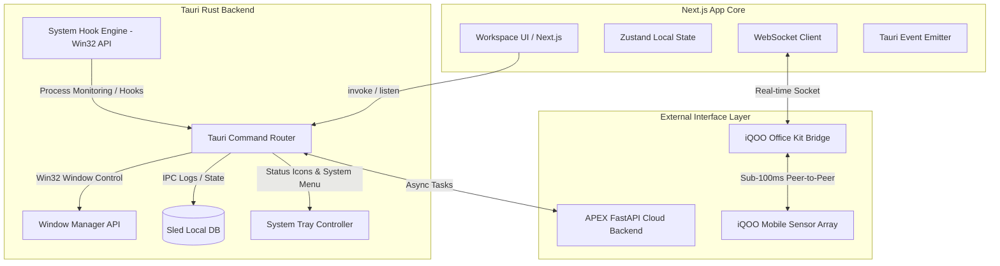
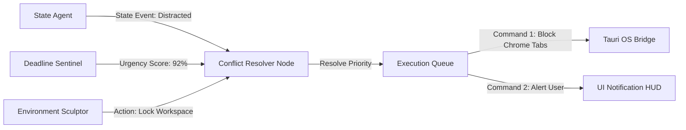
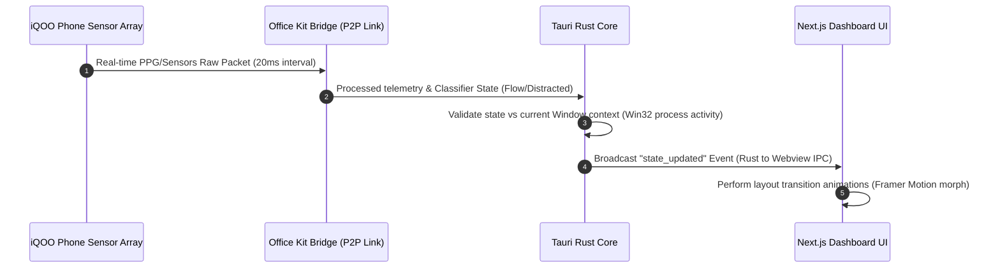

# APEX Laptop Application Specification
## Part 3 of 5: The Execution Environment (Tauri + Next.js)

### Document Metadata
* **Author:** Staff Systems Architect & Lead UX Designer, iQOO AI Ecosystem & APEX Core Team
* **Target Version:** v1.0.0-rc3
* **Status:** Approved for Implementation
* **Latency Budget:** Sub-100ms cross-platform sync via iQOO Office Kit Bridge
* **Primary Target OS:** Windows 11 (build 22000+)

---

## 1. System-Level Window Architecture & Tauri-Rust Core Bridge

The APEX Laptop Application is built as a native desktop application using **Tauri** (Rust core) and **Next.js** (TypeScript/Tailwind frontend). The application serves as the user's primary execution workspace, maintaining low-overhead background monitoring and providing high-performance system-level window management, DND control, and application-blocking capabilities.



### 1.1 Window Chrome & Layout Architecture
The application runs inside a custom-designed, borderless Tauri window to maintain a unified, immersive visual style. The custom window layout consists of the following components:

1. **Custom Title Bar (`TitleBar`):**
   * **Height:** 40px fixed.
   * **Background:** `#0A0A0A` with a 1px bottom border of `#121212`.
   * **Drag Behavior:** Custom Rust-level drag region using Tauri's `data-tauri-drag-region`.
   * **Traffic Light Controls (Left-aligned, Apple style):**
     * **Close Button:** Circles of 12px diameter. Rest color: `#FF4D4F` with 20% opacity. Hover: `#FF4D4F` solid with an internal cross icon (`scale-100` transition).
     * **Minimize Button:** Rest color: `#FFB800` with 20% opacity. Hover: `#FFB800` solid with an internal minus icon.
     * **Maximize/Zoom Button:** Rest color: `#00D26A` with 20% opacity. Hover: `#00D26A` solid with an internal expand icon.
     * **Spacing:** 8px gap between circles; 16px left margin.

2. **Collapsible Navigation Sidebar (`Sidebar`):**
   * **Default Width:** 240px. Resizable from 180px to 400px.
   * **Resizing Handle:** A 4px invisible hover border that highlights with a thin Accent Yellow (`#FFD400`) line after a 150ms delay. Dragging updates the width dynamically inside a React state and writes to the Tauri configuration store.
   * **Transitions:** Smooth collapse/expand via Framer Motion:
     ```typescript
     const sidebarVariants = {
       expanded: { width: 240, transition: { type: "spring", stiffness: 300, damping: 30 } },
       collapsed: { width: 64, transition: { type: "spring", stiffness: 300, damping: 30 } }
     };
     ```
   * **Items:** Dynamic list of workspace links, with active indicators (vertical Accent Yellow bar on the left edge, 3px wide, spanning the height of the item).

3. **Workspace Panels System:**
   * Uses a grid/flex system allowing modular draggable panels.
   * Panels can be pulled out to form detached, floating widgets (always-on-top micro windows managed via Tauri window APIs).

4. **System Tray Integration:**
   * Rust-native tray menu with options: `Show Workspace`, `Toggle Deep Work Mode`, `Agent Logs`, `Exit`.
   * Dynamic tray icon color matching the detected cognitive state:
     * Flow: Accent Yellow (`#FFD400`) pulsing dot.
     * Overloaded: Red (`#FF4D4F`) warning indicator.
     * Distracted: Warning Orange (`#FFB800`) flashing bar.
     * Fatigued: Gray (`#B0B0B0`) solid circle.

5. **Multi-Monitor Support & Adaptive DPI:**
   * High-DPI Windows auto-scaling managed at the Tauri manifest level.
   * Command palette and notifications automatically center on the active monitor containing the mouse cursor coordinates.

---

## 2. SCREEN 1: ADAPTIVE WORKSPACE DASHBOARD

This is the primary user landing view. The interface dynamically morphs based on the cognitive state outputted by the State Agent (sub-100ms sync from mobile sensors).

### 2.1 Layout & Proportions
* **Layout Grid:** 12-column responsive grid with a 16px gutter.
* **Flow State Layout:** Core widget scales to fill the screen (`col-span-12`). All secondary panels fade out. Left sidebar automatically collapses to a thin 64px bar.
* **Distracted State Layout:** Centered focus countdown timer (`col-span-6`, centered). Sidebar displays a "Refocus Goal" input. Right side features a "Recent Distractions List" with duration markers.
* **Fatigued State Layout:** Three-column cards layout (`col-span-4` each). Simplified interfaces, larger button hits, and color overlays to reduce visual clutter.
* **Overloaded State Layout:** High-alert triage system. Split into:
  * Left: Urgent Task Priority List (`col-span-8`).
  * Right: Emergency Recovery Panel (`col-span-4`) featuring a large recovery button.

### 2.2 Widgets & Data Sources
* **Cognitive State Widget:** Reads from `flow_state` WebSocket stream. Updates every 250ms.
* **Active Task Widget:** Fetches active task details from local PostgreSQL via Tauri IPC commands. Updates on change.
* **Deadline Sentinel Alert Widget:** Displays real-time risk scores calculated by the Deadline Sentinel. Updates every 5 seconds.
* **Quick Actions Panel:** Event-driven, displaying adaptive automation scripts from the Environment Sculptor.

### 2.3 Color & Typography Specifications
* **Flow State:** Background `#0A0A0A`, accents in Accent Yellow (`#FFD400`). High contrast, minimal glow.
* **Overloaded State:** Accent color shifts to Warning Red (`#FF4D4F`) with an ambient background pulse of 5% opacity red.
* **Distracted State:** Yellow warning text (`#FFB800`) highlighting app switch count.
* **Typography:**
  * Headers: `iQOO Sans Semibold` or `SF Pro Display`, size 28px, line-height 34px, letter-spacing -0.02em.
  * Body Text: `Inter Regular`, size 14px, line-height 20px.
  * Timer Indicators: `JetBrains Mono Medium`, size 64px, tabular numerals enabled.

### 2.4 Interactions & Animations
* **State Morph Transition:** When the state transitions (e.g., Flow -> Distracted), layout components animate their position and sizing using Framer Motion's `<AnimateSharedLayout>` and `layoutId`. Transition duration is 450ms with `easeOut` curves.
* **Emergency Recovery Button Hover:** Hovering over the button triggers an inner ring rotation (`duration: 2s, ease: linear, repeat: Infinity`). Pressing triggers a ripple expansion that fills the screen.

### 2.5 Keyboard Shortcuts
| Shortcut | Action | Scope |
|:---|:---|:---|
| `Ctrl + D` | Toggle Deep Work Mode | Global |
| `Ctrl + E` | Trigger Emergency Recovery Plan | Dashboard |
| `Ctrl + Space` | Open Command Palette | Global |
| `Ctrl + Tab` | Switch to next dashboard widget | Dashboard |

### 2.6 Context Menus & Drag-and-Drop
* **Right-click on Workspace Widget:** Displays menu: `Minimize Widget`, `Float on Top`, `Configure Refresh Interval`, `Reset Position`.
* **Widget Drag-and-Drop:** Widgets are draggable within the grid using `@dnd-kit/core`. Drop targets highlight with a dashed `#FFD400` border at 50% opacity.

### 2.7 Loading, Error & Offline States
* **Loading:** Pulsing skeletal structure matching the active state profile.
* **Error:** Red outline border with a "Retry Connection" action button and exact Rust-level thread error logs displayed in a collapsible code terminal.
* **Offline:** Display banner: "Local Sync Active (Offline Mode)". Dashboard uses local SQLite replica cached in `SledDB`.

---

## 3. SCREEN 2: AGENT ACTIVITY MONITOR

Visualizes the status, active processes, and queue pipeline of the five core APEX agents.



### 3.1 Layout & Proportions
* **Layout:** Split view.
  * **Left Panel (35% width, fixed):** Real-time vertical list of active agents (State Agent, Deadline Sentinel, Environment Sculptor, Peer Radar, Socratic Challenger).
  * **Right Panel (65% width):** Agent detail view containing a dynamic message queue, performance metrics, and transaction logs.

### 3.2 Widgets & Data Sources
* **Agent Heartbeat Widget:** Displays green indicator if thread is active. Source: Rust backend thread monitor.
* **Agent Conflict Queue Visualizer:** Renders real-time message exchange between agents. Utilizes a dynamic Mermaid-based architecture updated on every agent communication packet.
* **Confidence Level Graph:** Small horizontal bar chart showing target accuracy of the active models (llama-3.3-70b vs llama-3.1-8b).

### 3.3 Color & Typography Specifications
* **Agent Active:** `#00D26A` (Success Green).
* **Agent Inactive/Paused:** `#B0B0B0` (Secondary Text).
* **Conflict State Alert:** `#FF4D4F` (Error Red) with bold flashing text.
* **Typography:**
  * Code/Message Console: `JetBrains Mono`, size 12px, line-height 16px, background `#121212`, border `#1F1F1F`.

### 3.4 Interactions & Animations
* **Real-Time Feed Animations:** New items enter the message log by sliding up 10px from the bottom and fading in (`duration: 0.2s, ease: easeOut`).
* **Agent Card Click:** Smooth expansion of the card to reveal parameter settings using layout animations.

### 3.5 Keyboard Shortcuts
| Shortcut | Action | Scope |
|:---|:---|:---|
| `Ctrl + Shift + A` | Open Agent Monitor | Global |
| `Ctrl + R` | Force-restart all agent background loops | Monitor |
| `1`, `2`, `3`, `4`, `5` | Toggle Agent Detail Panes | Monitor |

### 3.6 Context Menus & Drag-and-Drop
* **Right-click Agent Card:** Menu includes: `Pause Agent Thread`, `Reset Confidence Weights`, `View Sled Key-Value Stores`.

### 3.7 Loading, Error & Offline States
* **Loading:** Dynamic vertical scrolling line indicator (similar to matrix falling code, in Accent Yellow, muted to 30% opacity).
* **Error:** System alert: "Tauri Bridge Communication Interrupted". Local thread monitoring fallback is activated.

---

## 4. SCREEN 3: LIVE WORKSPACE CONTROLS

The direct manual console for control over the user's workspace, browser windows, application lists, and system-level states.

### 4.1 Layout & Proportions
* **Layout:** Grid with three vertical panels:
  * **Panel 1 (30%):** Application lists, blockers configuration, and browser tab overrides.
  * **Panel 2 (45%):** Visual screen arrangement layout map (representation of active monitors, window positions, DND zones).
  * **Panel 3 (25%):** Action History, Undo Queue, and Pending Agent Decisions requiring approval.

### 4.2 Widgets & Data Sources
* **Screen Arrangement Canvas:** Dynamic canvas rendering active desktop windows. Data fetched from Rust process enumerators via Win32 calls. Updated every 1 second.
* **Active App Blocker List:** Reads blocked process configurations from system registries.
* **DND Toggle Switch:** Bypasses Windows Focus Assist APIs to lock system notifications.

### 4.3 Color & Typography Specifications
* **Active Blocked App Badge:** Background `#FF4D4F` (Error Red), text `#FFFFFF`.
* **Allowed App Badge:** Background `#121212`, border `#00D26A`.
* **Typography:** Labels use `iQOO Sans Medium`, size 13px, uppercase with 0.05em tracking.

### 4.4 Interactions & Animations
* **Window Arranger Drag-and-Drop:** Users can drag-and-drop window icons representing their native application windows on the canvas to force real-time tiling. Arrangement executes system-level reposition commands within 80ms.
* **Toggle Switches:** Custom slider with a spring-like micro-animation (`stiffness: 500, damping: 25`).

### 4.5 Keyboard Shortcuts
| Shortcut | Action | Scope |
|:---|:---|:---|
| `Ctrl + Z` | Undo last workspace arrangement | Global |
| `Ctrl + B` | Force block active window | Global |
| `Ctrl + L` | Lock layout arrangement | Controls Screen |

### 4.6 Context Menus & Drag-and-Drop
* **Right-click on Window Icon:** Displays options: `Pin Window`, `Minimize Process`, `Move to Monitor 2`, `Add to Permanent App Blocklist`.

### 4.7 Loading, Error & Offline States
* **Loading:** Rotating blueprint lattice grid.
* **Error:** If process detection fails, displays: "Access Denied: Win32 API Hook Failed. Enable Admin Privileges".
* **Offline:** Controls function identically offline as the Win32 hooks run completely locally on the device.

---

## 5. SCREEN 4: KNOWLEDGE HUB

A comprehensive information store structured for maximum readability and rapid cognitive ingestion, integrating semantic search and graphical concept mapping.

```
+------------------+------------------------------+--------------------+
| NAVIGATION SIDE  | CONTENT EDITOR / GRAPH VIEW  | AI CONTEXT PANEL   |
| (20% Width)      | (55% Width)                  | (25% Width)        |
|                  |                              |                    |
| - Notebooks      | - Rich Markdown text         | - Concepts List    |
| - Concepts       | - Semantic Graph Render      | - Key Insights     |
| - Saved Snippets | - Bidirectional Links        | - Challenge Prompts|
+------------------+------------------------------+--------------------+
```

### 5.1 Layout & Proportions
* **Layout:** Three-column layout.
  * **Col 1 (20%):** Navigation sidebar (Notebooks, Tags, Graph View toggle).
  * **Col 2 (55%):** Rich text editor / interactive concept graph canvas.
  * **Col 3 (25%):** AI context engine sidebar containing concept maps, auto-generated flashcards, and summary highlights.

### 5.2 Widgets & Data Sources
* **Note Editor Widget:** Standard WYSIWYG editor supporting Markdown. Autosaves to local database every 3 seconds.
* **Interactive Graph View:** SVG Canvas built using D3.js force-directed graphs. Coordinates recalculate dynamically based on note cross-links.
* **AI Summary Panel:** Updates using `llama-3.3-70b-versatile` background summarization threads upon note completion.

### 5.3 Color & Typography Specifications
* **Active Node in Graph:** Accent Yellow `#FFD400` glow filter (`drop-shadow(0 0 8px #FFD400)`).
* **Cross-Link Line:** `#1F1F1F` transition to Accent Yellow on mouse hover.
* **Typography:**
  * Title: `iQOO Sans Bold`, size 32px, line-height 38px.
  * Editor Body: `Inter Regular`, size 16px, line-height 1.6.

### 5.4 Interactions & Animations
* **Graph Node Zoom/Pan:** Mousewheel zooms the SVG layout between scales `0.1x` to `3x`. Drag-to-pan moves coordinates smoothly.
* **Link Click Animation:** Clicking a concept node triggers a circular ripple expansion along the node paths.

### 5.5 Keyboard Shortcuts
| Shortcut | Action | Scope |
|:---|:---|:---|
| `Ctrl + N` | Create new note | Knowledge Hub |
| `Ctrl + G` | Toggle full-screen Graph View | Knowledge Hub |
| `Ctrl + K` | Trigger semantic global search | Global |
| `Ctrl + [` | Go back one page in history | Knowledge Hub |

### 5.6 Context Menus & Drag-and-Drop
* **Right-click Node:** Menu includes: `Open in split-pane`, `Merge Concept`, `Generate Flashcards`, `Export PDF`.
* **Drag-and-Drop Note:** Dragging notes into target folder tags assigns metadata updates instantly.

### 5.7 Loading, Error & Offline States
* **Loading:** Horizontal skeleton blocks.
* **Error:** Graph render failure prompts a fallback: "Vector Grid rendering error. Rebuilding local D3 coordinates".
* **Offline:** Full local read-write support using local db stores. Sync to cloud queue launches upon internet availability.

---

## 6. SCREEN 5: RESEARCH WORKSPACE

An optimized workspace to analyze research documents, extract citations, and trace information lineages.

### 6.1 Layout & Proportions
* **Layout:** 50/50 Split View.
  * **Left Pane (50%):** PDF Document Annotator and Web Clipper Viewer.
  * **Right Pane (50%):** Structured Notes Panel and Research Trail Navigator.

### 6.2 Widgets & Data Sources
* **PDF Annotator:** Custom canvas overlays. Highlights extract coordinates relative to PDF page boundaries.
* **Credibility Score Card:** Background evaluator querying databases. Displays credibility score index.
* **Research Trail Visualizer:** A horizontal chronological timeline tracking paper citations and linked web pages visited.

### 6.3 Color & Typography Specifications
* **Highlight Color Yellow:** `#FFD400` with 30% alpha layer opacity.
* **Credibility Score High:** Text `#00D26A` (Success Green).
* **Credibility Score Alert:** Text `#FF4D4F` (Error Red).
* **Typography:**
  * PDF Text: Rendered using local system fonts.
  * Notes: Mono code blocks for citation outputs.

### 6.4 Interactions & Animations
* **Drag Highlight Interaction:** Highlighting text on the left panel creates a draggable preview card. Dropping it on the right note panel appends the text formatted with markdown citation blocks automatically:
  ```markdown
  > "[Highlighted Text]" (Author, Year, p. [Page])
  ```
* **Timeline Scrubber:** Scrollbar in the timeline translates mousewheel scroll into horizontal pan with custom inertia.

### 6.5 Keyboard Shortcuts
| Shortcut | Action | Scope |
|:---|:---|:---|
| `Ctrl + H` | Highlight selected text block | Research Pane |
| `Ctrl + J` | Open citation configuration | Research Pane |
| `Ctrl + Alt + C` | Copy auto-citation | Research Pane |

### 6.6 Context Menus & Drag-and-Drop
* **Right-click PDF page:** Menu: `Rotate Page`, `Extract OCR Image`, `Translate Block`, `Search Google Scholar`.

### 6.7 Loading, Error & Offline States
* **Loading:** Rotating documents wireframe.
* **Error:** Corrupted PDF message: "Failed to render document: Stream encoding error. Redownloading...".
* **Offline:** Locally cached PDFs in Sled database display instantly. Credibility analyzer shows "Offline - Evaluation Pending".

---

## 7. SCREEN 6: WRITING WORKSPACE

A distraction-free writing environment integrated with an automated AI argument challenger to test logical integrity.

```
+---------------+-------------------------------------+------------------+
| OUTLINE PANEL | CENTRAL MD WRITER                   | SOCRATIC PANEL   |
| (15% Width)   | (60% Width)                         | (25% Width)      |
|               |                                     |                  |
| - Header list | - Main editor surface               | - Argument weak  |
| - Drag handle | - Minimalist chrome                 | - Counter-point  |
| - Section tag | - Live wordcount stats              | - Source checks  |
+---------------+-------------------------------------+------------------+
```

### 7.1 Layout & Proportions
* **Layout:** Three-panel setup.
  * **Outline Panel (15%):** Left sidebar displaying structured header hierarchy.
  * **Central Writer Panel (60%):** Centered editor workspace.
  * **Socratic Challenger Panel (25%):** Right panel containing logic strength indicators and counter-argument challenges.

### 7.2 Widgets & Data Sources
* **Rich Markdown Editor:** Tracks typing pace (words/minute).
* **Socratic Logic Analyzer:** Uses `llama-3.3-70b-versatile` to audit paragraphs when typing pauses for more than 2 seconds.
* **Writing Analytics Widget:** Local tracker storing session word velocity, correlation indices with state records.

### 7.3 Color & Typography Specifications
* **Strong Arguments Label:** Text `#00D26A` (Success Green).
* **Weak Arguments Label:** Text `#FFB800` (Warning Orange) with underlined target text in editor.
* **Typography:**
  * Writer: Georgia or iQOO Sans, size 18px, line-height 1.8. Custom margins to ensure center alignment.

### 7.4 Interactions & Animations
* **Logical Alert Hover:** Hovering over underlined text in the editor flashes the corresponding Socratic counter-argument card in the right sidebar.
* **Outline Rearrangement:** Dragging headers in the outline dynamically reorders the text sections inside the central editor.

### 7.5 Keyboard Shortcuts
| Shortcut | Action | Scope |
|:---|:---|:---|
| `Ctrl + S` | Force save local revision history diff | Global |
| `Ctrl + Alt + S` | Toggle Socratic Challenger Panel | Writing Pane |
| `Ctrl + Shift + E` | Export active draft | Writing Pane |

### 7.6 Context Menus & Drag-and-Drop
* **Right-click Text Block:** Menu: `Verify Logic`, `Refine Tone`, `Summarize Paragraph`, `Insert Citation link`.

### 7.7 Loading, Error & Offline States
* **Loading:** Pulsing line placeholder layout.
* **Error:** Socratic Challenger network error: "Connecting local Llama thread for logic evaluation".
* **Offline:** Switches logic testing tasks to local low-latency models if available, or buffers requests.

---

## 8. SCREEN 7: DEEP WORK MODE

The system-wide focus mode takeover environment. It hides unnecessary system components to minimize distractions.

### 8.1 Layout & Proportions
* **Layout:** Fullscreen display overriding multi-monitor outputs.
  * **Primary Monitor:** Minimal HUD displaying focus timer, target objective, and ambient audio controller.
  * **Secondary Monitors:** Display abstract dark canvas animations (`#0A0A0A` background) to prevent screen distraction.

### 8.2 Widgets & Data Sources
* **Countdown HUD:** Displays target time. Updates every 100ms.
* **Ambient Audio Controller:** Interfaces with local audio players or streaming clients.
* **Process Watchdog Indicator:** Visualizes background activities blocked by the Environment Sculptor.

### 8.3 Color & Typography Specifications
* **Active Indicator:** Accent Yellow `#FFD400` glows against deep black `#0A0A0A`.
* **Blocked Indicator:** Muted red `#FF4D4F` notifications that fade out after 1.5 seconds.
* **Typography:** Large font format. Focus timer uses `JetBrains Mono Thin`, size 96px.

### 8.4 Interactions & Animations
* **HUD Entrance:** Initiates with an expand transition. Background opacity shifts from 0% to 98% over 800ms.
* **Pulsing Timer Animation:** Timer pulses dynamically with slow inhale/exhale cycles (4s cycle duration).

### 8.5 Keyboard Shortcuts
| Shortcut | Action | Scope |
|:---|:---|:---|
| `Escape (Hold 2s)` | Exit Deep Work Mode | Global |
| `Space` | Pause/Resume timer | Deep Work Mode |
| `Ctrl + Up/Down` | Adjust Ambient Audio volume | Deep Work Mode |

### 8.6 Context Menus & Drag-and-Drop
* **Right-click HUD:** Menu: `Change Backdrop Style`, `Select Ambient Track`, `Adjust Screen Dim Level`.

### 8.7 Loading, Error & Offline States
* **Loading:** Fullscreen blur fade.
* **Error:** System DND block error notification: "Windows API locked. Please close Settings app manually".
* **Offline:** Operates fully offline; ambient audio falls back to local assets.

---

## 9. SCREEN 8: DEADLINE WAR ROOM

An urgency UI dashboard designed for rapid execution and coordination when tasks near their deadline.

```
+-----------------------------------------------------------------------+
|  URGENCY STATUS BAR (10% Height) - Risk Score 94% [HIGH RISK]         |
+------------------------------------------+----------------------------+
|  TASK TRIAGE DECOMPOSITION (60% Width)   |  PEER RADAR LOG (40% Width)|
|                                          |                            |
|  - Task A -> Subtask A1 (Alloc: 20m)     |  - Slack: Project Update   |
|  - Task B -> Subtask B1 (Alloc: 10m)     |  - Discord: Team Meeting   |
|  - One-click action items                |  - WhatsApp: Teacher Alert |
+------------------------------------------+----------------------------+
|  DYNAMIC RESOURCE SURFACE (30% Height) - PDF / Docs / Code Refs       |
+-----------------------------------------------------------------------+
```

### 8.1 Layout & Proportions
* **Layout:** Grid structure with header status bar:
  * **Header Status Bar (10% height):** Displays urgency indices and time-remaining indicators.
  * **Task Pane (60% width):** Subdivided into prioritized action items.
  * **Peer Radar Log (40% width):** Summarized priority messages from academic channels.
  * **Resource Bar (30% height, bottom):** Surfaces documents and reference templates matching the active task.

### 8.2 Widgets & Data Sources
* **Sentinel Urgency Meter:** Calculated from deadlines, progress velocity, and estimated task durations.
* **Peer Radar Widget:** Parses external channels for key terms. Updates every 30 seconds.
* **Resource Suggestion Bar:** Uses embedding models to locate relative research papers or code repositories locally.

### 8.3 Color & Typography Specifications
* **Urgency High:** Warning Red `#FF4D4F`.
* **Urgency Moderate:** Orange `#FFB800`.
* **Typography:** Headings use `iQOO Sans Bold`, size 22px. Action timers use `JetBrains Mono Bold`, size 16px.

### 8.4 Interactions & Animations
* **Task Drag-and-Drop:** Drag tasks between priority columns.
* **Alert Flash:** The border of the screen flashes red when risk score increases.

### 8.5 Keyboard Shortcuts
| Shortcut | Action | Scope |
|:---|:---|:---|
| `Ctrl + W` | Focus War Room View | Global |
| `Ctrl + P` | Fast-reply to priority contact | War Room |
| `Ctrl + Enter` | Mark top subtask as complete | War Room |

### 8.6 Context Menus & Drag-and-Drop
* **Right-click Peer Alert:** Menu: `Mute Contact`, `Snooze Notification`, `Delegate Task`, `Generate Quick Reply`.

### 8.7 Loading, Error & Offline States
* **Loading:** Fast-scrolling alert stripes layout.
* **Error:** Peer Radar Sync Error: "Reconnecting messaging channels. Using cached logs".
* **Offline:** System operates on locally stored project files and caches messaging queue actions.

---

## 9. SCREEN 9: SESSION REPLAY

An interface that allows users to review their cognitive patterns, applications used, and agent actions post-session.

### 9.1 Layout & Proportions
* **Layout:** Split Horizontal View.
  * **Top Pane (70%):** Workspace screenshot playback canvas and synchronized timeline metric charts.
  * **Bottom Pane (30%):** Interactive scrubbing timeline with event markers.

### 9.2 Widgets & Data Sources
* **Replay Player Canvas:** Renders scaled frame captures of the session.
* **Synchronized Metric Charts:** Tracks attention indices, keyboard events, and agent intervention events.
* **Log Stream Panel:** Displays real-time logs synchronized to the timeline cursor.

### 9.3 Color & Typography Specifications
* **Timeline Cursor:** Accent Yellow `#FFD400` vertical line.
* **State Highlights:** Color-coded timeline zones representing Flow (`#FFD400`), Distracted (`#FFB800`), Fatigued (`#B0B0B0`), and Overloaded (`#FF4D4F`).
* **Typography:** Time indicators use `JetBrains Mono`, size 11px.

### 9.4 Interactions & Animations
* **Scrubber Drag:** Dragging the cursor updates all graphs and logs synchronously.
* **Play/Pause Toggle:** Spacebar toggles playback (`1x`, `2x`, `4x` speed settings).

### 9.5 Keyboard Shortcuts
| Shortcut | Action | Scope |
|:---|:---|:---|
| `Space` | Play/Pause Playback | Replay Screen |
| `Right Arrow` | Skip forward 10 seconds | Replay Screen |
| `Left Arrow` | Skip backward 10 seconds | Replay Screen |
| `Up Arrow` | Increase playback speed | Replay Screen |

### 9.6 Context Menus & Drag-and-Drop
* **Right-click Timeline Marker:** Menu: `Add Marker Annotation`, `Export Session Segment`, `Flag Incorrect State Classification`.

### 9.7 Loading, Error & Offline States
* **Loading:** Rotating video icon skeleton.
* **Error:** Replay Load Error: "Video frame directory index not found".
* **Offline:** Full local replay functionality using local screenshot folders.

---

## 10. SCREEN 10: ANALYTICS DASHBOARD

A comprehensive visualization view providing insights into focus patterns, time allocation, and agent behavior over time.

```
+-----------------------------------------------------------------------+
|  PRODUCTIVITY TELEMETRY PANELS (Flow Score / Session Durations)       |
+-----------------------------------+-----------------------------------+
|  COGNITIVE STATE HEATMAP (50%)    |  AGENT ACTIONS & OVERRIDES (50%)  |
|                                   |                                   |
|  - Heatmap showing hour/day       |  - Interventions bar chart        |
|  - Transition paths flow matrix   |  - Override rates by hour         |
+-----------------------------------+-----------------------------------+
|  DEADLINE RISK BUFFER ACCURACY GRAPH (100% Width)                     |
+-----------------------------------------------------------------------+
```

### 10.1 Layout & Proportions
* **Layout:** Grid system.
  * **Top Row (col-span-12):** Focus metric summary cards (Average Flow duration, Task completeness rate).
  * **Middle Row (col-span-6 each):** Cognitive State Transition Heatmap and Agent Override charts.
  * **Bottom Row (col-span-12):** Deadline Risk Buffer Accuracy Graph.

### 10.2 Widgets & Data Sources
* **State Heatmap Widget:** Displays focus levels by hour and day.
* **Agent Intervention Chart:** Displays bar chart of blocked actions.
* **Risk Buffer Graph:** Compares Sentinel estimates against actual task completion times.

### 10.3 Color & Typography Specifications
* **High Focus Density:** Intense Accent Yellow `#FFD400`.
* **Low Focus Density:** Deep Gray `#121212`.
* **Typography:** Values use `iQOO Sans Semibold`, size 36px. Labels use `Inter Regular`, size 12px.

### 10.4 Interactions & Animations
* **Chart Hover Tooltips:** Hovering over bars displays detailed data overlays with a 100ms fade-in transition.
* **Date Range Selector Toggle:** Animate graph redraws using cubic-bezier transitions over 300ms.

### 10.5 Keyboard Shortcuts
| Shortcut | Action | Scope |
|:---|:---|:---|
| `Ctrl + 1` | Set range to Day | Analytics Screen |
| `Ctrl + 2` | Set range to Week | Analytics Screen |
| `Ctrl + 3` | Set range to Month | Analytics Screen |
| `Ctrl + P` | Export Analytics PDF report | Analytics Screen |

### 10.6 Context Menus & Drag-and-Drop
* **Right-click Chart:** Menu: `Export PNG Chart`, `View Raw Data Table`, `Exclude Outlier Session`.

### 10.7 Loading, Error & Offline States
* **Loading:** Pulsing chart bars and maps.
* **Error:** Database query error displays: "Failed to compile session metadata".
* **Offline:** Loads local session files, displaying a sync badge.

---

## 11. SCREEN 11: COMMAND CENTER (RAYCAST-INSPIRED)

The fast entry-point overlay allowing key-driven system operations and navigation.

### 11.1 Layout & Proportions
* **Layout:** Modal design.
  * **Width:** 680px fixed.
  * **Height:** Dynamic, auto-adjusting to results size (maximum height 420px).
  * **Structure:** Top Search Input Bar (56px) + Dynamic Results List (Scrollable) + Bottom Status/Shortcut helper bar (28px).

### 11.2 Widgets & Data Sources
* **Fuzzy Finder Input:** Text field parsing global command list, user notes, active applications, and agent settings.
* **Command Registry Database:** Reads configurations from local Tauri stores.

### 11.3 Color & Typography Specifications
* **Modal Background:** `#121212` with 80% opacity and backing blur filter (`backdrop-blur-md`).
* **Selected Row:** Accent Yellow `#FFD400` with 15% opacity overlay and solid yellow border outline.
* **Typography:** Input text uses `iQOO Sans Light`, size 20px. Results list uses `Inter Medium`, size 14px.

### 11.4 Interactions & Animations
* **Activation Animation:** Triggers instantly on shortcut keypress:
  ```typescript
  const overlayVariants = {
    hidden: { scale: 0.95, opacity: 0 },
    visible: { scale: 1, opacity: 1, transition: { type: "spring", stiffness: 450, damping: 28 } }
  };
  ```
* **Selection Scroller:** Arrow keys cycle through results. Selected items scroll into view automatically.

### 11.5 Keyboard Shortcuts
| Shortcut | Action | Scope |
|:---|:---|:---|
| `Ctrl + Space` | Toggle Command Center Modal | Global |
| `Escape` | Close Command Center | Command Center |
| `Enter` | Execute selected command action | Command Center |
| `Tab` | Open inline options sub-menu | Command Center |

### 11.6 Context Menus & Drag-and-Drop
* *Context Menu is disabled inside the Command Center overlay to preserve a pure keyboard-focused interface.*

### 11.7 Loading, Error & Offline States
* **Loading:** Micro pulsing spinner in search input.
* **Error:** Empty result displays: "No actions matching keyword. Try: 'Deep Work'".
* **Offline:** Local indexing remains operational. Cloud searches are bypassed.

---

## 12. SCREEN 12: AGENT LOGS

The technical verification viewer detailing background agent transactions and confidence levels.

### 12.1 Layout & Proportions
* **Layout:** Full screen workspace with a top control filter bar (44px) and log output pane.

### 12.2 Widgets & Data Sources
* **Log Streaming Canvas:** Renders a list of agent actions.
* **Agent Thread Toggle Panel:** Filters outputs by Agent name.
* **Log Exporter Widget:** Prepares CSV, JSON, or TXT archives for export.

### 12.3 Color & Typography Specifications
* **DEBUG Log Level:** Color `#B0B0B0`.
* **INFO Log Level:** Color `#00D26A` (Success Green).
* **WARN Log Level:** Color `#FFB800` (Warning Orange).
* **ERROR Log Level:** Color `#FF4D4F` (Error Red).
* **Typography:** Pure terminal design. Monospace `JetBrains Mono`, size 11px.

### 12.4 Interactions & Animations
* **Auto-Scroll Toggle:** A checkbox stops log tracking when unchecked, allowing text inspection without content displacement.
* **Log Row Double-click:** Expands the line to display a JSON payload with syntax highlights.

### 12.5 Keyboard Shortcuts
| Shortcut | Action | Scope |
|:---|:---|:---|
| `Ctrl + F` | Search inside active log logs | Logs Screen |
| `Ctrl + K` | Clear log screen buffer | Logs Screen |
| `Ctrl + Shift + X` | Fast export raw session log | Logs Screen |

### 12.6 Context Menus & Drag-and-Drop
* **Right-click Log Line:** Menu: `Copy Log Line`, `Copy Full Stacktrace`, `Flag Session Log`, `Create Custom Block Trigger`.

### 12.7 Loading, Error & Offline States
* **Loading:** Scrolling empty trace lines.
* **Error:** DB Log Read Error: "Log file system locked by Tauri database engine".
* **Offline:** All log operations run locally and remain functional.

---

## 13. CROSS-PLATFORM INTERACTION SPECIFICATION (iQOO Office Kit Bridge)

The sub-100ms sync capability is enabled by the custom **iQOO Office Kit Bridge**. Below is the data structure and sequence of operations for key interactions.

### 13.1 Cognitive State Sync Sequence


### 13.2 Workspace Sync Payload
This schema is used for high-frequency synchronization between the laptop, phone, and cloud backends:

```json
{
  "timestamp": "2026-06-03T12:57:36.000Z",
  "session_id": "apex-session-98f3-a2b1",
  "active_task": {
    "task_id": "t-1092",
    "title": "Machine Learning Lab 3 Analysis",
    "deadline": "2026-06-03T18:00:00.000Z",
    "risk_score": 0.87
  },
  "cognitive_state": {
    "current_state": "FLOW",
    "confidence": 0.94,
    "last_transition": "2026-06-03T12:52:10.000Z",
    "metrics": {
      "heart_rate_variability": 72.4,
      "blink_rate_per_min": 14,
      "keyboard_dwell_time_ms": 110.2
    }
  },
  "workspace_state": {
    "active_application": "VSCode.exe",
    "blocked_applications_active": [
      "Discord.exe",
      "Steam.exe"
    ],
    "browser_tabs_count": 4,
    "dnd_enabled": true
  },
  "agent_status": {
    "state_agent": "ACTIVE",
    "deadline_sentinel": "ACTIVE",
    "environment_sculptor": "ACTIVE",
    "peer_radar": "IDLE",
    "socratic_challenger": "STANDBY"
  }
}
```

### 13.3 Real-Time Network Interruption Protocol
1. **P2P Disconnect Detection:** If the iQOO Office Kit Bridge drops (no heartbeat received for 500ms), the Tauri app attempts a reconnect handshake.
2. **UI Fallback:** The dashboard displays a status indicator: `[Office Kit Bridge Offline - Sensor Sync Paused]`.
3. **Local Logic Fallback:** The laptop relies on local keystroke velocity metrics to estimate cognitive load until sensor sync is restored.
4. **Data Sync Reconciliation:** Upon reconnection, the Tauri database uploads accumulated session logs in bulk chunks (100 logs/batch) to keep the backend database synchronized.
