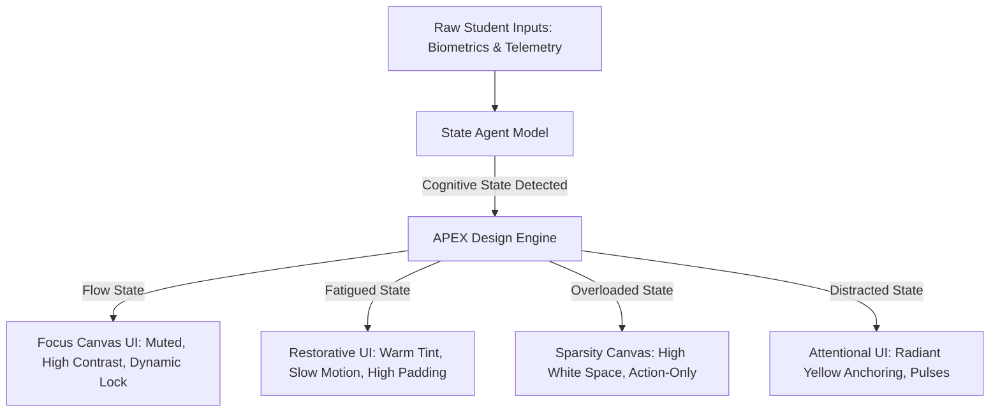
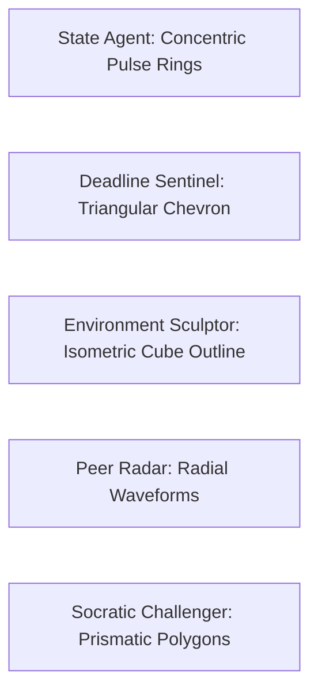
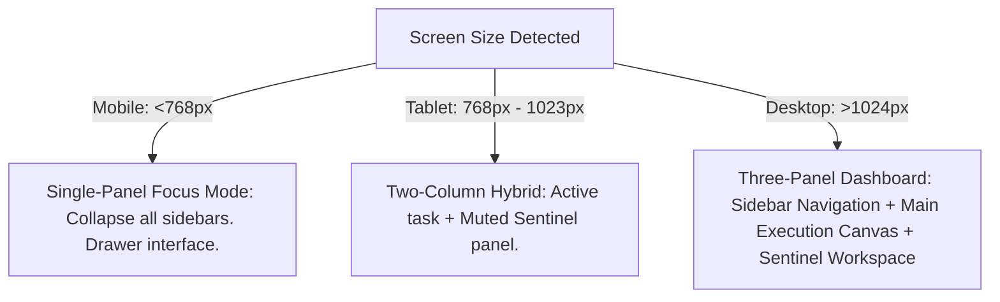

# APEX Design System & Visual Language Specification
## Version 1.0.0
### Launch Module: iQOO AI Ecosystem Cognitive Operating Layer (APEX)

---

## 1. DESIGN PHILOSOPHY

APEX (Adaptive Presence & Execution Intelligence) is built on the premise that an interface should not be static; it must act as a real-time cognitive mirror and workspace sculpt for the student. The visual system is an active partner in learning, balancing executive execution with cognitive restoration.



### 1.1 Core Design Principles

#### 1. Clarity over Clutter
Every pixel must earn its right to exist. Information density is optimized dynamically. Secondary information is buried behind progressive disclosure, ensuring the student is never presented with more than three primary decisions at any given moment.

#### 2. State-Aware Adaptation
The UI is not passive. It morphs its color palette, typography scale, motion coefficients, and density based on the student's cognitive state (Flow, Distracted, Fatigued, Overloaded) detected by the State Agent.

#### 3. Seamless Continuity
Sub-100ms sync across the iQOO Phone, Laptop, and the iQOO Office Kit bridge. Spatial orientation remains constant: layouts do not shift unexpectedly; instead, they scale and fold logically across physical boundaries.

#### 4. Physical Micro-Feedback Loops
Every interaction generates a physical consequence. Button presses mimic mechanical keyboard switches with spring-physics recoil. Sliders model fluid resistance.

#### 5. Cognitive Symbiosis
The system does not just display data; it prompts reflection. Socratic Challenger components inject deliberate friction (e.g., disabling instant copy-paste or requiring a written hypothesis before displaying an answer) to foster deep learning.

### 1.2 Design & Cognitive State Mapping

| Cognitive State | Contrast Ratio | Visual Density | Motion Curve Stiffness | Primary Accent | Display Mode |
| :--- | :--- | :--- | :--- | :--- | :--- |
| **Flow** | High (7:1+) | Ultra-Low (Focus Canvas) | Infinite (Instant cuts) | #FFD400 (Laser Focus) | Full Screen, Muted Sidebars |
| **Distracted** | High (5:1) | Medium (Attentional Anchors) | High (Snappy snaps) | #FF8800 (Alert Glow) | Dynamic Spotlights, Screen Lock |
| **Fatigued** | High-Warm (8:1) | Low-Medium (Large text) | Low (Smooth Ease-Out) | #00A3FF (Indigo Rest) | Large Spacing, Blue-Light Filter |
| **Overloaded** | Medium (4.5:1) | Minimum (Sparsity Canvas) | Muted (No-spring linear) | #FF3B30 (Hyper-Stress) | Single-Task Focus, Auto-Collapse |

### 1.3 iQOO Brand Integration & Aesthetics
The design language is a premium, high-octane fusion of **Nothing OS**'s dotted matrix retro-futurism, **Apple VisionOS**'s spatial glass layering, **Linear**'s meticulous keyboard-first navigation paths, and **Tesla UI**'s dark, performance-oriented telemetric readouts.
- **iQOO Accent Yellow (#FFD400)** is the ultimate focal anchor. It is used exclusively to highlight active execution vectors, priority deadlines, or active state transitions.
- **Geometric Rigor**: Corners are sharp (exactly 8px radius on cards, 4px on controls). 45-degree chamfers are utilized for accent borders and button edges to match the gaming-pedigree performance aesthetic of iQOO hardware.

### 1.4 Design Anti-Patterns
- **No Soft Gradients**: Avoid multi-colored, low-contrast background sweeps. Backgrounds must be pure `#0A0A0A` or `#121212`.
- **No Rounded Pills**: Buttons and badges must not have full rounded capsules (no `border-radius: 9999px`). Radius must remain constrained to `8px` or `4px` to maintain a structural, technological look.
- **No Un-throttled Notifications**: Never trigger generic popup banners during Flow state. Notification delivery must be batched and spatially projected onto the Peer Radar panel.

---

## 2. COLOR SYSTEM

The APEX color system is strictly dark-mode first. It uses high-contrast surface separations and a functional extended palette to signal cognitive urgency and agent identity.

```
+-------------------------------------------------------------+
| #0A0A0A (Primary Background)                                |
|   +-------------------------------------------------------+ |
|   | #121212 (Secondary Background Card)                   | |
|   |   +-------------------------------------------------+ | |
|   |   | #181818 (Solid Surface / Interactive Card)      | | |
|   |   |   +-------------------------------------------+ | | |
|   |   |   | #FFD400 (Accent Yellow Laser Focus)        | | | |
|   |   |   +-------------------------------------------+ | | |
|   |   +-------------------------------------------------+ | |
|   +-------------------------------------------------------+ |
+-------------------------------------------------------------+
```

### 2.1 Core Palette

```json
{
  "colors": {
    "background-primary": { "hex": "#0A0A0A", "usage": "Default screen base canvas background" },
    "background-secondary": { "hex": "#121212", "usage": "Default card, container, and sidebar background" },
    "accent-yellow": { "hex": "#FFD400", "usage": "Primary brand color, focus state, active execution" },
    "text-primary": { "hex": "#FFFFFF", "usage": "Titles, primary table values, high-contrast headings" },
    "text-secondary": { "hex": "#B0B0B0", "usage": "Body copy, metadata, secondary instructions" },
    "success": { "hex": "#00D26A", "usage": "Task completions, positive progress, calibration pass" },
    "warning": { "hex": "#FFB800", "usage": "Imminent deadlines, approaching fatigue threshold" },
    "error": { "hex": "#FF4D4F", "usage": "Failed states, critical deadline risk, distraction alerts" }
  }
}
```

### 2.2 Extended Palette: Agent Colors & Cognitive States

Each of the 5 cognitive agents is associated with a distinct wavelength color signature used for borders, subtle glows, and terminal telemetry:

| Agent / State | Color Token | HEX Value | Glow Rule | CSS Variable |
| :--- | :--- | :--- | :--- | :--- |
| **State Agent** | Orange Infrared | `#FF4500` | 8px radial blur, 10% opacity | `--agent-state` |
| **Deadline Sentinel** | Neon Crimson | `#FF0055` | 12px radial blur, 15% opacity | `--agent-deadline` |
| **Environment Sculptor**| Cyberspace Cyan | `#00F5FF` | 6px radial blur, 12% opacity | `--agent-environment` |
| **Peer Radar** | Quantum Purple | `#7B2CBF` | 8px radial blur, 8% opacity | `--agent-peer` |
| **Socratic Challenger** | Socratic Emerald | `#00FF87` | 10px radial blur, 15% opacity | `--agent-socratic` |
| **Flow State** | Golden Focus | `#FFD400` | 16px pulse glow, 20% opacity | `--state-flow` |
| **Distracted State** | Warning Orange | `#FF8800` | 24px flashing pulse, 30% opacity| `--state-distracted`|
| **Fatigued State** | Restorative Indigo | `#00A3FF` | Static diffuse glow, 8% opacity | `--state-fatigued` |
| **Overloaded State** | Hyper-Stress Red | `#FF3B30` | Static edge outline, 0% blur | `--state-overloaded` |

### 2.3 Surface & Interactive States
- **Hover State**: Lighten background by 4% or overlay a white tint with 4% opacity (`rgba(255,255,255,0.04)`).
- **Active / Pressed State**: Overlay a black tint with 8% opacity (`rgba(0,0,0,0.08)`).
- **Focus Ring**: `2px` solid `#FFD400` with `2px` offset (`#0A0A0A`).
- **Default Border**: `1px` solid `#2C2C2C`.
- **Muted Border**: `1px` solid `#1F1F1F`.

### 2.4 Glassmorphism Specifications
Glassmorphism is restricted to overlay components (Command Palette, Popovers, Dropdowns, Float-over bars) to guarantee GPU execution efficiency.
- **Backdrop Filter**: `blur(20px)` (Tailwind `backdrop-blur-md`).
- **Surface Fill**: `rgba(18, 18, 18, 0.7)`.
- **Border Spec**:
  ```css
  border: 1px solid;
  border-image: linear-gradient(
    to bottom,
    rgba(255, 255, 255, 0.1) 0%,
    rgba(255, 255, 255, 0.05) 50%,
    rgba(255, 255, 255, 0.02) 100%
  ) 1;
  ```
- **Layer Constraint**: Max 2 overlapping glass containers. Any deeper hierarchy triggers fallback to solid surfaces (`#121212`) to prevent composite rendering lag on mobile devices.

---

## 3. TYPOGRAPHY SYSTEM

Typography must establish absolute structural hierarchy. Numbers are highly prominent, reflecting the system's quantitative telemetric core.

### 3.1 Font Families
1. **Display & Heading Font**: `Cabinet Grotesk` (Geometric, wide-track, high impact for metrics, state indicators, and layout titles). Fallback: `SF Pro Display`, `Arial Black`.
2. **Body & Interface Font**: `Inter` (Optimized for readability in small sizes, high x-height, neutral letterforms). Fallback: `SF Pro Text`, `Segoe UI`.
3. **Monospace & Code Font**: `JetBrains Mono` (Zero ambiguity between 0/O and 1/I, structured for code, telemetry, and mathematical formula readouts). Fallback: `SF Mono`, `Consolas`.

### 3.2 Typography Scale

| Token Name | Font Family | Size (px) | Line Height | Weight | Letter Spacing | Ideal Application |
| :--- | :--- | :--- | :--- | :--- | :--- | :--- |
| `display-xl` | Cabinet Grotesk | 48px | 52px (1.08) | 800 (ExtraBold) | -0.04em | Giant state changes, focus timers |
| `display-lg` | Cabinet Grotesk | 36px | 40px (1.11) | 700 (Bold) | -0.03em | Primary dashboard metrics, scores |
| `heading-xl` | Cabinet Grotesk | 24px | 28px (1.16) | 700 (Bold) | -0.02em | Module header titles, card titles |
| `heading-lg` | Inter | 20px | 26px (1.30) | 600 (SemiBold) | -0.01em | Modal headers, sub-sections |
| `heading-md` | Inter | 16px | 22px (1.37) | 600 (SemiBold) | 0.00em | Settings headers, table column headers|
| `heading-sm` | Inter | 14px | 20px (1.42) | 600 (SemiBold) | +0.01em | Small item titles, active sidebar items|
| `body-lg` | Inter | 16px | 24px (1.50) | 400 (Regular) | 0.00em | Long-form reading, Socratic prompts |
| `body-md` | Inter | 14px | 20px (1.42) | 400 (Regular) | 0.00em | General body copy, chat transcripts |
| `body-sm` | Inter | 12px | 18px (1.50) | 400 (Regular) | +0.01em | Contextual tips, workspace descriptions|
| `caption` | Inter | 10px | 14px (1.40) | 500 (Medium) | +0.03em | Metadata, timestamp, device sync state|
| `overline` | Inter | 10px | 12px (1.20) | 700 (Bold) | +0.08em | Small capitalized labels (e.g. AGENT) |
| `code-lg` | JetBrains Mono | 14px | 20px (1.42) | 400 (Regular) | -0.01em | Code editor blocks, workspace files |
| `code-sm` | JetBrains Mono | 12px | 16px (1.33) | 500 (Medium) | 0.00em | Micro-terminal telemetry, logs |

### 3.3 Typography Rules
- **Line Length**: Main reading paragraphs (e.g. Socratic text, peer summaries) are constrained to a maximum width of `65ch` (approximately `520px` at `16px` font size) to optimize visual scan velocity.
- **Truncation**: For list views and cards, single-line text truncation must implement:
  ```css
  overflow: hidden;
  text-overflow: ellipsis;
  white-space: nowrap;
  ```
- **Numerical Alignments**: Numeric tabular data (e.g., scoring tables, timers) must use tabular lining digits (`font-variant-numeric: tabular-nums`) to prevent horizontal jitter during real-time value increments.

---

## 4. SPACING & GRID SYSTEM

APEX adheres to a strict 8px spatial grid. No margin, padding, height, width, or gap value may fall outside of this base grid scale.

### 4.1 Spacing Scale

| Token Name | Pixel Value | Tailwind Equivalent | Primary Structural Application |
| :--- | :--- | :--- | :--- |
| `space-0` | 0px | `p-0` / `m-0` | Element reset |
| `space-1` | 4px | `p-1` / `gap-1` | Inner micro-spacing, badges, avatar borders |
| `space-2` | 8px | `p-2` / `gap-2` | Button padding, tag list gaps, input item margin |
| `space-3` | 16px | `p-4` / `gap-4` | Inner card padding, list item gaps, small containers|
| `space-4` | 24px | `p-6` / `gap-6` | Standard layout gaps, card padding, modal content |
| `space-5` | 32px | `p-8` / `gap-8` | Page margins (desktop), large section dividers |
| `space-6` | 48px | `p-12` / `gap-12` | Hero layout gaps, empty state margins |
| `space-7` | 64px | `p-16` / `gap-16` | Absolute focus canvas padding (Flow State) |
| `space-8` | 80px | `p-20` / `gap-20` | Section spacing on wide displays |
| `space-9` | 96px | `p-24` / `gap-24` | Bottom-safe areas, large decorative offsets |
| `space-10` | 128px | `p-32` / `gap-32` | Socratic canvas margins (Fatigue/Overload mode) |

### 4.2 Layout Grid Systems

```
Desktop Grid (12 Columns, 32px Margins, 24px Gutters)
+---+   +---+   +---+   +---+   +---+   +---+   +---+   +---+   +---+   +---+   +---+   +---+
| 1 |   | 2 |   | 3 |   | 4 |   | 5 |   | 6 |   | 7 |   | 8 |   | 9 |   |10 |   |11 |   |12 |
+---+   +---+   +---+   +---+   +---+   +---+   +---+   +---+   +---+   +---+   +---+   +---+
|<-------------- Grid Area Width: 100% (max-width: 1440px) -------------------------------->|
```

- **Desktop (1200px - 1440px+)**:
  - Grid: 12 columns.
  - Gutters: `24px` (`space-4`).
  - Margins: `32px` (`space-5`).
  - Max Width: `1440px`.
- **Laptop (1024px - 1199px)**:
  - Grid: 12 columns.
  - Gutters: `16px` (`space-3`).
  - Margins: `24px` (`space-4`).
- **Tablet (768px - 1023px)**:
  - Grid: 8 columns.
  - Gutters: `16px` (`space-3`).
  - Margins: `24px` (`space-4`).
- **Mobile (320px - 767px)**:
  - Grid: 4 columns.
  - Gutters: `12px` (Custom hybrid spacing).
  - Margins: `16px` (`space-3`).

---

## 5. ICONOGRAPHY SYSTEM

APEX icons must look structured, structural, and clean. Custom line-drawn icons dictate the technical tone.

### 5.1 Stroke Rules
- **Line Weight**: Strictly `1.5px`. No exceptions.
- **Corner Fillet**: `1px` stroke radius for corners.
- **End Caps**: Rounded butt-caps (`stroke-linecap="round" stroke-linejoin="round"`).
- **Bounding Boxes**: Every icon is rendered in a square container:
  - Small: `16x16px` bounding box.
  - Medium (Default): `20x20px` bounding box.
  - Large: `24x24px` bounding box.

### 5.2 Icon Taxonomy

| Category | Primary Icon | Visual Style (SVG Specs) | Function |
| :--- | :--- | :--- | :--- |
| **Navigation** | `Home`, `Radar`, `Sentinel`, `Challenge` | 1.5px Stroke, un-filled, geometric | Sidebar navigation links |
| **Actions** | `Trigger`, `Sculpt`, `Calibrate`, `Sync` | 1.5px Stroke, filled path on hover | Interactive actions, setup |
| **States** | `Flow`, `Distracted`, `Fatigue`, `Overload` | Adaptive glowing stroke | Status badge prefixes |
| **System** | `Wifi-Bridge`, `Device-Phone`, `Device-Laptop` | Hardware-accurate outline profiles | Sync status, telemetry bridge |

### 5.3 Agent Avatars
Agent avatars are not pictures. They are functional, responsive geometric representations generated in real-time.



1. **State Agent**:
   - Visual: Three concentric, thin circles (`0.75px` stroke).
   - Interaction: The circles pulse and morph based on real-time focus levels (e.g. tight and high frequency under Flow; broad, slow oscillations under Fatigue).
   - Core Hex: `#FF4500`.
2. **Deadline Sentinel**:
   - Visual: A downward-pointing sharp equilateral triangle. An inner triangular warning indicator moves downward as the deadline approaches.
   - Core Hex: `#FF0055`.
3. **Environment Sculptor**:
   - Visual: An isometric projection of a cube. Side panels light up and fade as workspace modifications occur.
   - Core Hex: `#00F5FF`.
4. **Peer Radar**:
   - Visual: A vertical sweep line across an arc field, mimicking sonar sweeps. Active peer summaries appear as glowing dots on the sweep line.
   - Core Hex: `#7B2CBF`.
5. **Socratic Challenger**:
   - Visual: A rotating, multi-faceted crystal prism. The number of active faces increases with task difficulty.
   - Core Hex: `#00FF87`.

---

## 6. COMPONENT LIBRARY

Every component is defined with exact measurements, tailwind mappings, and structural behavior.

### 6.1 Buttons

```
  Primary Button (Accent Yellow)            Secondary Button (Muted Dark)
+-----------------------------------+     +-----------------------------------+
|  [ICON]  EXECUTE ACTIVE TASK      |     |  [ICON]  Snooze Action            |
+-----------------------------------+     +-----------------------------------+
  Width: Auto/Full, Height: 40px            Width: Auto/Full, Height: 40px
  Background: #FFD400                       Background: #181818
  Text: #0A0A0A (Bold)                      Text: #FFFFFF (Medium)
  Border: None                              Border: 1px Solid #2C2C2C
```

#### 1. Primary Button
- Height: `40px` (Desktop) / `48px` (Mobile touch target).
- Background: `#FFD400`.
- Text Color: `#0A0A0A` (Cabinet Grotesk, Bold, size `14px`).
- Border: None.
- Corner Radius: `4px` (Sharp-bevel chamfer edge).
- States:
  - Hover: Background `#E5BE00`.
  - Active: Scale down to `0.98` using spring motion.
  - Disabled: Background `#2C2C2C`, Text `#666666`, Cursor not-allowed.

#### 2. Secondary Button
- Height: `40px` / `48px`.
- Background: `#181818`.
- Text Color: `#FFFFFF` (Inter, SemiBold, size `14px`).
- Border: `1px` solid `#2C2C2C`.
- Corner Radius: `4px`.
- States:
  - Hover: Background `#222222`, Border `#444444`.
  - Active: Scale down to `0.98`.

#### 3. Ghost Button
- Height: `40px`.
- Background: Transparent.
- Text Color: `#B0B0B0` (Inter, Medium, size `14px`).
- Border: None.
- States:
  - Hover: Background `rgba(255,255,255,0.04)`, Text `#FFFFFF`.
  - Active: Background `rgba(255,255,255,0.08)`.

#### 4. Icon Button
- Dimension: `36x36px` (square).
- Background: `#121212`.
- Border: `1px` solid `#2C2C2C`.
- States:
  - Hover: Background `#181818`, Border `#FFD400` (1.5px accent line border).

#### 5. Floating Action Button (FAB)
- Dimension: `56x56px` circular container.
- Background: `#FFD400`.
- Text/Icon Color: `#0A0A0A`.
- Shadow: `shadow-lg` (0px 8px 24px rgba(254, 212, 0, 0.25)).
- Position: Fixed at bottom right, `32px` (`space-5`) margin from edges. Only visible under non-Flow states.

#### 6. Toggle Switch (Segmented Control)
- Height: `32px`.
- Background: `#121212` container.
- Slider pill: `#181818` with `#FFD400` indicator dot.
- Text: Medium `12px` layout labels.

---

### 6.2 Cards

#### 1. Base Card
- Background: `#121212` solid.
- Border: `1px` solid `#2C2C2C`.
- Padding: `24px` (`space-4`).
- Radius: `8px`.

#### 2. Interactive Card
- Background: `#121212`.
- Border: `1px` solid `#2C2C2C`.
- States:
  - Hover: Background `#181818`, Border `#FFD400`, cursor pointer.
  - Active: Scale down to `0.99`.
- Transition: `border-color 150ms cubic-bezier(0.16, 1, 0.3, 1)`.

#### 3. Elevated Card
- Background: `#181818` (Solid Surface).
- Border: `1px` solid `#3C3C3C`.
- Shadow: `shadow-md` (0px 8px 16px rgba(0, 0, 0, 0.6)).
- Radius: `8px`.

#### 4. Inset Card
- Background: `#0A0A0A` (Recessed canvas background).
- Border: `1px` solid `#1F1F1F`.
- Shadow: Inner shadow `inset 0 2px 4px rgba(0,0,0,0.8)`.
- Padding: `16px` (`space-3`).

---

### 6.3 Inputs

#### 1. Text Field
- Height: `40px`.
- Background: `#121212`.
- Border: `1px` solid `#2C2C2C`.
- Text Color: `#FFFFFF`, Placeholder `#555555`.
- Radius: `4px`.
- States:
  - Focus: Border `#FFD400`, Outline: None. Active ring expansion.

#### 2. Search Box (Command Palette Variant)
- Height: `56px`.
- Background: `rgba(18, 18, 18, 0.7)` (Glass).
- Border-bottom: `1px` solid `#2C2C2C`.
- Typography: Inter Regular `16px`, tracking `0.02em`.
- Left-icon: `Search` (20x20px, `#B0B0B0`).
- Shortcut badge: Displaying `⌘K` or `Ctrl+K` right-aligned, monospace text.

#### 3. Slider (Flow Intensity Slider)
- Track Height: `4px`.
- Track Color: `#2C2C2C`.
- Progress Color: Linear gradient (`#FFD400` to `#FF8800`).
- Thumb Size: `16x16px` square with a `45-degree` rotation.
- State: Scale thumb to `18x18px` on active drag.

#### 4. Toggle Switch (Checkbox Alternate)
- Track Size: `36x20px`.
- Track Color (Off): `#2C2C2C`.
- Track Color (On): `#FFD400`.
- Thumb Size: `16x16px` square.
- Snap physics: Springs to position with `stiffness: 700`, `damping: 30`.

---

### 6.4 Navigation

#### 1. Sidebar (Desktop Environment)
- Width: `240px` (Collapsible to `64px` icon-only).
- Background: `#0A0A0A`.
- Right Border: `1px` solid `#1F1F1F`.
- Layout:
  - Header: APEX Identity (logo + iQOO connectivity status badge).
  - Navigation Section: Vertical stack of list items (gap `8px`).
  - Agent Heartbeat Widget: Anchored at the bottom showing active agent states.

```
+-----------------------------------+
|  [APEX LOGO]       [iQOO SYNC]    |
+-----------------------------------+
|  ( ) Flow Space                   |
|  ( ) Deadline Sentinel            |
|  ( ) Peer Radar                   |
|  ( ) Socratic challenges          |
+-----------------------------------+
|  [STATE AGENT PULSE HEARTBEAT]   |
+-----------------------------------+
```

#### 2. Mobile Tab Bar
- Height: `64px` (Safe area bottom padding added dynamically).
- Background: `rgba(10, 10, 10, 0.85)` (Glassmorphism).
- Layout: 4 primary actions horizontally spaced, centered.
- Active Item indicator: A tiny `#FFD400` dash (2px height, 16px width) floating right below the active tab icon.

#### 3. Stepper (Calibration / Setup Process)
- Layout: Horizontal line with geometric nodes.
- Step node: `24x24px` square.
- Done node: Solid `#FFD400` with checkmark.
- Active node: Border `#FFD400` with pulsing dot.
- Pending node: Border `#2C2C2C`.

---

### 6.5 Data Display

#### 1. Telemetry Table
- Header Background: `#121212`.
- Row Background: Alternating `#0A0A0A` and `#121212`.
- Column Gridlines: None. Horizontal borders only (`1px` solid `#1F1F1F`).
- Padding: Cells have `12px` top/bottom, `16px` left/right.

#### 2. Dynamic List Items
- Height: Variable based on content metadata.
- Left Element: Avatar or Category Icon.
- Middle Element: Primary Label (14px Bold) + Secondary description (12px Muted).
- Right Element: Urgency / Deadline indicator badge (e.g. `2h left`).

#### 3. Badges
- Height: `20px`.
- Radius: `2px`.
- Typography: Overline style, bold `9px`, `tracking: 0.05em`.
- Variants:
  - Urgent: Red text `#FF4D4F` on dark red fill `#2A0A0A`.
  - Normal: Yellow text `#FFD400` on `#221C00`.
  - Muted: Gray text `#B0B0B0` on `#1F1F1F`.

#### 4. Progress Indicators (Radial)
- Stroke Thickness: `3px`.
- Background circle: `#1F1F1F`.
- Dynamic circle: `#FFD400` with `stroke-dasharray` transition.
- Center text: Cabinet Grotesk bold number showing completion percentage.

---

### 6.6 Feedback & Overlay

#### 1. Toast System
- Dimension: Width `320px`, Height `Auto` (cap at `80px`).
- Placement: Bottom right (Desktop), Top center (Mobile).
- Background: `#181818` solid with a `2px` left border colored by status (Success, Error, Warning).
- Slide-in direction: slide-in from right.

#### 2. Modal Window
- Dimensions: Width options (Small: `400px`, Medium: `600px`, Large: `900px`).
- Backdrop: Color `#000000` with `50%` opacity, `backdrop-filter: blur(8px)`.
- Transition: scale-up and fade-in from center.

#### 3. Skeletons (Loading States)
- Background: `#1C1C1C`.
- Animation: Linear sweep gradient (`#1C1C1C` -> `#2C2C2C` -> `#1C1C1C`) looping every `1.2` seconds.

#### 4. Command Palette Overlay
- Dimension: Width `640px`, height locked to `380px` max.
- Placement: Top-centered relative to layout window, offset by `120px` from top margin.
- Blur: `backdrop-filter: blur(25px)`.
- Navigation: Complete keyboard mapping (Arrow keys down/up, Enter to trigger, Esc to clear).

---

### 6.7 Data Charts
APEX tracks telemetry, requiring three bespoke visualizations:

```
    Focus Timeline (Flow Trend)               Distraction Radar
[Y: State]                             [Deadline]
   Flow  /\                              / \
        /  \   /\                       /   \
   Muted    \-/  \                     /     \
  [X: Time 08:00 -> 12:00]       [Peer]-------[Phone Sensor]
```

#### 1. Focus Timeline (Area Chart)
- Chart Type: Smooth spline area chart.
- Fill: Gradient from `#FFD400` at top to `rgba(254, 212, 0, 0)` at baseline.
- Grid: Light horizontal lines only (`#1F1F1F`).

#### 2. Distraction Radar (Spider Web Chart)
- Axes: Phone Pickups, Tab Swapping, Ambient Noise, Keyboard Idle Time, Rapid Tab Switching.
- Metric Line: Solid `#FF0055` with sharp markers.

#### 3. Cognitive Load Indicator
- Visual: Multi-segmented stack bar graph (10 segments).
- Colors: Green segments (1-4), Yellow segments (5-7), Red segments (8-10).
- State-aware change: Red segments pulse when State Agent reports Overloaded.

---

## 7. MOTION SYSTEM

Motion is not decorative decoration; it communicates velocity and priority. Animations utilize a spring-physics engine rather than standard cubic-bezier curves where interactive feedback is paramount.

### 7.1 Motion Spring Specifications

We define three primary spring constants for use in components:

```javascript
// Spring Physics Presets
const motionSprings = {
  snappy: {
    stiffness: 700,
    damping: 35,
    mass: 0.8
  },
  smooth: {
    stiffness: 400,
    damping: 28,
    mass: 1.0
  },
  restorative: {
    stiffness: 150,
    damping: 20,
    mass: 1.5
  }
};
```
- **Snappy Spring**: Used for immediate UI confirmations, button clicks, command palette expansion, and tab highlights.
- **Smooth Spring**: Used for layout cards expanding, page transitions, and panel side-drawer slides.
- **Restorative Spring**: Used during Fatigued and Overloaded states to ease elements slowly into position, reducing optical stimulation.

### 7.2 Duration Scale (Cubic-Bezier Fallback)
For standard linear properties (e.g. opacity, color morphing), use these exact timings:
- `duration-micro`: `80ms` (hover states, tick boxes).
- `duration-fast`: `150ms` (button state color sweeps, tooltips).
- `duration-normal`: `250ms` (standard card slide-ins, modal entries).
- `duration-slow`: `400ms` (complex full-screen view transformations).

### 7.3 Animation Micro-Patterns

#### 1. Page Transitions
- Concept: The incoming container shifts upwards by `12px` while transitioning opacity from `0` to `1`.
- Timing: `250ms` using `cubic-bezier(0.16, 1, 0.3, 1)` (ease-out-expo).

#### 2. Modal Overlay Opening
- Concept: Backdrop opacity changes from `0` to `1` in `200ms`. The modal container scales from `0.95` to `1.0` using the `snappy` spring.

#### 3. Card Expand & Workspace Shift
- Concept: Grid elements re-arrange dynamically. Siblings slide to the side using `smooth` spring settings, while the target card expands to fill columns.

#### 4. Cognitive State Motion Adaptation (Crucial)
APEX slows down the interface when a student is struggling.
- **Under Flow**: UI animations are instantaneous or locked to `80ms` transition cuts. No decorative animations are rendered.
- **Under Fatigued / Overloaded**:
  - The UI transitions instantly to slow, low-intensity ease curves.
  - Spring-physics stiffness is scaled down by `50%`.
  - Continuous animated micro-behaviors (e.g. loader sweeps, pulse effects) are completely paused.

#### 5. Reduced Motion Fallback
If user preferences have `prefers-reduced-motion: reduce` activated:
- All translates and scaling are removed (`transform: none`).
- Transitions collapse to standard `150ms` opacity fades.

---

## 8. ELEVATION SYSTEM

Elevation separates layers of execution context. Shadows reflect structured dark surfaces using high-spread, low-opacity shadow layers.

### 8.1 Shadow Scale

| Level | Shadow Definition (CSS box-shadow) | Placement & Target Components |
| :--- | :--- | :--- |
| **`shadow-none`** | `none` | Recessed base elements, inputs, background containers |
| **`shadow-sm`** | `0 2px 8px rgba(0,0,0,0.5), 0 1px 3px rgba(0,0,0,0.3)` | Navigation list items, default grid card items |
| **`shadow-md`** | `0 12px 24px rgba(0,0,0,0.6), 0 4px 12px rgba(0,0,0,0.4)` | Hovered cards, context dropdown overlays, status modules |
| **`shadow-lg`** | `0 24px 48px rgba(0,0,0,0.7), 0 8px 16px rgba(0,0,0,0.5)` | Modal panels, command palette, toast notifications |

### 8.2 Z-Index Scale

| Level | Z-Index Value | Component Class Allocation |
| :--- | :--- | :--- |
| **Base** | `z-0` | Default page structures, main grid layouts |
| **Fixed Content**| `z-10` | Collapsible sidebar container, floating telemetry headers |
| **Popover** | `z-100` | Custom context menus, field tooltips, input select dropdowns |
| **Header Status**| `z-200` | Sticky top iQOO sync bar, persistent connectivity indicators |
| **Modal Mask** | `z-500` | Fullscreen modal overlay backgrounds |
| **Modal Panel** | `z-600` | Primary interactive modal windows, challenges dialogs |
| **System Toasts**| `z-999` | Critical alerts, emergency Sentinel deadline warnings |

---

## 9. RESPONSIVE DESIGN

The APEX workspace dynamically scales across the iQOO AI ecosystem. The core layouts shift from double-panel sidebars to single focused columns.

### 9.1 Breakpoint System
- **`sm`**: `640px` (Mobile focus canvas).
- **`md`**: `768px` (Tablet / Landscape mobile split view).
- **`lg`**: `1024px` (Default Laptop dashboard).
- **`xl`**: `1280px` (Desktop wide execution view).
- **`2xl`**: `1536px` (Dual-window workspace).

### 9.2 Layout Adaptation Matrix


- **Sidebar Collapsing**:
  - On screens `< 1024px`, the navigation sidebar folds to a minimal vertical ribbon showing only high-contrast icons.
  - On screens `< 768px`, the sidebar disappears entirely and becomes accessible via a bottom navigation tab bar.
- **Telemetry Multi-column Wrapping**:
  - Tables collapse to simple list items under screen widths smaller than `768px`. Non-essential telemetry values (e.g., precise millisecond latency readouts) fade out to prioritize remaining time.

---

## 10. ACCESSIBILITY

APEX is built to be usable by every student, regardless of physical or visual constraints, keeping within strict WCAG guidelines.

### 10.1 Contrast Compliance
- Text Primary (`#FFFFFF`) to background (`#0A0A0A` / `#121212`) maintains a contrast ratio of **18.9:1** (Far exceeding the **WCAG AAA** threshold of 7:1).
- Secondary Text (`#B0B0B0`) on `#121212` maintains a contrast ratio of **5.8:1** (Exceeding the **WCAG AA** threshold of 4.5:1).
- Interactive element indicator borders have a minimum thickness of `1px` and maintain a contrast separation of at least `3:1` against adjacent surfaces.

### 10.2 Touch Targets
- All mobile controls, buttons, list item links, and action inputs possess a minimum tap target dimension of **48x48px**.
- Spacing between adjacent buttons is locked to at least `8px` (`space-2`) to avoid accidental trigger errors.

### 10.3 Keyboard Navigation
The interface is fully executable without mouse or touch inputs:
- Focus Outline indicator: Clear contrast using `#FFD400` border styling.
- Tab Order: Left-to-right, top-to-bottom layout flow.
- Custom System Shortcuts:
  - `⌘K` or `Ctrl+K`: Open command palette.
  - `Space` (when in Focus Canvas): Toggle flow timer.
  - `Esc`: Cancel/Close overlays, modals, and dropdowns.
  - `Tab`: Cycle through interactive elements.

---

## 11. SOUND DESIGN & 12. HAPTICS (Mobile)

Tactile feedback completes the physical bridge between user actions and screen transitions. APEX maps auditory and haptic profiles to specific execution categories.

### 11.1 Sound Design Specification
Auditory feedback is designed to be organic, high-frequency, and brief. Sound profiles are completely silenced during Flow State.

- **Sync Connection Alert**: A low-frequency dual tone (220Hz to 440Hz, `80ms` duration, gentle ramp-up) indicating iQOO Office Kit bridge calibration.
- **Deadline Threat Warning**: A high-frequency metallic sweep (880Hz down to 660Hz, `150ms` duration, played twice) indicating immediate time pressure.
- **Success Tone**: A soft pentatonic chord transition (C5 -> E5 -> G5, `250ms` duration, soft attack) triggering on active calibration checklist completion.

### 11.2 Mobile Haptic Pattern Map
Haptic outputs use the physical vibration engine of iQOO mobile hardware, specifying milliseconds of active duration and intensity:

| Action / Event | Haptic Pattern | Active Waveform / Duration | Pulse Intensity | Rationale |
| :--- | :--- | :--- | :--- | :--- |
| **Light Confirmation**| Single Tick | Single pulse, `10ms` | Low (15% capacity) | Button press, settings toggle |
| **Action Success** | Double Pulse | Double pulse (`15ms` active, `20ms` gap, `15ms` active) | Medium (45% capacity) | File synced, calibration passed |
| **Urgent Warning** | Intermittent Pulse| Triple repeating pulse (`30ms` active, `30ms` gap, repeat x3) | High (75% capacity) | Deadline Sentinel alert |
| **Cognitive Shift** | Swell | Gradual vibration ramp-up from `0ms` to `120ms` | Low-to-High ramp | Entering Flow state |
| **Error / Blocked** | Sharp Snag | Sharp, abrupt pulse (`40ms` duration) | High (90% capacity) | Blocked distraction action |

---

This concludes Part 4 of the APEX Specification: Design System & Visual Language.
