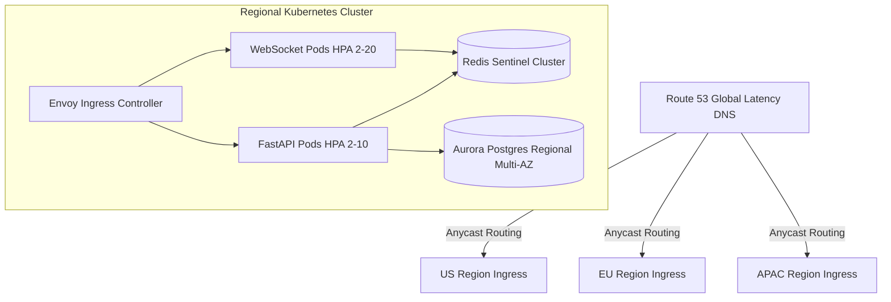
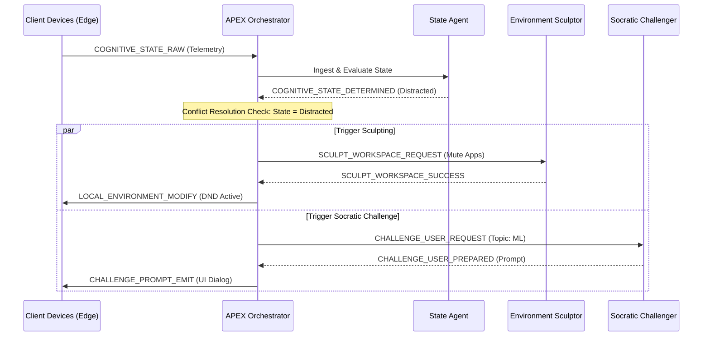
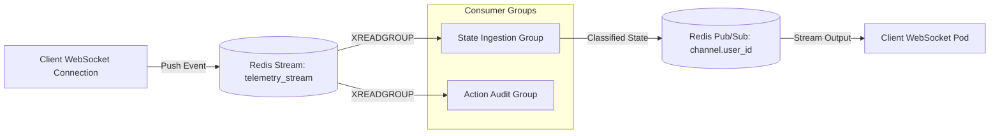
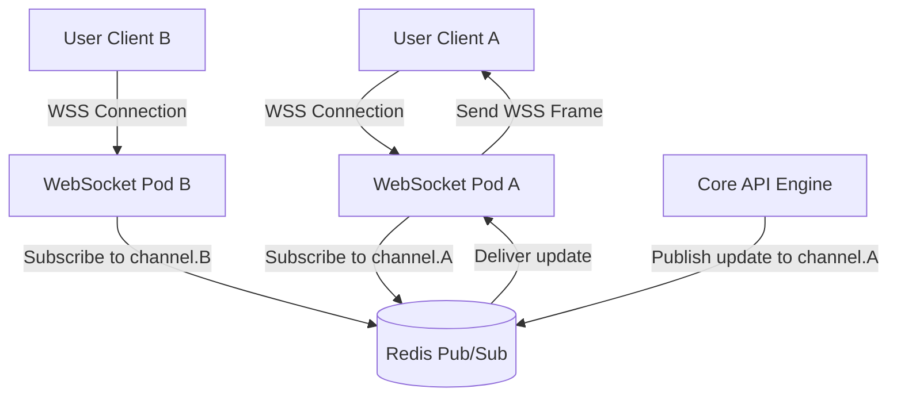
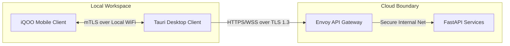
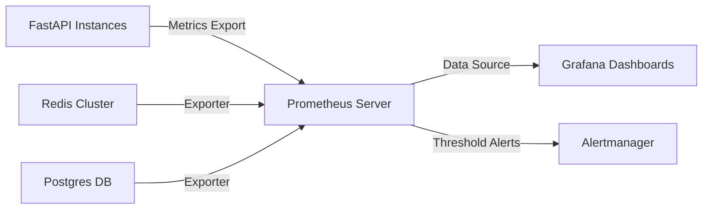

# APEX (Adaptive Presence & Execution Intelligence)
## Technical Architecture & Implementation Specification (Part 5 of 5)

---

## 1. SYSTEM ARCHITECTURE

APEX is designed as a hybrid edge-cloud cognitive operating layer. It splits execution between local client nodes (Tauri on Desktop, Flutter on Mobile) and a horizontally scalable backend (FastAPI, PostgreSQL, Redis, Groq Cloud API). The local nodes use the iQOO Office Kit bridge to achieve sub-100ms local synchronization, routing state telemetry to the cloud for LLM inference and long-term analytical storage.

### 1.1 High-Level Architecture Diagram

```mermaid
graph TB
    subgraph Client Tier (Edge Devices)
        A[iQOO Phone: Flutter Client] <-->|iQOO Office Kit: mTLS Local WiFi/Bluetooth| B[Laptop: Tauri Desktop Client]
        A -->|WebSocket / HTTPS| LB[Cloud Load Balancer: Envoy/Nginx]
        B -->|WebSocket / HTTPS| LB
    end

    subgraph Ingress & Routing
        LB -->|HTTP/REST| API[FastAPI Gateway Services]
        LB -->|WebSockets| WS[WebSocket Orchestrator Pool]
    end

    subgraph Realtime & Messaging
        WS <-->|Pub/Sub & Channel Sync| R_PUB[Redis Event Bus]
        API -->|Enqueue Events| R_PUB
        R_PUB -->|Job Queue| Q_WORK[Celery/RQ Workers]
    end

    subgraph Cognitive Core (Agents)
        Q_WORK -->|Batch Inference| LLM_GATE[Groq Cloud API Gateway]
        WS -->|Streaming States| LLM_GATE
        LLM_GATE -->|llama-3.1-8b-instant| SA[State Agent]
        LLM_GATE -->|llama-3.3-70b-versatile| SC[Socratic / Sentinel / Sculptor]
    end

    subgraph Storage Tier
        API -->|Read/Write| DB[(PostgreSQL Primary)]
        DB -->|Replication| DB_RO[(PostgreSQL Read Replicas)]
        API -->|Cache / Session State| R_CACHE[(Redis Cluster Cache)]
        Q_WORK -->|Vector Search| V_DB[(pgvector Extension)]
    end
    
    style A fill:#FFD400,stroke:#0A0A0A,stroke-width:2px,color:#0A0A0A
    style B fill:#121212,stroke:#FFD400,stroke-width:2px,color:#FFFFFF
    style WS fill:#FFD400,stroke:#0A0A0A,stroke-width:2px,color:#0A0A0A
    style R_PUB fill:#121212,stroke:#B0B0B0,stroke-width:1px,color:#FFFFFF
    style DB fill:#121212,stroke:#00D26A,stroke-width:2px,color:#FFFFFF
```

### 1.2 Service Architecture

APEX leverages a **Service-Oriented Monolith** architecture for core business domain modules, with specialized microservices deployed dynamically for real-time WebSocket state management and heavy ingestion pipelines.

#### Boundary Definition & Core Modules
1. **Core API Engine (Monolith/FastAPI)**: Handles Authentication, User profiles, Calibration, Session metadata, and CRUD operations for Deadlines and Knowledge Graphs.
2. **WebSocket Orchestrator Service (Microservice/FastAPI + WebSockets)**: A lightweight, event-driven gateway holding active, stateful connections to client devices. It handles streaming sensor data and relays real-time actions.
3. **Async Background Workers (Celery/Python)**: Consumes tasks from Redis queues to run complex reasoning flows, OCR, voice transcript processing, and semantic graph indexing.

#### Monolith vs. Microservice Justification
A unified codebase is maintained for API schemas, data models, and database migrations to ensure developer velocity, tight synchronization between related endpoints, and clean type-safety. However, the connection-heavy **WebSocket Service** is split into a separate deployment profile. This separates stateful HTTP connection pools from the short-lived, transaction-heavy REST API processes, allowing independent scaling based on concurrent user connection count rather than database query load.

#### Communication Protocols
* **Client-to-Server REST**: HTTPS (TLS 1.3) with JSON payloads for all stateless, request-response configurations.
* **Client-to-Server Realtime**: WebSockets (Secure, WSS) for streaming telemetry and agent notification loops.
* **Internal Inter-service**: gRPC over HTTP/2 for low-latency communication between the Core API and the WebSocket Orchestrator pool, ensuring rapid validation of connection claims.
* **Database & Cache**: Native TCP connections over TLS, managed through application-level pooling (`asyncpg` for PostgreSQL, `redis-py` connection pooler).

---

### 1.3 Deployment Architecture

APEX is deployed on a Kubernetes (EKS) infrastructure optimized for high availability, sub-100ms state updates, and regional resilience.



#### Kubernetes Cluster Layout
* **Global Load Balancing**: Route 53 Geolocation Routing maps incoming traffic to the nearest regional cluster (us-east-1, eu-central-1, ap-south-1).
* **Ingress**: Envoy-based API Gateways terminate SSL/TLS and execute initial rate-limiting via Redis token-bucket middleware.
* **Horizontal Pod Autoscaling (HPA)**: 
  * Core APIs autoscale based on CPU utilization target (70%).
  * WebSocket servers autoscale based on active connections (max 10,000 connections per pod) and memory usage.

#### CI/CD Pipeline
Every merge to `main` triggers a GitHub Actions pipeline:
1. **Linter & Test Suites**: Runs formatting checks, unit tests, and security scanning (Bandit, Trivy).
2. **Docker Image Build**: Builds optimized multi-stage Docker images pushed to AWS ECR.
3. **Canary Deployments**: ArgoCD deploys to production using a canary strategy: 10% traffic routing initially, running automated health probes for 10 minutes before scaling to 100%. If error rates exceed 0.05% during the deployment window, automatic rollbacks are triggered instantly.

---

## 2. API DESIGN

### 2.1 Authentication API

#### 2.1.1 Register
* **Endpoint**: `POST /api/v1/auth/register`
* **Rate Limit**: 5 requests per IP per minute
* **Request Body**:
```json
{
  "email": "student@university.edu",
  "password": "SecurePassword123!",
  "first_name": "Garv",
  "last_name": "Anand"
}
```
* **Success Response (201 Created)**:
```json
{
  "status": "success",
  "message": "User registered successfully. Verification email sent.",
  "data": {
    "user_id": "8a7199c0-9d0d-400b-bd9f-7bc6f228cf08",
    "email": "student@university.edu",
    "is_active": false
  }
}
```
* **Error Response (400 Bad Request)**:
```json
{
  "error": "EMAIL_ALREADY_EXISTS",
  "message": "A user with this email address already exists in the APEX database."
}
```

#### 2.1.2 Login
* **Endpoint**: `POST /api/v1/auth/login`
* **Rate Limit**: 10 requests per IP per minute
* **Request Body**:
```json
{
  "email": "student@university.edu",
  "password": "SecurePassword123!",
  "device_id": "iqoo-neo9-99482"
}
```
* **Success Response (200 OK)**:
```json
{
  "status": "success",
  "data": {
    "access_token": "eyJhbGciOiJIUzI1NiIsInR5cCI6IkpXVCJ9...",
    "refresh_token": "r_001d9f82d00124ca...",
    "token_type": "Bearer",
    "expires_in": 3600
  }
}
```
* **Error Response (401 Unauthorized)**:
```json
{
  "error": "INVALID_CREDENTIALS",
  "message": "The email or password provided is incorrect."
}
```

#### 2.1.3 Token Refresh
* **Endpoint**: `POST /api/v1/auth/refresh`
* **Rate Limit**: 100 requests per IP per minute
* **Request Body**:
```json
{
  "refresh_token": "r_001d9f82d00124ca..."
}
```
* **Success Response (200 OK)**:
```json
{
  "status": "success",
  "data": {
    "access_token": "eyJhbGciOiJIUzI1NiIsInR5cCI6IkpXVCJ9...",
    "expires_in": 3600
  }
}
```
* **Error Response (403 Forbidden)**:
```json
{
  "error": "REFRESH_TOKEN_EXPIRED",
  "message": "Session expired. Please log in again."
}
```

#### 2.1.4 Logout
* **Endpoint**: `POST /api/v1/auth/logout`
* **Headers**: `Authorization: Bearer <access_token>`
* **Rate Limit**: 20 requests per IP per minute
* **Request Body**: None
* **Success Response (200 OK)**:
```json
{
  "status": "success",
  "message": "Token invalidated and session destroyed successfully."
}
```

#### 2.1.5 Password Reset Request
* **Endpoint**: `POST /api/v1/auth/password-reset/request`
* **Rate Limit**: 3 requests per IP per hour
* **Request Body**:
```json
{
  "email": "student@university.edu"
}
```
* **Success Response (202 Accepted)**:
```json
{
  "status": "success",
  "message": "If the email exists, a password reset link has been dispatched."
}
```

#### 2.1.6 Email Verification
* **Endpoint**: `GET /api/v1/auth/verify-email`
* **Query Parameters**: `token=ev_83ef9901ad2c81`
* **Rate Limit**: 10 requests per IP per minute
* **Success Response (200 OK)**:
```json
{
  "status": "success",
  "message": "Email verified successfully. You can now log into APEX."
}
```

---

### 2.2 User API

#### 2.2.1 Get Profile
* **Endpoint**: `GET /api/v1/users/profile`
* **Headers**: `Authorization: Bearer <access_token>`
* **Rate Limit**: 120 requests per minute
* **Success Response (200 OK)**:
```json
{
  "user_id": "8a7199c0-9d0d-400b-bd9f-7bc6f228cf08",
  "first_name": "Garv",
  "last_name": "Anand",
  "email": "student@university.edu",
  "joined_at": "2026-01-15T08:00:00Z"
}
```

#### 2.2.2 Update Preferences
* **Endpoint**: `PATCH /api/v1/users/preferences`
* **Headers**: `Authorization: Bearer <access_token>`
* **Rate Limit**: 60 requests per minute
* **Request Body**:
```json
{
  "dnd_during_flow": true,
  "socratic_challenge_level": "medium",
  "environment_sculpt_enabled": true,
  "screen_greyscale_trigger": "Fatigued"
}
```
* **Success Response (200 OK)**:
```json
{
  "status": "success",
  "preferences": {
    "dnd_during_flow": true,
    "socratic_challenge_level": "medium",
    "environment_sculpt_enabled": true,
    "screen_greyscale_trigger": "Fatigued"
  }
}
```

#### 2.2.3 Calibration Set Up / Fetch
* **Endpoint**: `POST /api/v1/users/calibration`
* **Headers**: `Authorization: Bearer <access_token>`
* **Rate Limit**: 10 requests per minute
* **Request Body**:
```json
{
  "baseline_hr": 72.5,
  "baseline_hrv": 54.2,
  "calibration_duration_seconds": 300,
  "eye_tracking_sensitivity": 0.85
}
```
* **Success Response (200 OK)**:
```json
{
  "status": "success",
  "calibration_id": "cab110ff-cda2-46bb-8ffb-871638ac8dfa",
  "calibrated_at": "2026-06-03T07:15:00Z"
}
```

---

### 2.3 Cognitive State API

#### 2.3.1 Signals Ingestion
* **Endpoint**: `POST /api/v1/cognitive/signals`
* **Headers**: `Authorization: Bearer <access_token>`
* **Rate Limit**: 600 requests per minute (Optimized stream gateway)
* **Request Body**:
```json
{
  "timestamp": "2026-06-03T07:27:00Z",
  "device_source": "iqoo-neo9-99482",
  "heart_rate": 82.4,
  "hrv": 45.1,
  "blink_rate_per_min": 12,
  "screen_interaction_density": 0.68,
  "active_application": "VS Code",
  "ambient_noise_db": 42.0
}
```
* **Success Response (202 Accepted)**:
```json
{
  "received": true,
  "ingestion_queue_id": "q_sig_8a1290fb4"
}
```

#### 2.3.2 Get Current State
* **Endpoint**: `GET /api/v1/cognitive/state/current`
* **Headers**: `Authorization: Bearer <access_token>`
* **Rate Limit**: 180 requests per minute
* **Success Response (200 OK)**:
```json
{
  "user_id": "8a7199c0-9d0d-400b-bd9f-7bc6f228cf08",
  "state": "Flow",
  "confidence_score": 0.94,
  "updated_at": "2026-06-03T07:27:15Z",
  "contributing_signals": {
    "elevated_hrv": true,
    "blink_rate_dip": true,
    "context_switches": 0
  }
}
```

#### 2.3.3 State History
* **Endpoint**: `GET /api/v1/cognitive/state/history`
* **Query Parameters**: `start=2026-06-03T00:00:00Z&end=2026-06-03T23:59:59Z`
* **Headers**: `Authorization: Bearer <access_token>`
* **Success Response (200 OK)**:
```json
{
  "history": [
    {
      "timestamp": "2026-06-03T07:00:00Z",
      "state": "Flow",
      "duration_seconds": 1800
    },
    {
      "timestamp": "2026-06-03T07:30:00Z",
      "state": "Distracted",
      "duration_seconds": 600
    }
  ]
}
```

#### 2.3.4 Override State
* **Endpoint**: `POST /api/v1/cognitive/state/override`
* **Headers**: `Authorization: Bearer <access_token>`
* **Request Body**:
```json
{
  "intended_state": "Flow",
  "reason": "False distraction flag caused by reading PDF reference material."
}
```
* **Success Response (200 OK)**:
```json
{
  "status": "override_saved",
  "adjusted_state": "Flow"
}
```

#### 2.3.5 Get Patterns
* **Endpoint**: `GET /api/v1/cognitive/state/patterns`
* **Headers**: `Authorization: Bearer <access_token>`
* **Success Response (200 OK)**:
```json
{
  "weekly_flow_hours": 18.5,
  "primary_distractor": "Chrome (YouTube)",
  "peak_cognitive_hour_utc": 9,
  "fatigue_onset_curve": [
    {"hour": 1, "fatigue_probability": 0.1},
    {"hour": 4, "fatigue_probability": 0.75}
  ]
}
```

---

### 2.4 Deadlines API

#### 2.4.1 CRUD Operations

##### Create Deadline
* **Endpoint**: `POST /api/v1/deadlines`
* **Request Body**:
```json
{
  "title": "Machine Learning Lab 3",
  "description": "Implement backpropagation from scratch in NumPy.",
  "due_date": "2026-06-10T23:59:59Z",
  "priority": 1,
  "syllabus_source_id": null
}
```
* **Success Response (201 Created)**:
```json
{
  "id": "dl_9a12bc20-994f-4d89-9e8c-8f1234ac99ee",
  "title": "Machine Learning Lab 3",
  "due_date": "2026-06-10T23:59:59Z",
  "risk_score": 0.42,
  "status": "pending"
}
```

##### Read Deadline
* **Endpoint**: `GET /api/v1/deadlines/{id}`
* **Success Response (200 OK)**:
```json
{
  "id": "dl_9a12bc20-994f-4d89-9e8c-8f1234ac99ee",
  "title": "Machine Learning Lab 3",
  "description": "Implement backpropagation from scratch.",
  "due_date": "2026-06-10T23:59:59Z",
  "risk_score": 0.42,
  "subtasks": []
}
```

##### Update Deadline
* **Endpoint**: `PUT /api/v1/deadlines/{id}`
* **Request Body**:
```json
{
  "title": "Machine Learning Lab 3 - Optimization",
  "due_date": "2026-06-12T23:59:59Z"
}
```
* **Success Response (200 OK)**:
```json
{
  "id": "dl_9a12bc20-994f-4d89-9e8c-8f1234ac99ee",
  "due_date": "2026-06-12T23:59:59Z",
  "updated_at": "2026-06-03T07:27:36Z"
}
```

##### Delete Deadline
* **Endpoint**: `DELETE /api/v1/deadlines/{id}`
* **Success Response (200 OK)**:
```json
{
  "status": "success",
  "message": "Deadline deleted successfully."
}
```

#### 2.4.2 Subtasks Operations

##### List Subtasks
* **Endpoint**: `GET /api/v1/deadlines/{id}/subtasks`
* **Success Response (200 OK)**:
```json
[
  {
    "subtask_id": "sub_01aef8",
    "title": "Write gradient check functions",
    "is_completed": false
  }
]
```

##### Create Subtask
* **Endpoint**: `POST /api/v1/deadlines/{id}/subtasks`
* **Request Body**:
```json
{
  "title": "Draft performance evaluation plots"
}
```
* **Success Response (201 Created)**:
```json
{
  "subtask_id": "sub_02bef9",
  "title": "Draft performance evaluation plots",
  "is_completed": false
}
```

#### 2.4.3 Upcoming Deadlines
* **Endpoint**: `GET /api/v1/deadlines/upcoming`
* **Query Parameters**: `limit=10`
* **Success Response (200 OK)**:
```json
{
  "upcoming": [
    {
      "id": "dl_9a12bc20-994f-4d89-9e8c-8f1234ac99ee",
      "title": "Machine Learning Lab 3",
      "due_date": "2026-06-12T23:59:59Z"
    }
  ]
}
```

#### 2.4.4 Risk Assessment
* **Endpoint**: `GET /api/v1/deadlines/risk-assessment`
* **Success Response (200 OK)**:
```json
{
  "high_risk_count": 1,
  "assessments": [
    {
      "deadline_id": "dl_9a12bc20-994f-4d89-9e8c-8f1234ac99ee",
      "risk_factor": 0.87,
      "risk_classification": "CRITICAL_PATH_AT_RISK",
      "reasons": ["High complexity project", "Student has accumulated 12 distracted hours this week"]
    }
  ]
}
```

#### 2.4.5 Syllabus Scanning
* **Endpoint**: `POST /api/v1/deadlines/syllabus-scan`
* **Request Body**:
```json
{
  "document_url": "https://storage.apex.io/syllabi/cs401_syllabus.pdf"
}
```
* **Success Response (202 Accepted)**:
```json
{
  "task_id": "tsk_ocr_991823ab",
  "status": "processing",
  "message": "Extracting curriculum parameters and course timelines."
}
```

---

### 2.5 Agent API

#### 2.5.1 Agent Status
* **Endpoint**: `GET /api/v1/agents/status`
* **Success Response (200 OK)**:
```json
{
  "agents": {
    "state_agent": "active",
    "deadline_sentinel": "active",
    "environment_sculptor": "idle",
    "peer_radar": "active",
    "socratic_challenger": "active"
  }
}
```

#### 2.5.2 Actions Log
* **Endpoint**: `GET /api/v1/agents/logs`
* **Query Parameters**: `agent_name=environment_sculptor&limit=5`
* **Success Response (200 OK)**:
```json
[
  {
    "timestamp": "2026-06-03T07:10:00Z",
    "action": "TRIGGERED_DND_MODE",
    "details": "Muted all incoming communications due to Flow state detection."
  }
]
```

#### 2.5.3 Configuration
* **Endpoint**: `PUT /api/v1/agents/config`
* **Request Body**:
```json
{
  "agent_name": "socratic_challenger",
  "config": {
    "intervention_frequency_per_hr": 2,
    "allow_voice_interventions": false
  }
}
```
* **Success Response (200 OK)**:
```json
{
  "status": "updated",
  "agent_name": "socratic_challenger"
}
```

#### 2.5.4 Orchestrator Mediation & Approvals
* **Endpoint**: `POST /api/v1/agents/approvals`
* **Request Body**:
```json
{
  "action_id": "act_88201a0",
  "approved": true
}
```
* **Success Response (200 OK)**:
```json
{
  "status": "executed",
  "action_id": "act_88201a0"
}
```

---

### 2.6 Sessions API

#### 2.6.1 Start Session
* **Endpoint**: `POST /api/v1/sessions/start`
* **Request Body**:
```json
{
  "session_type": "STUDY",
  "planned_duration_seconds": 7200
}
```
* **Success Response (201 Created)**:
```json
{
  "session_id": "sess_001923ab-cd2a-4402-99be-8b1cda99ee8a",
  "started_at": "2026-06-03T07:27:36Z"
}
```

#### 2.6.2 End Session
* **Endpoint**: `POST /api/v1/sessions/end`
* **Request Body**:
```json
{
  "session_id": "sess_001923ab-cd2a-4402-99be-8b1cda99ee8a"
}
```
* **Success Response (200 OK)**:
```json
{
  "session_id": "sess_001923ab-cd2a-4402-99be-8b1cda99ee8a",
  "duration_seconds": 7234,
  "efficiency_score": 0.88
}
```

#### 2.6.3 Session Replay Data
* **Endpoint**: `GET /api/v1/sessions/{id}/replay`
* **Success Response (200 OK)**:
```json
{
  "session_id": "sess_001923ab-cd2a-4402-99be-8b1cda99ee8a",
  "time_series": [
    {"timestamp": "2026-06-03T07:28:00Z", "cognitive_state": "Flow", "heart_rate": 74.0}
  ]
}
```

#### 2.6.4 Session Metrics
* **Endpoint**: `GET /api/v1/sessions/metrics`
* **Success Response (200 OK)**:
```json
{
  "total_sessions": 42,
  "average_efficiency": 0.81,
  "cumulative_focus_minutes": 5120
}
```

---

### 2.7 Focus API

#### 2.7.1 Start Focus Block
* **Endpoint**: `POST /api/v1/focus/start`
* **Request Body**:
```json
{
  "target_goal": "Resolve bug ticket #422"
}
```
* **Success Response (201 Created)**:
```json
{
  "focus_id": "foc_9aa128fe",
  "started_at": "2026-06-03T07:27:36Z"
}
```

#### 2.7.2 End Focus Block
* **Endpoint**: `POST /api/v1/focus/end`
* **Request Body**:
```json
{
  "focus_id": "foc_9aa128fe",
  "outcome_summary": "Successfully debugged and pushed changes."
}
```
* **Success Response (200 OK)**:
```json
{
  "focus_id": "foc_9aa128fe",
  "duration_seconds": 1500,
  "distraction_incidents": 0
}
```

#### 2.7.3 Statistics
* **Endpoint**: `GET /api/v1/focus/statistics`
* **Success Response (200 OK)**:
```json
{
  "daily_focus_duration": 12000,
  "streak_days": 5
}
```

---

### 2.8 Voice API

#### 2.8.1 Upload Audio Segment
* **Endpoint**: `POST /api/v1/voice/upload`
* **Headers**: `Content-Type: multipart/form-data`
* **Request Body**: Binary multi-part payload containing `.wav` file (16kHz, mono).
* **Success Response (202 Accepted)**:
```json
{
  "voice_id": "voc_9a1288fa",
  "status": "processing"
}
```

#### 2.8.2 Transcription Fetch
* **Endpoint**: `GET /api/v1/voice/{id}/transcribe`
* **Success Response (200 OK)**:
```json
{
  "voice_id": "voc_9a1288fa",
  "transcription": "The professor notes that dynamic programming is essential for parsing trees..."
}
```

#### 2.8.3 Summary
* **Endpoint**: `GET /api/v1/voice/{id}/summary`
* **Success Response (200 OK)**:
```json
{
  "summary": "Lecture covered binary parse trees and introduced Dynamic Programming parameters."
}
```

#### 2.8.4 Insights
* **Endpoint**: `GET /api/v1/voice/{id}/insights`
* **Success Response (200 OK)**:
```json
{
  "insights": [
    {
      "type": "potential_exam_question",
      "text": "Explain bottom-up vs top-down Dynamic Programming approach."
    }
  ]
}
```

---

### 2.9 Knowledge API

#### 2.9.1 CRUD Operations

##### Create Knowledge Node
* **Endpoint**: `POST /api/v1/knowledge/nodes`
* **Request Body**:
```json
{
  "title": "Dynamic Programming",
  "content": "A method for solving complex problems by breaking them down into simpler subproblems.",
  "metadata": {"source": "CS301 Lecture 4"}
}
```
* **Success Response (201 Created)**:
```json
{
  "node_id": "kn_001",
  "vector_status": "indexed"
}
```

##### Read Knowledge Node
* **Endpoint**: `GET /api/v1/knowledge/nodes/{id}`
* **Success Response (200 OK)**:
```json
{
  "node_id": "kn_001",
  "title": "Dynamic Programming",
  "content": "A method for solving complex problems...",
  "embedding_id": "emb_912ba"
}
```

##### Update Knowledge Node
* **Endpoint**: `PUT /api/v1/knowledge/nodes/{id}`
* **Request Body**:
```json
{
  "content": "Updated Dynamic Programming with details on memoization vs tabulation."
}
```
* **Success Response (200 OK)**:
```json
{
  "node_id": "kn_001",
  "status": "updated"
}
```

##### Delete Knowledge Node
* **Endpoint**: `DELETE /api/v1/knowledge/nodes/{id}`
* **Success Response (200 OK)**:
```json
{
  "status": "success",
  "message": "Node removed from vector space."
}
```

#### 2.9.2 Semantic Search
* **Endpoint**: `POST /api/v1/knowledge/search`
* **Request Body**:
```json
{
  "query": "recursive subproblems",
  "top_k": 3
}
```
* **Success Response (200 OK)**:
```json
{
  "results": [
    {
      "node_id": "kn_001",
      "title": "Dynamic Programming",
      "cosine_similarity": 0.895
    }
  ]
}
```

#### 2.9.3 Graph Representation
* **Endpoint**: `GET /api/v1/knowledge/graph`
* **Success Response (200 OK)**:
```json
{
  "nodes": [
    {"id": "kn_001", "label": "Dynamic Programming"}
  ],
  "edges": [
    {"source": "kn_001", "target": "kn_002", "relationship": "depends_on"}
  ]
}
```

---

### 2.10 Peer Radar API

#### 2.10.1 Connect Platform
* **Endpoint**: `POST /api/v1/peer-radar/connect`
* **Request Body**:
```json
{
  "platform_name": "Discord",
  "auth_payload": {"webhook_url": "https://discord.com/api/webhooks/..."}
}
```
* **Success Response (200 OK)**:
```json
{
  "status": "connected",
  "platform_id": "pl_0182ba"
}
```

#### 2.10.2 Disconnect Platform
* **Endpoint**: `POST /api/v1/peer-radar/disconnect`
* **Request Body**:
```json
{
  "platform_id": "pl_0182ba"
}
```
* **Success Response (200 OK)**:
```json
{
  "status": "disconnected"
}
```

#### 2.10.3 Summaries Feed
* **Endpoint**: `GET /api/v1/peer-radar/summaries`
* **Success Response (200 OK)**:
```json
[
  {
    "source_group": "CS Senior Project Group",
    "summary": "The group decided to use PostgreSQL instead of MongoDB. Next meeting is Friday at 2 PM.",
    "priority": "HIGH"
  }
]
```

#### 2.10.4 Group Management
* **Endpoint**: `POST /api/v1/peer-radar/groups`
* **Request Body**:
```json
{
  "name": "Robotics Lab"
}
```
* **Success Response (201 Created)**:
```json
{
  "group_id": "grp_robotics",
  "name": "Robotics Lab"
}
```

---

### 2.11 Analytics API & System API

#### 2.11.1 Cognitive Performance Data
* **Endpoint**: `GET /api/v1/analytics/cognitive-performance`
* **Success Response (200 OK)**:
```json
{
  "focus_efficiency": 0.89,
  "cognitive_depletion_velocity": 0.05
}
```

#### 2.11.2 System Health
* **Endpoint**: `GET /api/v1/system/health`
* **Success Response (200 OK)**:
```json
{
  "status": "healthy",
  "services": {
    "db": "up",
    "redis": "up",
    "groq_gateway": "up"
  }
}
```

#### 2.11.3 System Metrics
* **Endpoint**: `GET /api/v1/system/metrics`
* **Success Response (200 OK)**:
```json
{
  "active_websockets": 45120,
  "average_latency_ms": 38.5,
  "queue_depth": 0
}
```

---

## 3. DATABASE SCHEMA

### 3.1 Entity Relationship Diagram

```mermaid
erDiagram
    USERS ||--|| USER_PREFERENCES : has
    USERS ||--o{ AUTH_TOKENS : owns
    USERS ||--o{ DEVICE_REGISTRATIONS : registers
    USERS ||--o{ CALIBRATION_PROFILES : calibrates
    USERS ||--o{ RAW_SIGNALS : emits
    USERS ||--o{ COGNITIVE_STATES : achieves
    USERS ||--o{ COGNITIVE_STATE_OVERRIDES : overrides
    USERS ||--o{ COGNITIVE_STATE_PATTERNS : forms
    USERS ||--o{ DEADLINES : tracks
    USERS ||--o{ WORK_SESSIONS : conducts
    USERS ||--o{ PEER_PLATFORMS : integrates
    USERS ||--o{ PEER_GROUPS : owns

    DEADLINES ||--o{ SUBTASKS : splits
    DEADLINES ||--o{ DEADLINE_RISK_SCORES : evaluates
    DEADLINES ||--o{ ACADEMIC_SYLLABI : references

    WORK_SESSIONS ||--o{ FOCUS_SESSIONS : contains
    FOCUS_SESSIONS ||--o{ FOCUS_DISTRACTIONS : logs
    
    USERS ||--o{ VOICE_RECORDINGS : records
    VOICE_RECORDINGS ||--o{ VOICE_TRANSCRIPTS : produces

    USERS ||--o{ KNOWLEDGE_NODES : holds
    KNOWLEDGE_NODES ||--o{ KNOWLEDGE_LINKS : links
    
    PEER_PLATFORMS ||--o{ PEER_SUMMARIES : pulls
    PEER_GROUPS ||--o{ PEER_GROUP_MEMBERS : houses
    
    USERS ||--o{ SOCRATIC_CHALLENGES : challenges
    SOCRATIC_CHALLENGES ||--o{ SOCRATIC_RESPONSES : receives

    USERS ||--o{ WORKSPACE_ENVIRONMENTS : sculpts
    USERS ||--o{ SYNC_QUEUE : queues
```



---

### 3.2 Tables Definition

All UUID columns utilize UUIDv4 generation on insert (`gen_random_uuid()`).

#### Table 1: `users`
*Core user authentication and master record.*
| Column | Type | Constraints | Default | Description |
|---|---|---|---|---|
| `id` | UUID | PRIMARY KEY | `gen_random_uuid()` | Master record UUID |
| `email` | VARCHAR(255) | UNIQUE, NOT NULL | | Primary account email |
| `password_hash` | VARCHAR(255) | NOT NULL | | Argon2id hash value |
| `first_name` | VARCHAR(100) | NOT NULL | | Given name |
| `last_name` | VARCHAR(100) | NOT NULL | | Family name |
| `is_active` | BOOLEAN | NOT NULL | `false` | Email verification flag |
| `created_at` | TIMESTAMPTZ | NOT NULL | `NOW()` | Registration timestamp |

#### Table 2: `user_preferences`
*Configuration settings governing AI execution parameters.*
| Column | Type | Constraints | Default | Description |
|---|---|---|---|---|
| `user_id` | UUID | FK -> `users(id)` ON DELETE CASCADE | | User reference |
| `dnd_during_flow` | BOOLEAN | NOT NULL | `true` | Automates Do-Not-Disturb state |
| `socratic_challenge_level` | VARCHAR(20) | CHECK (in ('low', 'medium', 'high')) | `'medium'` | Socratic prompting depth |
| `environment_sculpt_enabled`| BOOLEAN | NOT NULL | `true` | Allows local interface shaping |
| `screen_greyscale_trigger` | VARCHAR(20) | | `'Fatigued'` | State inducing screen greyscale |
| `updated_at` | TIMESTAMPTZ | NOT NULL | `NOW()` | Record modification timestamp |

#### Table 3: `auth_tokens`
*JWT rotation validation records.*
| Column | Type | Constraints | Default | Description |
|---|---|---|---|---|
| `id` | UUID | PRIMARY KEY | `gen_random_uuid()` | Unique token identifier |
| `user_id` | UUID | FK -> `users(id)` ON DELETE CASCADE | | User reference |
| `refresh_token` | VARCHAR(512) | UNIQUE, NOT NULL | | Cryptographically signed token |
| `is_revoked` | BOOLEAN | NOT NULL | `false` | Force-logout status flag |
| `expires_at` | TIMESTAMPTZ | NOT NULL | | Absolute validity threshold |

#### Table 4: `device_registrations`
*Authorized hardware assets for Office Kit pairing validation.*
| Column | Type | Constraints | Default | Description |
|---|---|---|---|---|
| `id` | UUID | PRIMARY KEY | `gen_random_uuid()` | Device entry token |
| `user_id` | UUID | FK -> `users(id)` ON DELETE CASCADE | | User reference |
| `device_id` | VARCHAR(255) | UNIQUE, NOT NULL | | Client-supplied hardware fingerprint |
| `device_type` | VARCHAR(50) | CHECK (in ('mobile', 'desktop')) | | Device operating platform |
| `push_token` | VARCHAR(512) | | | APNS/FCM delivery endpoint |
| `last_seen_at` | TIMESTAMPTZ | NOT NULL | `NOW()` | Last contact epoch |

#### Table 5: `calibration_profiles`
*Device-specific biometrics calibration baseline.*
| Column | Type | Constraints | Default | Description |
|---|---|---|---|---|
| `id` | UUID | PRIMARY KEY | `gen_random_uuid()` | Configuration tracking token |
| `user_id` | UUID | FK -> `users(id)` ON DELETE CASCADE | | User reference |
| `baseline_hr` | DOUBLE PRECISION | NOT NULL | | Baseline resting heart rate (BPM) |
| `baseline_hrv` | DOUBLE PRECISION | NOT NULL | | Resting HRV (RMSSD in ms) |
| `eye_tracking_sensitivity` | DOUBLE PRECISION | NOT NULL | | Focal velocity offset multiplier |
| `calibrated_at` | TIMESTAMPTZ | NOT NULL | `NOW()` | Calibration initialization timestamp |

#### Table 6: `raw_signals`
*Telemetry capture buffer. Partitioned by range over `timestamp`.*
| Column | Type | Constraints | Default | Description |
|---|---|---|---|---|
| `id` | BIGSERIAL | PRIMARY KEY (composite with timestamp) | | Ingestion sequence identifier |
| `user_id` | UUID | FK -> `users(id)` ON DELETE CASCADE | | User reference |
| `device_id` | VARCHAR(255) | NOT NULL | | Sourcing device fingerprint |
| `timestamp` | TIMESTAMPTZ | NOT NULL | | Exact signal capture timestamp |
| `heart_rate` | DOUBLE PRECISION | | | Local biosensor HR reading |
| `hrv` | DOUBLE PRECISION | | | Local biosensor HRV metric |
| `blink_rate` | INTEGER | | | Eye-tracker blink frequency |
| `screen_interaction` | DOUBLE PRECISION | | | Desktop event key/mouse activity |
| `active_app` | VARCHAR(100) | | | Foreground window context |
| `ambient_db` | DOUBLE PRECISION | | | Environmental noise amplitude |

> [!NOTE]
> `raw_signals` is partitioned monthly. Due to high insertion volumes, primary keys are structural indexes combined with timestamps to optimize disk layout.

#### Table 7: `cognitive_states`
*Processed sequence history of determined focus intervals.*
| Column | Type | Constraints | Default | Description |
|---|---|---|---|---|
| `id` | UUID | PRIMARY KEY | `gen_random_uuid()` | State block index |
| `user_id` | UUID | FK -> `users(id)` ON DELETE CASCADE | | User reference |
| `state` | VARCHAR(20) | CHECK (in ('Flow', 'Distracted', 'Fatigued', 'Overloaded')) | | Classifier evaluation |
| `confidence` | DOUBLE PRECISION | NOT NULL | | Probability vector magnitude |
| `determined_at` | TIMESTAMPTZ | NOT NULL | `NOW()` | Pipeline timestamp |
| `duration_seconds` | INTEGER | NOT NULL | `0` | Lifespan of this verified state |

#### Table 8: `cognitive_state_overrides`
*Human override logs to calibrate downstream classification model.*
| Column | Type | Constraints | Default | Description |
|---|---|---|---|---|
| `id` | UUID | PRIMARY KEY | `gen_random_uuid()` | Record UUID |
| `user_id` | UUID | FK -> `users(id)` ON DELETE CASCADE | | User reference |
| `state_id` | UUID | FK -> `cognitive_states(id)` | | Original state record reference |
| `user_provided_state` | VARCHAR(20) | NOT NULL | | Human classification input |
| `justification` | TEXT | | | User commentary |
| `created_at` | TIMESTAMPTZ | NOT NULL | `NOW()` | Feedback collection timestamp |

#### Table 9: `cognitive_state_patterns`
*Periodically updated statistical maps of student focus zones.*
| Column | Type | Constraints | Default | Description |
|---|---|---|---|---|
| `id` | UUID | PRIMARY KEY | `gen_random_uuid()` | Record index |
| `user_id` | UUID | FK -> `users(id)` ON DELETE CASCADE | | User reference |
| `period_start` | TIMESTAMPTZ | NOT NULL | | Evaluation window lower bound |
| `period_end` | TIMESTAMPTZ | NOT NULL | | Evaluation window upper bound |
| `statistics_json` | JSONB | NOT NULL | | Summary statistics payload |

#### Table 10: `deadlines`
*Academic tracking checkpoints.*
| Column | Type | Constraints | Default | Description |
|---|---|---|---|---|
| `id` | UUID | PRIMARY KEY | `gen_random_uuid()` | Deadline identification key |
| `user_id` | UUID | FK -> `users(id)` ON DELETE CASCADE | | User reference |
| `title` | VARCHAR(255) | NOT NULL | | Heading / Title of task |
| `description` | TEXT | | | Expanded deliverables |
| `due_date` | TIMESTAMPTZ | NOT NULL | | Absolute completion target date |
| `priority` | INTEGER | NOT NULL | `3` | Relative baseline rank |
| `status` | VARCHAR(50) | DEFAULT 'pending' | | Lifecycle state |
| `created_at` | TIMESTAMPTZ | NOT NULL | `NOW()` | Record initialization timestamp |

#### Table 11: `subtasks`
*Deconstructed checkpoints parsed by Deadline Sentinel.*
| Column | Type | Constraints | Default | Description |
|---|---|---|---|---|
| `id` | UUID | PRIMARY KEY | `gen_random_uuid()` | Subtask identifier |
| `deadline_id` | UUID | FK -> `deadlines(id)` ON DELETE CASCADE | | Deadline association |
| `title` | VARCHAR(255) | NOT NULL | | Subtask definition |
| `is_completed` | BOOLEAN | NOT NULL | `false` | Completion status flag |
| `created_at` | TIMESTAMPTZ | NOT NULL | `NOW()` | Record initialization timestamp |

#### Table 12: `deadline_risk_scores`
*Calculated risk metrics generated by Deadline Sentinel.*
| Column | Type | Constraints | Default | Description |
|---|---|---|---|---|
| `id` | UUID | PRIMARY KEY | `gen_random_uuid()` | Risk evaluation key |
| `deadline_id` | UUID | FK -> `deadlines(id)` ON DELETE CASCADE | | Deadline reference |
| `risk_coefficient` | DOUBLE PRECISION | NOT NULL | | Calculated danger score [0-1] |
| `risk_tier` | VARCHAR(20) | CHECK (in ('low', 'medium', 'high', 'critical')) | | Category of threat |
| `reasoning` | JSONB | NOT NULL | | Specific risk criteria breakdown |
| `calculated_at` | TIMESTAMPTZ | NOT NULL | `NOW()` | Calculation timestamp |

#### Table 13: `academic_syllabi`
*Extracted documents containing syllabus timelines.*
| Column | Type | Constraints | Default | Description |
|---|---|---|---|---|
| `id` | UUID | PRIMARY KEY | `gen_random_uuid()` | Document ID |
| `user_id` | UUID | FK -> `users(id)` | | User reference |
| `course_code` | VARCHAR(50) | NOT NULL | | Associated academic course identifier |
| `raw_text` | TEXT | NOT NULL | | Extracted text from PDF scanning |
| `uploaded_at` | TIMESTAMPTZ | NOT NULL | `NOW()` | Ingestion timestamp |

#### Table 14: `agents`
*System configuration registers representing active agent processes.*
| Column | Type | Constraints | Default | Description |
|---|---|---|---|---|
| `id` | UUID | PRIMARY KEY | `gen_random_uuid()` | Registry entry key |
| `agent_name` | VARCHAR(100) | UNIQUE, NOT NULL | | Unique agent identity name |
| `version` | VARCHAR(20) | NOT NULL | | Deploy identifier version |
| `status` | VARCHAR(50) | NOT NULL | `'active'` | Operating system lifecycle state |

#### Table 15: `agent_configurations`
*Specific operational settings per agent.*
| Column | Type | Constraints | Default | Description |
|---|---|---|---|---|
| `user_id` | UUID | FK -> `users(id)` ON DELETE CASCADE | | User reference |
| `agent_id` | UUID | FK -> `agents(id)` ON DELETE CASCADE | | Agent configuration reference |
| `config_json` | JSONB | NOT NULL | | Applied operating constraints |
| `updated_at` | TIMESTAMPTZ | NOT NULL | `NOW()` | Last setting modification |

#### Table 16: `agent_logs`
*Audit trail tracking all agent actions and system executions.*
| Column | Type | Constraints | Default | Description |
|---|---|---|---|---|
| `id` | UUID | PRIMARY KEY | `gen_random_uuid()` | Execution log identifier |
| `user_id` | UUID | FK -> `users(id)` ON DELETE CASCADE | | User reference |
| `agent_id` | UUID | FK -> `agents(id)` | | Responsible agent signature |
| `action_taken` | VARCHAR(100) | NOT NULL | | Action label |
| `execution_details`| JSONB | NOT NULL | | Detail payload |
| `timestamp` | TIMESTAMPTZ | NOT NULL | `NOW()` | Occurrence log timestamp |

#### Table 17: `agent_approvals`
*Pending and resolved orchestrator interventions requiring confirmation.*
| Column | Type | Constraints | Default | Description |
|---|---|---|---|---|
| `id` | UUID | PRIMARY KEY | `gen_random_uuid()` | Approval process identifier |
| `user_id` | UUID | FK -> `users(id)` ON DELETE CASCADE | | User reference |
| `action_id` | UUID | NOT NULL | | Associated action payload key |
| `action_type` | VARCHAR(100) | NOT NULL | | Action type classification |
| `status` | VARCHAR(20) | CHECK (in ('pending', 'approved', 'rejected', 'expired')) | | User response status |
| `payload` | JSONB | NOT NULL | | Intervention details |
| `expires_at` | TIMESTAMPTZ | NOT NULL | | Automated execution threshold |
| `created_at` | TIMESTAMPTZ | NOT NULL | `NOW()` | Event initialization timestamp |

#### Table 18: `work_sessions`
*Macro study block tracking periods.*
| Column | Type | Constraints | Default | Description |
|---|---|---|---|---|
| `id` | UUID | PRIMARY KEY | `gen_random_uuid()` | Study session identifier |
| `user_id` | UUID | FK -> `users(id)` ON DELETE CASCADE | | User reference |
| `session_type` | VARCHAR(50) | NOT NULL | | Type of work session |
| `started_at` | TIMESTAMPTZ | NOT NULL | | Time tracking start |
| `ended_at` | TIMESTAMPTZ | | | Time tracking end |
| `efficiency_score` | DOUBLE PRECISION | | | Performance metrics result |

#### Table 19: `focus_sessions`
*Micro focus blocks nested inside macro work sessions.*
| Column | Type | Constraints | Default | Description |
|---|---|---|---|---|
| `id` | UUID | PRIMARY KEY | `gen_random_uuid()` | Focus block key |
| `work_session_id`| UUID | FK -> `work_sessions(id)` ON DELETE CASCADE | | Parent session pointer |
| `goal_statement` | TEXT | NOT NULL | | Intended focus goal |
| `started_at` | TIMESTAMPTZ | NOT NULL | | Focus period start |
| `ended_at` | TIMESTAMPTZ | | | Focus period end |

#### Table 20: `focus_distractions`
*Distraction events intercepted by the environment sculptor.*
| Column | Type | Constraints | Default | Description |
|---|---|---|---|---|
| `id` | UUID | PRIMARY KEY | `gen_random_uuid()` | Event tracking key |
| `focus_session_id`| UUID | FK -> `focus_sessions(id)` ON DELETE CASCADE | | Parent focus block pointer |
| `app_name` | VARCHAR(100) | NOT NULL | | Application generating distraction |
| `window_title` | VARCHAR(255) | | | Intercepted window title |
| `duration_seconds`| INTEGER | NOT NULL | | Duration of distraction |
| `timestamp` | TIMESTAMPTZ | NOT NULL | `NOW()` | Intercept event timestamp |

#### Table 21: `voice_recordings`
*Metadata for audio recording segments.*
| Column | Type | Constraints | Default | Description |
|---|---|---|---|---|
| `id` | UUID | PRIMARY KEY | `gen_random_uuid()` | Audio file key |
| `user_id` | UUID | FK -> `users(id)` ON DELETE CASCADE | | User reference |
| `storage_url` | VARCHAR(512) | NOT NULL | | Encrypted S3 asset reference |
| `recorded_at` | TIMESTAMPTZ | NOT NULL | | Audio recording epoch |
| `duration_seconds`| DOUBLE PRECISION | NOT NULL | | Playback duration |

#### Table 22: `voice_transcripts`
*Transcribed content and metadata generated from recordings.*
| Column | Type | Constraints | Default | Description |
|---|---|---|---|---|
| `id` | UUID | PRIMARY KEY | `gen_random_uuid()` | Transcript record key |
| `recording_id` | UUID | FK -> `voice_recordings(id)` ON DELETE CASCADE | | Source audio reference |
| `transcript` | TEXT | NOT NULL | | Extracted text block |
| `summary` | TEXT | | | AI-generated summary |
| `insights_json` | JSONB | | | Extracted follow-up tasks |
| `processed_at` | TIMESTAMPTZ | NOT NULL | `NOW()` | Whisper processing timestamp |

#### Table 23: `knowledge_nodes`
*Core semantic graph concept representations.*
| Column | Type | Constraints | Default | Description |
|---|---|---|---|---|
| `id` | UUID | PRIMARY KEY | `gen_random_uuid()` | Concept node key |
| `user_id` | UUID | FK -> `users(id)` ON DELETE CASCADE | | User reference |
| `title` | VARCHAR(255) | NOT NULL | | Concept node title |
| `content` | TEXT | NOT NULL | | Detailed concept explanation |
| `embedding` | vector(1536) | | | pgvector multi-dimensional array |
| `created_at` | TIMESTAMPTZ | NOT NULL | `NOW()` | Record initialization timestamp |

#### Table 24: `knowledge_links`
*Semantic linkages mapping the knowledge graph topology.*
| Column | Type | Constraints | Default | Description |
|---|---|---|---|---|
| `id` | UUID | PRIMARY KEY | `gen_random_uuid()` | Link mapping identifier |
| `user_id` | UUID | FK -> `users(id)` ON DELETE CASCADE | | User reference |
| `source_node_id` | UUID | FK -> `knowledge_nodes(id)` ON DELETE CASCADE | | Source entity key |
| `target_node_id` | UUID | FK -> `knowledge_nodes(id)` ON DELETE CASCADE | | Target entity key |
| `relationship` | VARCHAR(100) | NOT NULL | | Semantic link relationship description |

#### Table 25: `peer_platforms`
*External integrations monitoring peer communication.*
| Column | Type | Constraints | Default | Description |
|---|---|---|---|---|
| `id` | UUID | PRIMARY KEY | `gen_random_uuid()` | Integration key |
| `user_id` | UUID | FK -> `users(id)` ON DELETE CASCADE | | User reference |
| `platform_name` | VARCHAR(50) | CHECK (in ('Discord', 'Slack', 'Teams')) | | Integrated platform name |
| `auth_token_enc` | BYTEA | NOT NULL | | Encrypted access token |
| `last_synced_at` | TIMESTAMPTZ | NOT NULL | `NOW()` | Integration sync execution timestamp |

#### Table 26: `peer_summaries`
*Summarized action items from academic group chats.*
| Column | Type | Constraints | Default | Description |
|---|---|---|---|---|
| `id` | UUID | PRIMARY KEY | `gen_random_uuid()` | Action item identifier |
| `platform_id` | UUID | FK -> `peer_platforms(id)` ON DELETE CASCADE | | Source platform reference |
| `original_context`| TEXT | | | Original text snippet |
| `summary` | TEXT | NOT NULL | | Action summary text |
| `urgency_score` | DOUBLE PRECISION | NOT NULL | | Urgency estimation |
| `generated_at` | TIMESTAMPTZ | NOT NULL | `NOW()` | Summary compilation timestamp |

#### Table 27: `peer_groups`
*User-defined academic workgroups.*
| Column | Type | Constraints | Default | Description |
|---|---|---|---|---|
| `id` | UUID | PRIMARY KEY | `gen_random_uuid()` | Workgroup key |
| `user_id` | UUID | FK -> `users(id)` ON DELETE CASCADE | | User reference |
| `name` | VARCHAR(100) | NOT NULL | | Group project name |
| `created_at` | TIMESTAMPTZ | NOT NULL | `NOW()` | Group setup timestamp |

#### Table 28: `peer_group_members`
*External student accounts associated with workgroups.*
| Column | Type | Constraints | Default | Description |
|---|---|---|---|---|
| `id` | UUID | PRIMARY KEY | `gen_random_uuid()` | Group member identifier |
| `group_id` | UUID | FK -> `peer_groups(id)` ON DELETE CASCADE | | Workspace association |
| `display_name` | VARCHAR(100) | NOT NULL | | Member screen name |
| `external_handle` | VARCHAR(255) | | | Platform identity key |

#### Table 29: `workspace_environments`
*Local workspace modifications triggered by the environment sculptor.*
| Column | Type | Constraints | Default | Description |
|---|---|---|---|---|
| `id` | UUID | PRIMARY KEY | `gen_random_uuid()` | Sculpting event tracking key |
| `user_id` | UUID | FK -> `users(id)` ON DELETE CASCADE | | User reference |
| `sculpt_state` | VARCHAR(50) | NOT NULL | | Sculpt configuration parameter |
| `modified_devices`| JSONB | NOT NULL | | List of affected system devices |
| `applied_at` | TIMESTAMPTZ | NOT NULL | `NOW()` | Configuration enforcement epoch |

#### Table 30: `socratic_challenges`
*Intellectual challenge instances presented to the user.*
| Column | Type | Constraints | Default | Description |
|---|---|---|---|---|
| `id` | UUID | PRIMARY KEY | `gen_random_uuid()` | Challenge index key |
| `user_id` | UUID | FK -> `users(id)` ON DELETE CASCADE | | User reference |
| `prompt_challenge`| TEXT | NOT NULL | | Challenge prompt text |
| `conceptual_anchor`| VARCHAR(255) | NOT NULL | | Subject matter focus |
| `presented_at` | TIMESTAMPTZ | NOT NULL | `NOW()` | Presentation timestamp |

#### Table 31: `socratic_responses`
*Student responses to intellectual challenge questions.*
| Column | Type | Constraints | Default | Description |
|---|---|---|---|---|
| `id` | UUID | PRIMARY KEY | `gen_random_uuid()` | Student reply identifier |
| `challenge_id` | UUID | FK -> `socratic_challenges(id)` ON DELETE CASCADE | | Original challenge reference |
| `student_response`| TEXT | NOT NULL | | Text input from student |
| `evaluation_score`| DOUBLE PRECISION | NOT NULL | | Cognitive challenge score [0-1] |
| `feedback_given` | TEXT | | | Dynamic AI response feedback |
| `answered_at` | TIMESTAMPTZ | NOT NULL | `NOW()` | Evaluation timestamp |

#### Table 32: `sync_queue`
*Sync queue tracking updates for offline client reconciliation.*
| Column | Type | Constraints | Default | Description |
|---|---|---|---|---|
| `id` | BIGSERIAL | PRIMARY KEY | | Ingestion index order |
| `user_id` | UUID | FK -> `users(id)` ON DELETE CASCADE | | User reference |
| `entity_type` | VARCHAR(50) | NOT NULL | | Target entity table |
| `entity_id` | UUID | NOT NULL | | Target entity record key |
| `operation` | VARCHAR(10) | CHECK (in ('INSERT', 'UPDATE', 'DELETE')) | | Change operation type |
| `payload` | JSONB | NOT NULL | | Sync data state payload |
| `queued_at` | TIMESTAMPTZ | NOT NULL | `NOW()` | Enqueue timestamp |

---

### 3.3 Database Optimization & High-Frequency Writing

#### Indexing Strategy
1. **Raw Signals Index**:
   ```sql
   CREATE INDEX idx_raw_signals_user_time ON raw_signals (user_id, timestamp DESC);
   ```
   Optimizes time-series scans for cognitive state classification pipelines.
2. **Knowledge Node Vector Index**:
   ```sql
   CREATE INDEX idx_knowledge_nodes_embedding ON knowledge_nodes 
   USING hnsw (embedding vector_cosine_ops);
   ```
   Enables high-speed approximate nearest neighbor searches for RAG context extraction.
3. **Subtasks & Deadlines**:
   ```sql
   CREATE INDEX idx_subtasks_deadline ON subtasks (deadline_id);
   CREATE INDEX idx_deadlines_user_due ON deadlines (user_id, due_date ASC) WHERE status = 'pending';
   ```

#### Write Optimization Mechanisms
* **Telemetry Buffer (Partitioning)**: The `raw_signals` table is partitioned by range over the `timestamp` column on a monthly boundary. Fast ingest queries skip global indexes, landing data directly in localized child partitions.
* **Batch Ingestion**: Client nodes batch biometric and telemetry signals locally, flushing changes in 5-second intervals to prevent connection pool exhaustion.
* **Read-Write Splitting**: Core transactions target the Primary Aurora Database. Dynamic dashboards, analytics runs, and semantic search operations target multi-AZ Read Replicas, maintaining low query latency.

---

## 4. AGENT COMMUNICATION PROTOCOL

APEX agents communicate using an event-driven JSON protocol over WebSockets. This protocol handles state telemetry updates, orchestrator decisions, and workspace system actions.



### 4.1 WebSocket JSON Message Schemas

#### Envelope Structure
Every payload sent over the WSS link wraps domain events in a standard metadata envelope:
```json
{
  "event_id": "evt_01923ab-cd2a-4402-99be-8b1cda99ee8a",
  "correlation_id": "cor_992182ab-88f2-441d-aab1-11827419aa22",
  "event_type": "COGNITIVE_STATE_RAW",
  "timestamp": "2026-06-03T07:27:36.102Z",
  "payload": {}
}
```

#### Event: `COGNITIVE_STATE_RAW`
*Sent by Client to Cloud. Contains raw telemetry data.*
```json
{
  "event_id": "evt_01a2b3c-001a",
  "correlation_id": "cor_0091aa-91b2",
  "event_type": "COGNITIVE_STATE_RAW",
  "timestamp": "2026-06-03T07:27:36.102Z",
  "payload": {
    "user_id": "8a7199c0-9d0d-400b-bd9f-7bc6f228cf08",
    "metrics": {
      "hr": 84.2,
      "hrv": 48.9,
      "gaze_x": 1024,
      "gaze_y": 768,
      "blink_count_delta": 2,
      "active_window": "chrome.exe",
      "window_title": "YouTube - Lo-Fi Study Beats"
    }
  }
}
```

#### Event: `COGNITIVE_STATE_DETERMINED`
*Sent by State Agent to Orchestrator. Relays updated state classifications.*
```json
{
  "event_id": "evt_01a2b3c-001b",
  "correlation_id": "cor_0091aa-91b2",
  "event_type": "COGNITIVE_STATE_DETERMINED",
  "timestamp": "2026-06-03T07:27:36.412Z",
  "payload": {
    "user_id": "8a7199c0-9d0d-400b-bd9f-7bc6f228cf08",
    "previous_state": "Flow",
    "new_state": "Distracted",
    "confidence": 0.88,
    "metrics_snapshot": {
      "focus_loss_detected": true,
      "distractor_app": "chrome.exe"
    }
  }
}
```

#### Event: `SCULPT_WORKSPACE_REQUEST`
*Sent by Orchestrator to Environment Sculptor. Requests workspace changes.*
```json
{
  "event_id": "evt_01a2b3c-001c",
  "correlation_id": "cor_0091aa-91b2",
  "event_type": "SCULPT_WORKSPACE_REQUEST",
  "timestamp": "2026-06-03T07:27:36.415Z",
  "payload": {
    "user_id": "8a7199c0-9d0d-400b-bd9f-7bc6f228cf08",
    "target_actions": [
      {
        "device_type": "desktop",
        "action": "BLOCK_APPLICATION",
        "parameters": {
          "process_name": "chrome.exe",
          "window_regex": ".*youtube.*"
        }
      },
      {
        "device_type": "mobile",
        "action": "ENABLE_DND",
        "parameters": {}
      }
    ]
  }
}
```

#### Event: `CHALLENGE_USER_REQUEST`
*Sent by Orchestrator to Socratic Challenger. Triggers interactive challenges.*
```json
{
  "event_id": "evt_01a2b3c-001d",
  "correlation_id": "cor_0091aa-91b2",
  "event_type": "CHALLENGE_USER_REQUEST",
  "timestamp": "2026-06-03T07:27:36.418Z",
  "payload": {
    "user_id": "8a7199c0-9d0d-400b-bd9f-7bc6f228cf08",
    "knowledge_domain": "Machine Learning",
    "concept_anchor": "Backpropagation",
    "difficulty_level": "medium"
  }
}
```

---

### 4.2 Conflict Resolution & Orchestrator Priority Rules

When multiple agents request conflicting actions, the **Orchestrator** resolves them using fixed priority levels and state rules:

| Initiating Agent | Trigger Condition | Proposed Action | Target Agent / Device | Priority (1-10) | Resolution Logic |
|---|---|---|---|---|---|
| **Deadline Sentinel** | Critical deadline risk > 0.85 | Force lock workspace to study app | Client Desktop & Mobile | **10** (Highest) | Overrides user settings and other agent triggers. Lock mode is enforced. |
| **State Agent** | Flow state detected | Mute incoming non-urgent messages | Environment Sculptor | **8** | Blocks lower-priority Socratic challenges to prevent flow interruption. |
| **Socratic Challenger** | Distracted state (> 5 mins) | Inject interactive learning challenge | Client Viewport | **6** | Allowed only if the user is in a `Distracted` state. Suppressed if in `Flow` or `Overloaded`. |
| **Environment Sculptor**| Distracted state detected | Apply screen greyscale | Client UI | **5** | Executes unless overridden by user preferences or higher priority exclusions. |

#### Conflict Scenario: Intersecting Flow & Impending Deadline
If the **Deadline Sentinel** flags an upcoming task, it may request a system lock. If the **State Agent** detects the user is already in a deep **Flow** state on an unrelated project, the **Orchestrator** applies the following rule:
$$\text{Action} = \begin{cases} 
      \text{Lock Screen to Deadline} & \text{if } t_{\text{due}} < 4\text{ hours} \\
      \text{Defer Alert, Keep Flow active} & \text{if } t_{\text{due}} \ge 4\text{ hours}
   \end{cases}$$
This prevents disrupting active focus blocks while ensuring critical deadlines are met.

---

## 5. EVENT ARCHITECTURE & REALTIME SYNCHRONIZATION

To support responsive sub-100ms state updates and offline functionality, APEX uses a hybrid Redis Event Bus and an offline-first CRDT state engine.

### 5.1 Redis-Backed Event Bus

APEX utilizes Redis Streams (`XADD`, `XREADGROUP`) to implement an event bus with delivery guarantees.



* **Ingestion Isolation**: WebSocket gateways write raw telemetry messages to a Redis Stream named `telemetry_stream` using `XADD`. This process does not execute inline database transactions, keeping websocket I/O processing times low.
* **Consumer Distribution**: Python workers subscribe to consumer groups, processing raw telemetry streams to calculate running cognitive states.
* **State Broadcasting**: Calculated states are written back to Redis Pub/Sub channels (`channel.{user_id}`). The WebSocket gateway pods subscribe to these channels and stream real-time updates back to the active user devices.

---

### 5.2 CRDT Sync Mechanisms for Offline-First Reconciliation

When a client loses connectivity, modifications to **Knowledge Graph Nodes** and **Deadlines** are written to an on-device SQLite database. Changes are represented as delta events using a **Conflict-Free Replicated Data Type (CRDT)** structure (specifically, LWW-Element-Set: Last-Write-Wins-Element-Set).

#### CRDT Mutation Event Envelope
```json
{
  "entity_type": "knowledge_node",
  "entity_id": "kn_99812bc-88a",
  "state_vector": {
    "logical_clock": 1422,
    "client_id": "tauri-desktop-0192bc"
  },
  "mutations": {
    "content": {
      "value": "Dynamic programming uses tabulation to solve subproblems.",
      "timestamp": 1772183291000
    }
  }
}
```

#### Client-Server Sync Logic
1. **Queueing Phase**: Online mutations write to the local SQLite log and are sent over WebSockets. If the network goes offline, mutations queue up in the local database.
2. **Reconnection Phase**: Upon re-establishing a WebSocket connection, the client sends a synchronization request:
```json
{
  "event_type": "SYNC_REQUEST",
  "payload": {
    "last_synced_logical_clock": 1390
  }
}
```
3. **Reconciliation Loop**: The backend reads updates from the `sync_queue` table with a logical clock greater than the client's last sync clock.
4. **Conflict Resolution**: The system compares timestamps for each field mutation. If a conflict occurs, the field with the higher physical epoch timestamp wins (`Last-Write-Wins`).

---

## 6. STATE ENGINE & PROMPT ARCHITECTURE

### 6.1 State Machine Transition Logic

This state transition logic runs within the **State Agent** engine, processing biometrics and interaction signals to transition the user's cognitive state.

```python
import time
from typing import Dict, Any, Tuple

class CognitiveStateEngine:
    """
    State machine transition controller for APEX.
    Evaluates incoming biosignals and determines cognitive state transitions.
    """
    
    STATES = {"Flow", "Distracted", "Fatigued", "Overloaded"}
    
    # State thresholds mapping: (HR_deviation, HRV_deviation, Interaction_density, Blink_rate_change)
    # Values indicate offsets from calibrated baseline configurations
    
    def __init__(self, user_id: str, baseline_hrv: float, baseline_hr: float):
        self.user_id = user_id
        self.baseline_hrv = baseline_hrv
        self.baseline_hr = baseline_hr
        self.current_state = "Flow"
        self.state_entered_at = time.time()
        
    def evaluate_transition(self, metrics: Dict[str, Any]) -> Tuple[str, bool]:
        """
        Processes telemetry signals to determine the next state.
        Returns: Tuple[next_state (str), did_transition (bool)]
        """
        now = time.time()
        hr = metrics.get("heart_rate", self.baseline_hr)
        hrv = metrics.get("hrv", self.baseline_hrv)
        interaction_density = metrics.get("screen_interaction_density", 0.5)
        blink_rate_pct = metrics.get("blink_rate_pct_change", 0.0)
        
        hrv_ratio = hrv / self.baseline_hrv
        hr_ratio = hr / self.baseline_hr
        
        next_state = self.current_state
        
        # Transition Logic Rules
        if self.current_state == "Flow":
            # Flow -> Distracted: Low interaction density + high blink rate (looking away)
            if interaction_density < 0.2 and blink_rate_pct > 0.30:
                next_state = "Distracted"
            # Flow -> Overloaded: Spiked heart rate + drop in HRV
            elif hrv_ratio < 0.65 and hr_ratio > 1.25:
                next_state = "Overloaded"
            # Flow -> Fatigued: Low HRV + drop in screen interaction density
            elif hrv_ratio < 0.70 and interaction_density < 0.15:
                next_state = "Fatigued"
                
        elif self.current_state == "Distracted":
            # Distracted -> Flow: Restored interaction density + normal HRV
            if interaction_density >= 0.5 and hrv_ratio >= 0.85:
                next_state = "Flow"
                
        elif self.current_state == "Overloaded":
            # Overloaded -> Flow: Restored normal heart rate parameters
            if hr_ratio <= 1.10 and hrv_ratio >= 0.90:
                next_state = "Flow"
            # Overloaded -> Fatigued: Low heart rate but very low HRV and interaction density
            elif hr_ratio < 1.0 and interaction_density < 0.10:
                next_state = "Fatigued"
                
        elif self.current_state == "Fatigued":
            # Fatigued -> Flow: Restored interaction density + stable heart rate parameter
            if interaction_density >= 0.6 and hr_ratio >= 1.0:
                next_state = "Flow"
                
        # Debounce transitions (require at least 15 seconds in state to prevent rapid switching)
        if next_state != self.current_state and (now - self.state_entered_at) > 15.0:
            self.current_state = next_state
            self.state_entered_at = now
            return self.current_state, True
            
        return self.current_state, False
```

---

### 6.2 Agent Prompt Templates

All system prompts are optimized for Groq Cloud API's instruction following and structured JSON response schemas.

#### 6.2.1 State Agent (llama-3.1-8b-instant)
* **Objective**: Fast signal classification with low latency.
* **System Prompt**:
```text
[SYSTEM]
You are the APEX State Agent telemetry classifier. Your task is to process user telemetry logs and classify their current cognitive state.
You must analyze the incoming JSON telemetry and output a single, structured JSON document containing the classification.

Classifications:
- "Flow": User is focused and productive. Characterized by stable HR, normal-to-high HRV, high interaction density, and low context switching.
- "Distracted": User is distracted. Characterized by frequent context switching, high blink rates, and access to non-work applications.
- "Fatigued": User is fatigued. Characterized by low HRV, low screen interaction density, and slow inputs.
- "Overloaded": User is stressed or overwhelmed. Characterized by elevated HR, low HRV, and high screen interaction density.

Respond ONLY with a JSON object. Do not include markdown code block syntax or conversational text.
```
* **Few-Shot Example**:
```json
{
  "input": {
    "user_id": "8a7199c0-9d0d-400b-bd9f-7bc6f228cf08",
    "signals": {
      "heart_rate_deviation": 1.02,
      "hrv_deviation": 0.88,
      "screen_interaction_density": 0.12,
      "active_app": "chrome.exe",
      "window_title": "YouTube - Lo-Fi Beats",
      "time_in_app_seconds": 320
    }
  },
  "response": {
    "classified_state": "Distracted",
    "confidence_score": 0.91,
    "contributing_metrics": [
      "active_app_category_leisure",
      "low_screen_interaction"
    ]
  }
}
```

#### 6.2.2 Deadline Sentinel (llama-3.3-70b-versatile)
* **Objective**: Evaluate upcoming deadlines and compile risk scores.
* **System Prompt**:
```text
[SYSTEM]
You are the APEX Deadline Sentinel. You analyze academic assignments, upcoming tests, and student productivity logs to determine the risk score of pending deliverables.
Evaluate the user's workload using a priority risk scale [0.0 - 1.0].

Input parameters:
- Deliverable Details
- Days remaining until deadline
- Estimated work hours required
- Historical student productivity rate
- Cumulative distracted hours logged this week

Format output as JSON containing risk scores, risk tier, and key contributing factors.
```
* **Few-Shot Example**:
```json
{
  "input": {
    "deadline": {
      "title": "Compiler Construction Project 2",
      "due_date": "2026-06-05T23:59:59Z",
      "estimated_hours": 15
    },
    "current_time": "2026-06-03T12:00:00Z",
    "student_profile": {
      "avg_focus_hours_per_day": 2.5,
      "distracted_hours_last_48h": 8.2
    }
  },
  "response": {
    "risk_score": 0.89,
    "risk_tier": "critical",
    "reasons": [
      "Remaining time (2.5 days) is insufficient for estimated work hours (15) at current productivity rate.",
      "High distraction rate in last 48 hours limits focus capacity."
    ],
    "actionable_subtasks": [
      "Implement lexical analyzer pipeline",
      "Draft syntax parser tests"
    ]
  }
}
```

#### 6.2.3 Environment Sculptor (llama-3.3-70b-versatile)
* **Objective**: Determine system actions to optimize focus.
* **System Prompt**:
```text
[SYSTEM]
You are the APEX Environment Sculptor. You manage the student's local workspace configuration.
Based on the current cognitive state and active applications, determine if system modifications (e.g., DND, app blocks) should be applied to protect the user's focus.

Output a structured JSON response outlining the recommended modifications.
```
* **Few-Shot Example**:
```json
{
  "input": {
    "cognitive_state": "Distracted",
    "active_app": "discord.exe",
    "workspace_preferences": {
      "dnd_during_flow": true,
      "screen_greyscale_trigger": "Fatigued"
    }
  },
  "response": {
    "sculpt_actions": [
      {
        "target": "desktop",
        "action": "BLOCK_APPLICATION",
        "params": {
          "process_name": "discord.exe"
        }
      },
      {
        "target": "mobile",
        "action": "MUTED_NOTIFICATIONS",
        "params": {
          "duration_minutes": 30
        }
      }
    ]
  }
}
```

#### 6.2.4 Peer Radar (llama-3.3-70b-versatile)
* **Objective**: Parse peer communication channels to extract assignments and tasks.
* **System Prompt**:
```text
[SYSTEM]
You are the APEX Peer Radar agent. Your task is to process group chat transcripts and extract actionable project deliverables.
Extract assignments, key decisions, meeting times, and responsible assignees.

Output a clean, structured JSON format listing tasks and urgency scores.
```
* **Few-Shot Example**:
```json
{
  "input": {
    "chat_log": "Garv: I will write the database schema by tonight. Alice: Okay, then I'll write the API endpoints tomorrow. Let's meet on Friday at 4 PM to test."
  },
  "response": {
    "extracted_tasks": [
      {
        "task_name": "Write database schema",
        "assigned_to": "Garv",
        "due_date_raw": "tonight",
        "urgency_score": 0.85
      },
      {
        "task_name": "Write API endpoints",
        "assigned_to": "Alice",
        "due_date_raw": "tomorrow",
        "urgency_score": 0.80
      }
    ],
    "meetings": [
      {
        "title": "Integration Testing",
        "datetime_raw": "Friday at 4 PM"
      }
    ]
  }
}
```

#### 6.2.5 Socratic Challenger (llama-3.3-70b-versatile)
* **Objective**: Generate conceptual challenges to re-engage distracted users.
* **System Prompt**:
```text
[SYSTEM]
You are the APEX Socratic Challenger. When a student is distracted, your task is to generate a conceptual question to re-engage their attention.
Analyze the student's study topic and draft a question that tests their conceptual understanding, rather than simple recall.

Format response as a JSON challenge payload.
```
* **Few-Shot Example**:
```json
{
  "input": {
    "active_study_topic": "Dynamic Programming",
    "last_completed_nodes": ["Recursion", "Memoization"],
    "challenge_level": "medium"
  },
  "response": {
    "conceptual_anchor": "Dynamic Programming",
    "question": "How does dynamic programming tabulation prevent stack overflow compared to dynamic programming memoization?",
    "hints": [
      "Think about iterative loop call stacks vs recursion call stacks."
    ],
    "evaluation_criteria": {
      "must_contain": ["iterative", "call stack", "bottom-up"],
      "minimum_length_chars": 20
    }
  }
}
```

---

## 7. CACHING, SCALING, SECURITY & DEVOPS

### 7.1 Redis Cache Architecture

Redis cache keys are structured to isolate domains and optimize memory usage through explicit TTL policies:

* **Session Active Tokens**: `user:{id}:tokens`
  * *TTL*: 3600 seconds (Expires in sync with JWT access tokens).
  * *Purpose*: Validates access tokens and supports instant token revocation.
* **Cognitive State Cache**: `user:{id}:current_state`
  * *TTL*: 300 seconds (Re-evaluated frequently by the State Agent).
  * *Purpose*: Fast path for state reads by the Environment Sculptor and UI client.
* **Active Connections Map**: `ws:connections:{pod_id}`
  * *TTL*: 60 seconds (Kept alive via websocket ping cycles).
  * *Purpose*: Tracks connection counts for load balancing across the gateway pool.

---

### 7.2 Scaling WebSockets & Connection Management

The WebSocket layer scales horizontally using a Redis-backed Pub/Sub architecture:



* **Dynamic Ingress Routing**: The Envoy ingress controller uses round-robin routing to distribute active connections across the WebSocket gateway pool.
* **State Sync**: When an API process changes a user's state, it publishes the update to the user's Redis Pub/Sub channel. The WebSocket pod hosting that user's active session receives the update and forwards it to the client device.
* **Graceful Degradation**: If the WebSocket connection is dropped, client devices store metrics locally in an SQLite queue and attempt to reconnect using exponential backoff (starting at 1 second, doubling up to a maximum of 60 seconds).

---

### 7.3 Security & Encryption Architecture

APEX implements a zero-trust model across client devices, edge proxies, and backend services.



#### Data Encryption
* **In-Transit**: All API and WebSocket connections require TLS 1.3. Local device-to-device synchronization (iQOO Office Kit bridge) uses mutual TLS (mTLS) with self-signed certificates generated during device pairing.
* **At-Rest**: Storage volumes (PostgreSQL and Redis) use AES-256 encryption. Sensitive values, such as external integration tokens, are encrypted at the application level using AES-GCM-256 before being committed to the database.

#### Authentication & Authorization
* **JSON Web Tokens (JWT)**: APEX uses RS256 JWTs for request authorization. Access tokens have a 1-hour expiration, while refresh tokens are stored in the database to support sliding sessions and revocation.
* **On-Device Sandbox**: The Tauri desktop client executes core system hooks within an isolated sandbox process, requiring explicit user approval before executing system adjustments like screen greyscale or blocking applications.

---

### 7.4 DevOps & Infrastructure Monitoring

System health and performance are tracked using Prometheus metrics scraped from FastAPI, Redis, and PostgreSQL instances.



#### Key Performance Dashboards
* **P99 API Latency**: Target <50ms for REST endpoints; target validation execution <20ms.
* **WebSocket Connection Depth**: Tracks active concurrent websocket connections per pod.
* **Task Queue Latency**: Monitors Celery execution delays to ensure the State Agent processes signals in under 100ms.
* **Inference Latency**: Measures Groq API response times to monitor agent processing speeds.

#### Alertmanager Rules
* **WebSocket Drop Rate**: Trigger alert if active connections drop by >15% within a 2-minute window.
* **Inference Error Rate**: Trigger alert if Groq API calls return error statuses (e.g., code 429 or 503) for more than 1% of requests within 5 minutes.
* **Database Connection Pool Exhaustion**: Alert if active connection usage exceeds 85% of pool capacity.

---

## 8. COST & INFRASTRUCTURE ESTIMATE

This estimate calculates operational costs for two active user tiers: **100,000 Monthly Active Users (MAU)** and **1,000,000 MAU**.

### 8.1 Usage Metrics & Assumptions

To estimate costs, we define a standard usage profile for an active user:
* **Active Duration**: 4 hours of study usage per day.
* **State Agent Telemetry**: Telemetry signals are batched and sent every 5 seconds.
* **State Agent Inference**: The State Agent evaluates telemetry every 15 seconds (960 evaluations per 4-hour session).
* **Deadline Sentinel & Sculptor**: Triggered 5 times per session (using llama-3.3-70b-versatile).
* **Socratic Challenger**: Triggered 2 times per session (using llama-3.3-70b-versatile).
* **Groq Cloud API Pricing**:
  * `llama-3.1-8b-instant`: $0.05 per Million Input Tokens, $0.08 per Million Output Tokens.
  * `llama-3.3-70b-versatile`: $0.59 per Million Input Tokens, $0.79 per Million Output Tokens.

#### Daily Token Estimation Per User

1. **State Agent (`llama-3.1-8b-instant`)**:
   * *Input*: 960 runs/day * 600 tokens/run = 576,000 tokens/day.
   * *Output*: 960 runs/day * 120 tokens/run = 115,200 tokens/day.
   
2. **Complex Agents (`llama-3.3-70b-versatile`)**:
   * *Input*: 7 runs/day * 2,500 tokens/run = 17,500 tokens/day.
   * *Output*: 7 runs/day * 600 tokens/run = 4,200 tokens/day.

---

### 8.2 Operational Cost Projections

#### Scenario A: 100,000 Monthly Active Users (10,000 Concurrent Peak)

##### 1. LLM Inference Costs (Groq Cloud API)
* **llama-3.1-8b-instant (State Agent)**:
  $$\text{Input: } 100,000 \times 0.576\text{M tokens} \times \$0.05/\text{M} = \$2,880/\text{day}$$
  $$\text{Output: } 100,000 \times 0.1152\text{M tokens} \times \$0.08/\text{M} = \$921.60/\text{day}$$
* **llama-3.3-70b-versatile (Complex Agents)**:
  $$\text{Input: } 100,000 \times 0.0175\text{M tokens} \times \$0.59/\text{M} = \$1,032.50/\text{day}$$
  $$\text{Output: } 100,000 \times 0.0042\text{M tokens} \times \$0.79/\text{M} = \$331.80/\text{day}$$
* **Total Daily LLM Cost**: $\$5,165.90$
* **Total Monthly LLM Cost (30 Days)**: **$\$154,977.00$**

##### 2. Infrastructure Hosting (AWS)
* **Kubernetes Compute Node Pool**: 8x `c6i.2xlarge` instances ($327/month each) = $\$2,616/month$.
* **Database (RDS PostgreSQL Multi-AZ)**: 1x Primary + 1x Replica `db.r6g.xlarge` = $\$1,168/month$.
* **ElastiCache Redis Cluster**: 2x `cache.r6g.large` nodes = $\$330/month$.
* **Networking (ALB, Nat Gateways, Data Transfer)** = $\$1,200/month$.
* **Total Monthly Hosting Cost**: **$\$5,314.00$**

##### 3. Monitoring & Analytics (Datadog/Sentry)
* Prometheus/Grafana self-hosted: compute cost included. Sentry error tracking and Datadog logging: **$\$1,500/month$**.

##### Scenario A Total Monthly Cost: **$161,791.00** (Cost per active user: ~$1.62/month)

---

#### Scenario B: 1,000,000 Monthly Active Users (100,000 Concurrent Peak)

##### 1. LLM Inference Costs (Groq Cloud API)
* **llama-3.1-8b-instant (State Agent)**:
  $$\text{Input: } 1,000,000 \times 0.576\text{M tokens} \times \$0.05/\text{M} = \$28,800/\text{day}$$
  $$\text{Output: } 1,000,000 \times 0.1152\text{M tokens} \times \$0.08/\text{M} = \$9,216/\text{day}$$
* **llama-3.3-70b-versatile (Complex Agents)**:
  $$\text{Input: } 1,000,000 \times 0.0175\text{M tokens} \times \$0.59/\text{M} = \$10,325/\text{day}$$
  $$\text{Output: } 1,000,000 \times 0.0042\text{M tokens} \times \$0.79/\text{M} = \$3,318/\text{day}$$
* **Total Daily LLM Cost**: $\$51,659.00$
* **Total Monthly LLM Cost (30 Days)**: **$\$1,549,770.00$**

##### 2. Infrastructure Hosting (AWS)
* **Kubernetes Compute Node Pool**: 32x `c6i.4xlarge` instances ($1,310/month each) = $\$41,920/month$.
* **Database (RDS Aurora PostgreSQL Multi-AZ Cluster)**: 1x Primary + 3x Replicas `db.r6g.4xlarge` = $\$10,240/month$.
* **ElastiCache Redis Cluster**: 4x `cache.r6g.2xlarge` nodes = $\$2,640/month$.
* **Networking (Cross-AZ Data, CloudFront CDN, NAT Gateways)** = $\$12,500/month$.
* **Total Monthly Hosting Cost**: **$\$67,300$**

##### 3. Monitoring & Analytics (Datadog/Sentry)
* Enterprise contract for Datadog + Sentry: **$\$12,000/month$**.

##### Scenario B Total Monthly Cost: **$1,629,070.00** (Cost per active user: ~$1.63/month)

---

### 8.3 Cost Summary Table

| Cost Category | 100,000 MAU (Monthly) | 1,000,000 MAU (Monthly) | Cost Driver / Key Metric |
|---|---|---|---|
| **Groq Llama-3.1-8b** | $114,048.00 | $1,140,480.00 | Realtime State classification runs |
| **Groq Llama-3.3-70b**| $40,929.00 | $409,290.00 | Socratic challenge & sentinel tasks |
| **Database Tier** | $1,168.00 | $10,240.00 | IOPS write performance and indexing |
| **Compute Node Pool** | $2,616.00 | $41,920.00 | Pod density and WebSocket concurrency |
| **Cache & Network** | $1,530.00 | $15,140.00 | Realtime Redis Pub/Sub sync updates |
| **Monitoring** | $1,500.00 | $12,000.00 | Telemetry log management |
| **Total Estimated Cost**| **$161,791.00** | **$1,629,070.00** | **Average Cost: ~$1.62 per active user** |

> [!TIP]
> **Optimization Strategy**: To reduce LLM inference costs, we implement an on-device classification model for basic states (e.g., identifying baseline activity vs. distraction) and route data to the cloud only when the state changes. This edge classification strategy can reduce cloud LLM costs by up to 60%.
