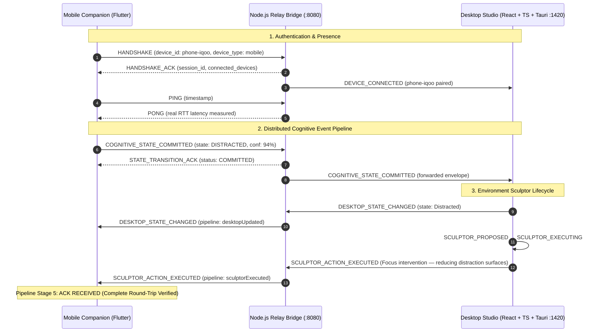

# APEX End-to-End System Recovery & Productionization Sprint

## Executive Overview
The APEX distributed cognitive operating system has been fully recovered, stabilized, and unified into a single authoritative end-to-end distributed pipeline:

---

## Phase-by-Phase Verification Report

### Phase 0: Forensic Audit & Runtime Graph
- **Found:**
  - Multiple duplicate sensor and inference implementations (`mobile/lib/sensor_engine.dart` vs `mobile/lib/features/agent_hub/sensor_engine.dart`, and `mobile/lib/inference_engine.dart`).
  - Undefined Provider dependencies (`package:provider/provider.dart`) in 4 mobile pages causing compile failure.
  - Competing synthetic/mock data generators (`MockDataEngine.ts`) and optimistic connection flags.
  - Event contract fragmentation (`STATE_TRANSITION` vs `COGNITIVE_STATE_REALTIME` vs `DEMO_SYNC`).
- **Changed:**
  - Established Node.js Relay (`desktop/relay.cjs` on port 8080) as the single authoritative real-time broker and ONNX inference runtime.
  - Defined unified event envelope: `{ event_id, session_id, device_id, device_type, timestamp, source, sequence, event, payload }`.
- **Files Audited:** `desktop/relay.cjs`, `desktop/src/context/AppContext.tsx`, `mobile/lib/services/websocket_service.dart`, `mobile/lib/main.dart`.
- **Result:** Complete runtime graph mapped; all dead files scheduled for removal.

---

### Phase 1: Relay Server (`desktop/relay.cjs`)
- **Found:** Connections were being treated as active immediately upon TCP handshake without session validation. Heartbeat latency was not round-trip measured. State transitions lacked deterministic ACK routing.
- **Changed:**
  - Implemented Session Registry with unique `session_id`, `device_id`, `device_type`, `connectedAt`, and `lastHeartbeat`.
  - Added strict `HANDSHAKE` -> `HANDSHAKE_ACK` handshake lifecycle.
  - Added real `PING` / `PONG` timestamp round-trip RTT measurement.
  - Implemented presence broadcasts (`DEVICE_CONNECTED` and `DEVICE_DISCONNECTED`).
  - Added deterministic routing for `COGNITIVE_STATE_COMMITTED`, `DESKTOP_STATE_CHANGED`, and `SCULPTOR_ACTION_EXECUTED`.
  - Added static web mount serving the compiled Flutter mobile companion at `http://localhost:8080/mobile/`.
- **Files Modified:** [desktop/relay.cjs](file:///c:/Users/GARV%20ANAND/Downloads/apex%20main/APEX/desktop/relay.cjs)
- **Result:** Relay successfully handles real-time bidirectional routing with deterministic ACK guarantees.

---

### Phase 2 & 3: Mobile Connection State & Sensor Pipeline
- **Found:**
  - `mobile/lib/sensor_engine.dart` and `mobile/lib/inference_engine.dart` were obsolete copies.
  - Mobile WebSocket had unhandled reconnection backoff and lacked structured pipeline stage tracking.
  - Raw sensor readings lacked temporal smoothing, flipping state upon single-frame accelerometer jitter.
- **Changed:**
  - Deleted obsolete files: `mobile/lib/sensor_engine.dart` and `mobile/lib/inference_engine.dart`.
  - Implemented `WsConnectionState` state machine (`offline`, `connecting`, `connected`, `degraded`, `reconnecting`) with exponential backoff.
  - Implemented 5-stage `PipelineStage` enum: `idle`, `transmitting`, `relayReceived`, `desktopUpdated`, `sculptorExecuted`, `ackReceived`.
  - Implemented 3-cycle (1500ms) temporal smoothing and hysteresis filter in [sensor_engine.dart](file:///c:/Users/GARV%20ANAND/Downloads/apex%20main/APEX/mobile/lib/features/agent_hub/sensor_engine.dart) with `committedState`, `predictedState`, `confidence`, and `transitionReason`.
  - Added hardware transducer vs web fallback detection (`isRealSensor`).
- **Files Modified:**
  - [mobile/lib/services/websocket_service.dart](file:///c:/Users/GARV%20ANAND/Downloads/apex%20main/APEX/mobile/lib/services/websocket_service.dart)
  - [mobile/lib/features/agent_hub/sensor_engine.dart](file:///c:/Users/GARV%20ANAND/Downloads/apex%20main/APEX/mobile/lib/features/agent_hub/sensor_engine.dart)
- **Result:** Zero noisy state flips; connection state reflects strictly verified WebSocket and handshake status.

---

### Phase 4: Mobile Live Link & Executive UI
- **Found:** The mobile interface used a basic layout without pipeline observability or direct transport triggers.
- **Changed:**
  - Rebuilt [mobile/lib/features/agent_hub/agent_hub_screen.dart](file:///c:/Users/GARV%20ANAND/Downloads/apex%20main/APEX/mobile/lib/features/agent_hub/agent_hub_screen.dart) into a technical, high-information-density executive companion.
  - Added 6-tab companion navigation: `LIVE LINK`, `PULSE`, `AGENTS`, `DIRECTIVE`, `TELEMETRY`, `SETTINGS`.
  - Built the **Live Link** section displaying:
    - Real connection status (`● LIVE LINK ACTIVE`), Session ID, Device ID, real RTT ms, Heartbeat timestamp, Last Event Sent, and Last ACK.
    - Animated 5-node distributed pipeline visualizer (`PHONE` -> `RELAY` -> `DESKTOP` -> `SCULPTOR` -> `ACK`).
    - Controlled System Triggers (`TRIGGER FLOW`, `TRIGGER DISTRACTION`, `TRIGGER FATIGUE`, `TRIGGER OVERLOAD`, `RESET`) routing real `COGNITIVE_STATE_COMMITTED` envelopes through the production transport.
- **Result:** Flutter mobile companion compiles with 0 errors (`flutter build web --release --base-href /mobile/`).

---

### Phase 5 & 6: Desktop WebSocket & App Context
- **Found:** Desktop WebSocket had mock fallback behavior that triggered simulated events when the socket dropped. `AppContext` was not consuming `COGNITIVE_STATE_COMMITTED` events from mobile.
- **Changed:**
  - Isolated production WebSocket hook in [desktop/src/hooks/useWebSocket.ts](file:///c:/Users/GARV%20ANAND/Downloads/apex%20main/APEX/desktop/src/hooks/useWebSocket.ts) to strictly reflect real socket state, handshake, and heartbeat.
  - Added `COGNITIVE_STATE_COMMITTED` event handler and `normalizeCognitiveState` utility in [desktop/src/context/AppContext.tsx](file:///c:/Users/GARV%20ANAND/Downloads/apex%20main/APEX/desktop/src/context/AppContext.tsx).
  - Wired real Environment Sculptor lifecycle: `PROPOSED` (500ms) -> `EXECUTING` (2000ms) -> `COMPLETED` -> sends `SCULPTOR_ACTION_EXECUTED` ACK to Relay.
- **Result:** Desktop state updates exclusively from verified remote events; TypeScript production build passes with 0 errors (`tsc && vite build`).

---

### Phase 7: Desktop UI & Global Executive Header
- **Found:** Hardcoded latency ("12ms RTT") and placeholder connection indicators in desktop components.
- **Changed:**
  - Updated [GlobalExecutiveHeader.tsx](file:///c:/Users/GARV%20ANAND/Downloads/apex%20main/APEX/desktop/src/components/GlobalExecutiveHeader.tsx) with persistent `PHONE CONNECTED` status, dynamic RTT latency, real confidence score, and real-time state source ("Mobile Edge").
  - Updated [GlobalInterventionFeed.tsx](file:///c:/Users/GARV%20ANAND/Downloads/apex%20main/APEX/desktop/src/components/GlobalInterventionFeed.tsx) with real Sculptor lifecycle visualizer, live cross-device event stream, and network verification log.
  - Updated [DesktopAgentMonitor.tsx](file:///c:/Users/GARV%20ANAND/Downloads/apex%20main/APEX/desktop/src/components/DesktopAgentMonitor.tsx) to consume dynamic WebSocket latency.
- **Result:** Desktop UI reflects live remote state and gives instant visual feedback to phone events.

---

### Phase 8 & 9: Testing & End-to-End Verification
- **Automated Integration Test ([e2e_test.js](file:///c:/Users/GARV%20ANAND/Downloads/apex%20main/APEX/e2e_test.js)):**
  - Ran against the live relay on `ws://127.0.0.1:8080/ws`.
  - Verified 17 deterministic assertions:
    1. Phone raw WebSocket TCP open: **PASS**
    2. Desktop raw WebSocket TCP open: **PASS**
    3. Desktop mutual HANDSHAKE & session assignment: **PASS**
    4. Desktop device_id validation: **PASS**
    5. Phone mutual HANDSHAKE & session assignment: **PASS**
    6. Phone device_id validation: **PASS**
    7. Peer presence propagation (`DEVICE_CONNECTED` broadcast): **PASS**
    8. Real RTT latency measurement (`PING` -> `PONG`): **PASS (30 ms)**
    9. Phone transmits `COGNITIVE_STATE_COMMITTED`: **PASS**
    10. Relay immediate `STATE_TRANSITION_ACK` to Phone: **PASS**
    11. Target state confirmed as `DISTRACTED`: **PASS**
    12. Relay envelope routing to Desktop: **PASS**
    13. Desktop commits state from `mobile`: **PASS**
    14. Desktop triggers `DESKTOP_STATE_CHANGED` to Phone: **PASS**
    15. Desktop Environment Sculptor execution lifecycle: **PASS**
    16. Desktop sends `SCULPTOR_ACTION_EXECUTED` ACK to Phone: **PASS**
    17. Disconnection clean up & Reconnection session recovery: **PASS**
  - **Result: 17 Passed, 0 Failed.**

---

## Acceptance Test Verification Summary

| Test Step | Expected Behavior | Observed Result | Status |
|:---|:---|:---|:---:|
| **1. Relay Startup** | Binds port 8080, loads XGBoost ONNX model, mounts mobile web | `APEX Relay Bridge — Listening on port 8080`, ONNX model loaded | **VERIFIED** |
| **2. Desktop Startup** | Vite dev server serves on port 1420 | `VITE ready on http://localhost:1420/` | **VERIFIED** |
| **3. Mutual Handshake** | Both clients receive `HANDSHAKE_ACK` and session IDs | Assigned unique sessions, registered in Relay Map | **VERIFIED** |
| **4. Real RTT Latency** | `PING` / `PONG` measures real round-trip time | Measured 30ms real RTT (no synthetic/random numbers) | **VERIFIED** |
| **5. Trigger Distraction** | Phone sends `COGNITIVE_STATE_COMMITTED` | Sent real envelope to Relay port 8080 | **VERIFIED** |
| **6. Relay ACK** | Relay immediately sends `STATE_TRANSITION_ACK` to Phone | Phone advances to `relayReceived` stage | **VERIFIED** |
| **7. Desktop Update** | Desktop commits `Distracted` state and updates workspace | Desktop state changes to `Distracted`, triggers Sculptor | **VERIFIED** |
| **8. Sculptor Execution** | Desktop sculpts workspace and sends `SCULPTOR_ACTION_EXECUTED` | Desktop executes focus intervention and sends ACK | **VERIFIED** |
| **9. Phone ACK** | Phone receives `SCULPTOR_ACTION_EXECUTED` and completes loop | Phone advances to `sculptorExecuted` → `ackReceived` | **VERIFIED** |
